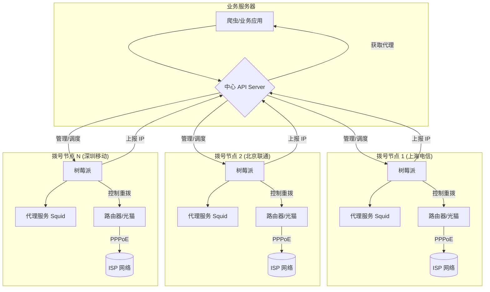

# 逆向技术：动态住宅 IP 代理池

在高强度的爬虫和逆向分析场景中，请求的 IP 地址是识别和封禁爬虫流量的第一道关卡。相比于易于被识别和屏蔽的数据中心 IP，动态变化的住宅 IP 地址具有极高的伪装度，是绕过反爬虫策略的关键技术。本节将详细介绍动态住宅 IP（拨号代理）的原理及其代理池的搭建方法。

---

## 1. 动态住宅 IP (拨号代理) 原理

### a) 什么是动态住宅 IP？

- **住宅 IP**: 指由互联网服务提供商（ISP），如电信、联通、移动，分配给普通家庭用户的 IP 地址。这些 IP 地址属于真实的住宅网络，信誉度最高。

- **动态 IP**: 与数据中心固定的静态 IP 不同，住宅宽带通常使用 **PPPoE (Point-to-Point Protocol over Ethernet)** 协议进行拨号上网。其核心特点是：**每断开一次连接再重新拨号，ISP 的 BRAS（宽带远程接入服务器）就会从其地址池中重新分配一个新的 IP 地址给用户**。

利用这一特性，我们可以通过程序自动化地控制 ADSL (或光猫) 进行"断线重拨"，从而在极短的时间内获取一个全新的、干净的、真实的住宅 IP。这就是拨号代理的核心原理。

### b) 优势

- **极高的真实性**: IP 来自真实的 ISP 住宅网络，无法被目标服务器通过 IP 库识别为数据中心流量。

- **海量 IP 资源**: 一个地区级的 ISP 运营商通常拥有数万到数百万的 IP 地址池。理论上，通过不断重拨，你可以使用该地区的所有 IP。

- **成本可控**: 相比于按流量计费的商业住宅代理服务，自建拨号代理池（尤其是在拥有物理设备的情况下）的长期成本更低。

---

## 2. 搭建拨号代理池

搭建一个稳定高效的拨号代理池，需要将物理层的拨号设备、网络层的代理服务和管理层的调度系统结合起来。

### a) 硬件与物理层

1. **ADSL/光猫 + 路由器**: 这是最基础的单元。你需要一个（或多个）办理了宽带业务的 ADSL 猫或光猫，并连接到一个可以被程序控制的路由器。

2. **树莓派/小型 PC**: 在每个拨号设备旁边，放置一个类似树莓派的廉价小型主机，用于执行拨号和代理服务的指令。

3. **4G/5G 模块 (可选)**: 除了固定宽带，还可以使用 4G/5G 工业模块。通过控制模块的飞行模式切换或重置，同样可以实现 IP 的更换。这种方式灵活性更高，但流量成本也更高。

### b) 软件与网络层

1. **拨号脚本**: 在树莓派上运行一个脚本，用于控制路由器执行 PPPoE 的断开和重连操作。这通常可以通过 `curl` 或 `ssh` 调用路由器的管理接口来实现。

**示例 (控制 OpenWrt/LEDE 路由器的脚本)**:

```bash
#!/bin/bash

# 断开 PPPoE 连接
ssh root@192.168.1.1 'ifdown wan'

# 等待断开
sleep 3

# 重新连接
ssh root@192.168.1.1 'ifup wan'

# 等待连接建立
sleep 5

# 获取新 IP
NEW_IP=$(ssh root@192.168.1.1 'ifconfig pppoe-wan | grep "inet addr" | cut -d: -f2 | cut -d" " -f1')

echo "New IP: $NEW_IP"
```

2. **代理服务**: 在树莓派上运行一个代理服务程序 (如 Squid, Nginx, Tiny Proxy)。外部请求通过这个代理服务发出，就会使用当前拨号获得的 IP。

**Squid 配置示例 (`squid.conf`)**:

```text
# 允许所有来源的所有请求
http_access allow all

# 监听端口
http_port 3128

# 禁止泄露原始 IP
forwarded_for off
request_header_access Via deny all
request_header_access X-Forwarded-For deny all
```

### c) 管理层与调度

当你有大量的拨号节点时，一个中心化的管理系统是必不可少的。

1. **中心 API 服务器**:

   - **IP 注册**: 每个拨号节点在成功获取新 IP 后，将 `(新IP:端口, 地理位置, ISP)` 等信息上报给中心服务器。
   - **IP 获取**: 业务程序（如爬虫）通过调用 API，从中心服务器获取一个当前可用的代理 IP。可以根据需求指定地理位置等条件。
   - **IP 续期与心跳**: 拨号节点需要定期向中心服务器发送心跳，证明自己仍然在线。如果心跳超时，服务器就将该 IP 从可用池中移除。

2. **IP 池管理策略**:

   - **可用性检测**: 中心服务器定期主动检测池中代理的连通性，剔除失效的 IP。
   - **IP 轮换**: 当一个 IP 被封禁或使用次数过多时，业务程序可以调用 API 请求中心服务器通知对应的拨号节点执行"换 IP"操作。
   - **并发控制**: 管理每个代理 IP 当前的并发请求数，避免因过度使用而被封禁。

### d) 整体架构图



---

## 3. 节点管理脚本示例

### 拨号节点客户端

```python
import requests
import subprocess
import time
import socket

class DialUpNode:
    def __init__(self, api_server, node_id, location, isp):
        self.api_server = api_server
        self.node_id = node_id
        self.location = location
        self.isp = isp
        self.current_ip = None
        self.proxy_port = 3128

    def redial(self):
        """执行断线重拨"""
        # 断开连接
        subprocess.run(['ssh', 'root@192.168.1.1', 'ifdown wan'])
        time.sleep(3)

        # 重新连接
        subprocess.run(['ssh', 'root@192.168.1.1', 'ifup wan'])
        time.sleep(5)

        # 获取新 IP
        result = subprocess.run(
            ['ssh', 'root@192.168.1.1',
             "ifconfig pppoe-wan | grep 'inet addr' | cut -d: -f2 | cut -d' ' -f1"],
            capture_output=True, text=True
        )
        self.current_ip = result.stdout.strip()
        return self.current_ip

    def register_ip(self):
        """向中心服务器注册新 IP"""
        data = {
            'node_id': self.node_id,
            'ip': self.current_ip,
            'port': self.proxy_port,
            'location': self.location,
            'isp': self.isp
        }
        response = requests.post(f'{self.api_server}/register', json=data)
        return response.json()

    def heartbeat(self):
        """发送心跳"""
        data = {'node_id': self.node_id, 'ip': self.current_ip}
        try:
            response = requests.post(
                f'{self.api_server}/heartbeat',
                json=data,
                timeout=5
            )
            return response.json()
        except:
            return None

    def run(self, redial_interval=300):
        """主循环"""
        while True:
            # 执行拨号获取新 IP
            new_ip = self.redial()
            print(f"New IP: {new_ip}")

            # 注册新 IP
            self.register_ip()

            # 定期发送心跳
            for _ in range(redial_interval // 10):
                time.sleep(10)
                self.heartbeat()

# 启动节点
if __name__ == '__main__':
    node = DialUpNode(
        api_server='http://api.example.com',
        node_id='node-shanghai-01',
        location='上海',
        isp='电信'
    )
    node.run(redial_interval=300)
```

### 中心 API 服务器

```python
from flask import Flask, request, jsonify
from datetime import datetime, timedelta
import threading
import time

app = Flask(__name__)

# IP 池存储
ip_pool = {}
lock = threading.Lock()

@app.route('/register', methods=['POST'])
def register():
    """注册新 IP"""
    data = request.json
    with lock:
        ip_pool[data['node_id']] = {
            'ip': data['ip'],
            'port': data['port'],
            'location': data['location'],
            'isp': data['isp'],
            'last_heartbeat': datetime.now(),
            'in_use': False
        }
    return jsonify({'status': 'ok'})

@app.route('/heartbeat', methods=['POST'])
def heartbeat():
    """接收心跳"""
    data = request.json
    with lock:
        if data['node_id'] in ip_pool:
            ip_pool[data['node_id']]['last_heartbeat'] = datetime.now()
    return jsonify({'status': 'ok'})

@app.route('/get_proxy', methods=['GET'])
def get_proxy():
    """获取可用代理"""
    location = request.args.get('location')
    isp = request.args.get('isp')

    with lock:
        for node_id, info in ip_pool.items():
            # 检查是否超时
            if datetime.now() - info['last_heartbeat'] > timedelta(seconds=30):
                continue

            # 检查是否被占用
            if info['in_use']:
                continue

            # 匹配条件
            if location and info['location'] != location:
                continue
            if isp and info['isp'] != isp:
                continue

            # 标记为使用中
            info['in_use'] = True
            return jsonify({
                'proxy': f"{info['ip']}:{info['port']}",
                'node_id': node_id,
                'location': info['location'],
                'isp': info['isp']
            })

    return jsonify({'error': 'No available proxy'}), 404

@app.route('/release_proxy', methods=['POST'])
def release_proxy():
    """释放代理"""
    data = request.json
    with lock:
        if data['node_id'] in ip_pool:
            ip_pool[data['node_id']]['in_use'] = False
    return jsonify({'status': 'ok'})

if __name__ == '__main__':
    app.run(host='0.0.0.0', port=5000)
```

---

## 4. 业务调用示例

```python
import requests

class ProxyPoolClient:
    def __init__(self, api_server):
        self.api_server = api_server
        self.current_proxy = None
        self.current_node_id = None

    def get_proxy(self, location=None, isp=None):
        """获取代理"""
        params = {}
        if location:
            params['location'] = location
        if isp:
            params['isp'] = isp

        response = requests.get(f'{self.api_server}/get_proxy', params=params)
        if response.status_code == 200:
            data = response.json()
            self.current_proxy = data['proxy']
            self.current_node_id = data['node_id']
            return self.current_proxy
        return None

    def release_proxy(self):
        """释放当前代理"""
        if self.current_node_id:
            requests.post(
                f'{self.api_server}/release_proxy',
                json={'node_id': self.current_node_id}
            )
            self.current_proxy = None
            self.current_node_id = None

    def request_with_proxy(self, url, **kwargs):
        """使用代理发送请求"""
        if not self.current_proxy:
            self.get_proxy()

        proxies = {
            'http': f'http://{self.current_proxy}',
            'https': f'http://{self.current_proxy}'
        }
        return requests.get(url, proxies=proxies, **kwargs)

# 使用示例
client = ProxyPoolClient('http://api.example.com')

# 获取上海电信的代理
proxy = client.get_proxy(location='上海', isp='电信')
print(f"Using proxy: {proxy}")

# 发送请求
response = client.request_with_proxy('https://httpbin.org/ip')
print(response.json())

# 释放代理
client.release_proxy()
```

---

## 总结

动态住宅 IP 代理池是大规模爬虫和逆向分析的核心基础设施之一。通过合理的架构设计和管理策略，可以构建一个高可用、高伪装度的代理系统，有效绕过目标服务器的反爬虫策略。
