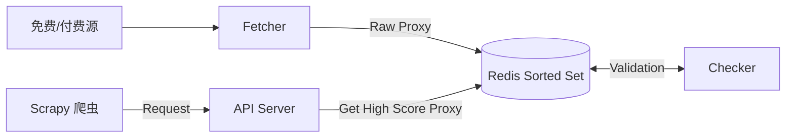
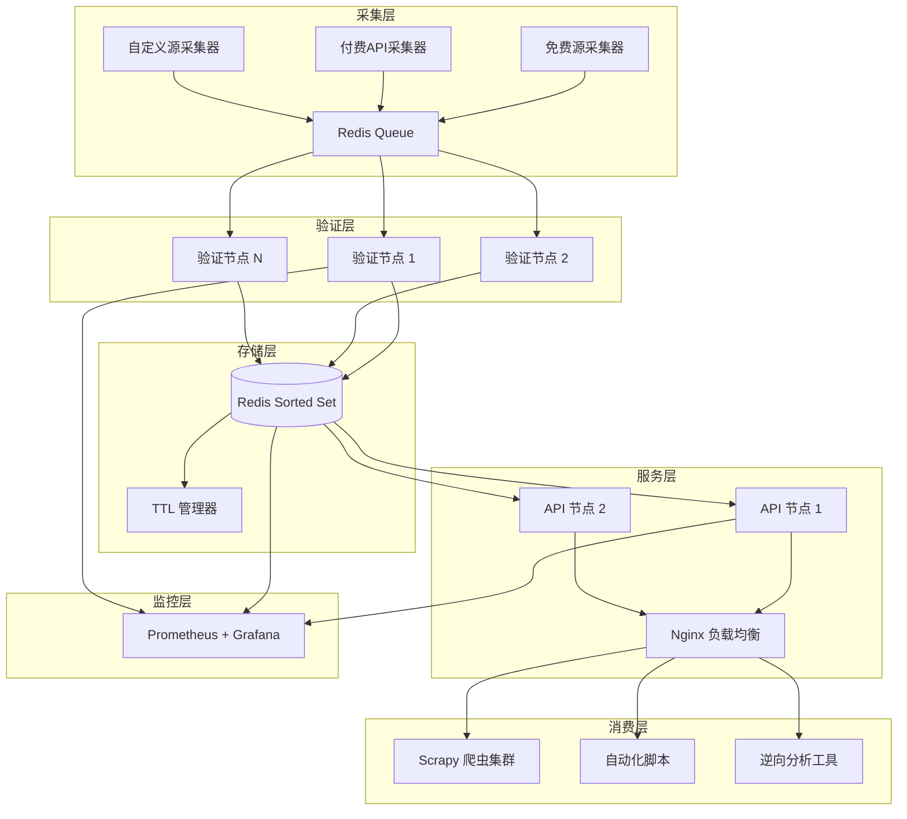

# 代理池设计与 Scrapy 集成

> **📚 前置知识**
>
> 本配方涉及以下核心技术，建议先阅读相关章节：
>
> - **[Scrapy 快速入门](./scrapy.md)** - 理解 Scrapy 中间件机制
> - **Redis 基础** - 理解 Redis 数据结构与操作
> - **Python asyncio** - 理解异步编程模型

在面对反爬虫策略严厉的目标站（如电商、社交媒体）时，单一 IP 很容易被封禁。构建一个高可用、自动轮转的代理池 (Proxy Pool) 是大规模数据采集的基础设施。

---

## 1. 代理池架构设计

一个成熟的代理池系统通常包含四个独立模块，通过 Redis 进行解耦：

### 核心组件

1. **Fetcher (获取器)**:
   - **职责**: 定时从各大免费代理网站（快代理、云代理等）或付费 API 接口拉取代理 IP。
   - **策略**: 每隔 N 分钟运行一次，将获取到的新 IP 存入 Redis 的"待检测"队列。

2. **Checker (检测器)**:
   - **职责**: 异步检测 Redis 中代理 IP 的可用性、匿名度和响应速度。
   - **实现**: 使用 `aiohttp` 或 `requests` 对目标网站（如百度、谷歌或特定目标站）发起请求。
   - **评分机制**:

| 项目       | 说明                                                        |
| ---------- | ----------------------------------------------------------- |
| **可用**   | 分数设为 100（或 +1）。                                     |
| **不可用** | 分数减 1，当分数低于阈值（如 0）时，从 Redis 移除。         |
| **复检**   | 定时遍历 Redis 中现存的代理进行复检，确保库中 IP 始终有效。 |

3. **Storage (存储器)**:

| 项目         | 说明                                                  |
| ------------ | ----------------------------------------------------- |
| **数据库**   | Redis 是最佳选择。                                    |
| **数据结构** | `Sorted Set` (有序集合)。                             |
| **Key**      | 代理 IP (`1.2.3.4:8080`)                              |
| **Score**    | 代理分数 (0-100)                                      |
| **优势**     | 可以利用 `ZRANGEBYSCORE` 轻松获取高质量（满分）代理。 |

4. **API Server (接口服务)**:
   - **职责**: 为爬虫提供简单的 HTTP 接口获取代理。
   - **接口**:
     - `/get`: 随机返回一个高分代理。
     - `/count`: 查看当前可用代理数量。

### 架构图


```mermaid
graph LR
    ProxySources[免费/付费源] --> Fetcher
    Fetcher -->|Raw Proxy| Redis[(Redis Sorted Set)]
    Redis <-->|Validation| Checker
    Crawler[Scrapy 爬虫] -->|Request| API[API Server]
    API -->|Get High Score Proxy| Redis
```

### 设计原则

在实现代理池时，应遵循以下核心设计原则：

| 原则             | 说明                                                                 |
| ---------------- | -------------------------------------------------------------------- |
| **模块解耦**     | 采集、验证、存储、服务四个模块独立运行，通过 Redis 消息队列通信       |
| **异步优先**     | 验证模块必须使用异步 IO，否则大量代理验证会成为瓶颈                   |
| **优雅降级**     | 当代理池为空时，支持直连或使用备用隧道代理，避免采集任务中断           |
| **水平扩展**     | 每个模块支持多实例部署，采集器和验证器可通过增加实例提升吞吐量         |
| **故障隔离**     | 单个代理源故障不影响整体系统，单个验证失败不影响其他代理               |

### 完整架构图


```mermaid
graph TB
    subgraph 采集层
        F1[免费源采集器] --> MQ[Redis Queue]
        F2[付费API采集器] --> MQ
        F3[自定义源采集器] --> MQ
    end

    subgraph 验证层
        MQ --> V1[验证节点 1]
        MQ --> V2[验证节点 2]
        MQ --> V3[验证节点 N]
    end

    subgraph 存储层
        V1 --> RS[(Redis Sorted Set)]
        V2 --> RS
        V3 --> RS
        RS --> TTL[TTL 管理器]
    end

    subgraph 服务层
        RS --> API1[API 节点 1]
        RS --> API2[API 节点 2]
        API1 --> LB[Nginx 负载均衡]
        API2 --> LB
    end

    subgraph 消费层
        LB --> S1[Scrapy 爬虫集群]
        LB --> S2[自动化脚本]
        LB --> S3[逆向分析工具]
    end

    subgraph 监控层
        RS --> MON[Prometheus + Grafana]
        API1 --> MON
        V1 --> MON
    end
```

---

## 2. 代理类型与来源

### 代理协议对比

选择代理类型时需要根据目标站点的协议和安全策略进行匹配：

| 特性           | HTTP 代理          | HTTPS 代理             | SOCKS5 代理            |
| -------------- | ------------------- | ---------------------- | ---------------------- |
| **协议支持**   | 仅 HTTP             | HTTP + HTTPS           | 任意 TCP/UDP           |
| **加密**       | 无                  | TLS 隧道              | 可选认证，无内置加密   |
| **速度**       | 最快                | 较快                   | 较快                   |
| **匿名性**     | 取决于配置          | 较好                   | 最好                   |
| **适用场景**   | 简单页面抓取        | 主流网站抓取           | APP 抓包、逆向分析     |
| **Scrapy 支持**| 原生支持            | 原生支持               | 需要额外中间件         |

### 匿名等级

代理按匿名程度分为三个等级：

| 等级           | 说明                                                                 |
| -------------- | -------------------------------------------------------------------- |
| **透明代理**   | 目标服务器可以看到你的真实 IP（通过 `X-Forwarded-For` 头部）          |
| **匿名代理**   | 目标服务器知道你在使用代理，但看不到真实 IP                           |
| **高匿代理**   | 目标服务器完全无法识别你在使用代理，最适合逆向工程场景                 |

### 代理来源对比

| 来源类型       | 可用率   | 速度     | 匿名性   | 成本     | 适用场景                 |
| -------------- | -------- | -------- | --------- | -------- | ------------------------ |
| **免费代理站** | < 5%     | 慢       | 低        | 免费     | 学习、测试               |
| **付费短效代理** | 60-80% | 中等     | 中等      | 低       | 中小规模采集             |
| **付费隧道代理** | > 95%  | 快       | 高        | 中等     | 生产环境采集             |
| **住宅代理**   | > 90%   | 中等     | 最高      | 高       | 高反爬目标、社交媒体     |
| **数据中心代理** | > 95%  | 最快     | 中等      | 中低     | 大规模无反爬目标         |

> **住宅代理 vs 数据中心代理**: 住宅代理使用真实家庭宽带 IP，极难被目标站识别为代理；数据中心代理使用 IDC 机房 IP 段，速度快但容易被识别。对于反爬严格的 APP（如抖音、美团），推荐使用住宅代理。

---

## 3. 代理采集模块

### 免费代理站抓取

以下示例展示如何从免费代理网站采集代理 IP：

```python
# fetcher/free_proxy.py
import re
import asyncio
import aiohttp
from typing import List, Tuple
from abc import ABC, abstractmethod


class BaseFetcher(ABC):
    """代理采集器基类"""

    @abstractmethod
    async def fetch(self) -> List[Tuple[str, int, str]]:
        """
        返回代理列表，每个元素为 (ip, port, protocol)
        protocol: 'http', 'https', 'socks5'
        """
        pass


class KuaiDailiFetcher(BaseFetcher):
    """快代理采集器"""

    BASE_URL = "https://www.kuaidaili.com/free/inha/{page}/"

    async def fetch(self) -> List[Tuple[str, int, str]]:
        proxies = []
        async with aiohttp.ClientSession() as session:
            for page in range(1, 6):  # 采集前 5 页
                try:
                    url = self.BASE_URL.format(page=page)
                    async with session.get(url, timeout=aiohttp.ClientTimeout(total=10)) as resp:
                        html = await resp.text()
                        # 解析 IP 和端口
                        ips = re.findall(
                            r'<td data-title="IP">([\d.]+)</td>', html
                        )
                        ports = re.findall(
                            r'<td data-title="PORT">(\d+)</td>', html
                        )
                        for ip, port in zip(ips, ports):
                            proxies.append((ip, int(port), "http"))
                    await asyncio.sleep(2)  # 避免被反爬
                except Exception as e:
                    print(f"[KuaiDaili] 采集第 {page} 页失败: {e}")
        return proxies


class Ip3366Fetcher(BaseFetcher):
    """云代理采集器"""

    BASE_URL = "http://www.ip3366.net/free/?stype=1&page={page}"

    async def fetch(self) -> List[Tuple[str, int, str]]:
        proxies = []
        async with aiohttp.ClientSession() as session:
            for page in range(1, 4):
                try:
                    url = self.BASE_URL.format(page=page)
                    async with session.get(url, timeout=aiohttp.ClientTimeout(total=10)) as resp:
                        html = await resp.text()
                        items = re.findall(
                            r'<tr>\s*<td>([\d.]+)</td>\s*<td>(\d+)</td>',
                            html
                        )
                        for ip, port in items:
                            proxies.append((ip, int(port), "http"))
                    await asyncio.sleep(2)
                except Exception as e:
                    print(f"[Ip3366] 采集第 {page} 页失败: {e}")
        return proxies
```

### 付费 API 集成

付费代理通常提供标准化 API 接口，集成更加简单：

```python
# fetcher/paid_proxy.py
import aiohttp
from typing import List, Tuple


class PaidProxyFetcher(BaseFetcher):
    """付费代理 API 采集器"""

    def __init__(self, api_url: str, api_key: str):
        self.api_url = api_url
        self.api_key = api_key

    async def fetch(self) -> List[Tuple[str, int, str]]:
        proxies = []
        params = {
            "key": self.api_key,
            "num": 100,          # 每次提取数量
            "protocol": 1,       # 1=HTTP, 2=HTTPS, 5=SOCKS5
            "anonymity": 2,      # 2=高匿
            "format": "json",
        }
        async with aiohttp.ClientSession() as session:
            try:
                async with session.get(self.api_url, params=params) as resp:
                    data = await resp.json()
                    for item in data.get("data", []):
                        proxies.append((
                            item["ip"],
                            item["port"],
                            item.get("protocol", "http")
                        ))
            except Exception as e:
                print(f"[PaidProxy] 采集失败: {e}")
        return proxies


class FetcherScheduler:
    """采集调度器：管理所有采集器并汇总结果"""

    def __init__(self, fetchers: list):
        self.fetchers = fetchers

    async def fetch_all(self) -> List[Tuple[str, int, str]]:
        tasks = [f.fetch() for f in self.fetchers]
        results = await asyncio.gather(*tasks, return_exceptions=True)

        all_proxies = []
        for i, result in enumerate(results):
            if isinstance(result, Exception):
                print(f"采集器 {i} 出错: {result}")
            else:
                all_proxies.extend(result)
                print(f"采集器 {i} 获取 {len(result)} 个代理")

        # 去重
        unique = list(set(all_proxies))
        print(f"汇总: 共 {len(all_proxies)} 个，去重后 {len(unique)} 个")
        return unique
```

---

## 4. 代理验证模块

### 异步批量验证

验证模块是代理池的性能瓶颈所在，必须使用异步 IO 来实现高并发验证：

```python
# checker/validator.py
import time
import asyncio
import aiohttp
from dataclasses import dataclass
from typing import Optional


@dataclass
class ProxyInfo:
    """代理详细信息"""
    ip: str
    port: int
    protocol: str
    speed: float = 0.0          # 响应时间（秒）
    anonymity: str = "unknown"  # transparent / anonymous / high_anonymous
    country: str = "unknown"
    is_valid: bool = False


class ProxyValidator:
    """异步代理验证器"""

    # 用于检测 IP 和匿名度的 API
    CHECK_URL = "https://httpbin.org/ip"
    TIMEOUT = 10  # 秒
    CONCURRENT_LIMIT = 100  # 最大并发数

    def __init__(self, local_ip: str):
        self.local_ip = local_ip
        self.semaphore = asyncio.Semaphore(self.CONCURRENT_LIMIT)

    async def validate_single(self, proxy: ProxyInfo) -> ProxyInfo:
        """验证单个代理"""
        async with self.semaphore:
            proxy_url = f"{proxy.protocol}://{proxy.ip}:{proxy.port}"
            start_time = time.time()
            try:
                async with aiohttp.ClientSession() as session:
                    async with session.get(
                        self.CHECK_URL,
                        proxy=proxy_url,
                        timeout=aiohttp.ClientTimeout(total=self.TIMEOUT),
                    ) as resp:
                        if resp.status == 200:
                            data = await resp.json()
                            proxy.speed = round(time.time() - start_time, 2)
                            proxy.is_valid = True
                            # 匿名度检测
                            origin_ip = data.get("origin", "")
                            if self.local_ip not in origin_ip:
                                proxy.anonymity = "high_anonymous"
                            else:
                                proxy.anonymity = "transparent"
            except Exception:
                proxy.is_valid = False
            return proxy

    async def validate_batch(self, proxies: list) -> list:
        """批量验证代理"""
        tasks = [self.validate_single(p) for p in proxies]
        results = await asyncio.gather(*tasks)
        valid = [p for p in results if p.is_valid]
        print(f"验证完成: {len(proxies)} 个中 {len(valid)} 个可用")
        return valid
```

### 地理位置检测

在某些场景下（如需要特定地区 IP 访问本地化内容），需要检测代理的地理位置：

```python
# checker/geo.py
import aiohttp


class GeoChecker:
    """代理地理位置检测"""

    GEO_API = "http://ip-api.com/json/{ip}?lang=zh-CN"

    async def check_geo(self, ip: str) -> dict:
        """查询 IP 地理信息"""
        try:
            async with aiohttp.ClientSession() as session:
                url = self.GEO_API.format(ip=ip)
                async with session.get(url, timeout=aiohttp.ClientTimeout(total=5)) as resp:
                    data = await resp.json()
                    if data.get("status") == "success":
                        return {
                            "country": data.get("country", ""),
                            "region": data.get("regionName", ""),
                            "city": data.get("city", ""),
                            "isp": data.get("isp", ""),
                        }
        except Exception:
            pass
        return {"country": "unknown", "region": "", "city": "", "isp": ""}
```

---

## 5. 存储方案

### Redis 有序集合存储

Redis 的 Sorted Set 是代理池存储的最佳选择，利用 score 实现代理质量评分的天然排序：

```python
# storage/redis_store.py
import json
import random
import redis
from typing import Optional, List


class ProxyStore:
    """Redis 代理存储"""

    PROXY_KEY = "proxy:pool"            # 有序集合主键
    PROXY_DETAIL_PREFIX = "proxy:detail:"  # 代理详情 Hash
    INITIAL_SCORE = 50                  # 新代理初始分数
    MAX_SCORE = 100
    MIN_SCORE = 0

    def __init__(self, host="localhost", port=6379, db=0, password=None):
        self.redis = redis.Redis(
            host=host, port=port, db=db, password=password,
            decode_responses=True
        )

    def add(self, proxy_str: str, detail: dict = None) -> bool:
        """添加新代理（如果已存在则跳过）"""
        if not self.redis.zscore(self.PROXY_KEY, proxy_str):
            self.redis.zadd(self.PROXY_KEY, {proxy_str: self.INITIAL_SCORE})
            if detail:
                self.redis.hset(
                    f"{self.PROXY_DETAIL_PREFIX}{proxy_str}",
                    mapping=detail
                )
                # 设置详情 TTL，24 小时后自动清理
                self.redis.expire(
                    f"{self.PROXY_DETAIL_PREFIX}{proxy_str}", 86400
                )
            return True
        return False

    def increase_score(self, proxy_str: str, delta: int = 1):
        """提升代理分数（验证成功时调用）"""
        score = self.redis.zscore(self.PROXY_KEY, proxy_str)
        if score is not None:
            new_score = min(self.MAX_SCORE, score + delta)
            self.redis.zadd(self.PROXY_KEY, {proxy_str: new_score})

    def decrease_score(self, proxy_str: str, delta: int = 1):
        """降低代理分数（验证失败时调用），低于阈值则删除"""
        score = self.redis.zscore(self.PROXY_KEY, proxy_str)
        if score is not None:
            new_score = score - delta
            if new_score <= self.MIN_SCORE:
                self.remove(proxy_str)
            else:
                self.redis.zadd(self.PROXY_KEY, {proxy_str: new_score})

    def remove(self, proxy_str: str):
        """删除代理"""
        self.redis.zrem(self.PROXY_KEY, proxy_str)
        self.redis.delete(f"{self.PROXY_DETAIL_PREFIX}{proxy_str}")

    def get_random(self, min_score: int = 80) -> Optional[str]:
        """获取一个高分随机代理"""
        # 先尝试获取满分代理
        top_proxies = self.redis.zrangebyscore(
            self.PROXY_KEY, min_score, self.MAX_SCORE
        )
        if top_proxies:
            return random.choice(top_proxies)
        # 降级：获取任意可用代理
        all_proxies = self.redis.zrangebyscore(
            self.PROXY_KEY, self.MIN_SCORE + 1, self.MAX_SCORE
        )
        if all_proxies:
            return random.choice(all_proxies)
        return None

    def get_top(self, count: int = 10) -> List[tuple]:
        """获取评分最高的 N 个代理"""
        return self.redis.zrevrangebyscore(
            self.PROXY_KEY, self.MAX_SCORE, self.MIN_SCORE,
            start=0, num=count, withscores=True
        )

    def count(self) -> int:
        """获取代理总数"""
        return self.redis.zcard(self.PROXY_KEY)

    def count_valid(self, min_score: int = 50) -> int:
        """获取有效代理数（分数高于阈值）"""
        return self.redis.zcount(self.PROXY_KEY, min_score, self.MAX_SCORE)

    def cleanup_expired(self, min_score: int = 10):
        """清理低分代理"""
        removed = self.redis.zremrangebyscore(
            self.PROXY_KEY, 0, min_score
        )
        print(f"清理了 {removed} 个低分代理")
```

### TTL 管理策略

| 策略               | 说明                                                     |
| ------------------ | -------------------------------------------------------- |
| **初始分数 50**    | 新代理给予中间分数，需通过验证才能升到高分                |
| **成功 +1**        | 每次验证成功加 1 分，最高 100 分                          |
| **失败 -10**       | 每次验证失败扣 10 分，快速淘汰不稳定代理                  |
| **低于阈值删除**   | 分数降到 0 时彻底删除，释放存储空间                       |
| **详情 24h 过期**  | 代理附属信息（地理位置、ISP 等）设置 TTL 自动过期          |

---

## 6. API 服务

### FastAPI 实现

使用 FastAPI 构建高性能的代理分发接口：

```python
# api/server.py
from fastapi import FastAPI, Query, HTTPException
from storage.redis_store import ProxyStore

app = FastAPI(title="Proxy Pool API", version="1.0")
store = ProxyStore()


@app.get("/get")
async def get_proxy(
    min_score: int = Query(80, description="最低分数阈值"),
    protocol: str = Query(None, description="指定协议: http/https/socks5"),
):
    """随机获取一个高质量代理"""
    proxy = store.get_random(min_score=min_score)
    if not proxy:
        raise HTTPException(status_code=503, detail="代理池为空")
    return {"proxy": proxy, "protocol": protocol or "http"}


@app.get("/get_batch")
async def get_batch(
    count: int = Query(10, description="获取数量"),
    min_score: int = Query(80, description="最低分数阈值"),
):
    """批量获取代理"""
    proxies = store.get_top(count=count)
    return {
        "count": len(proxies),
        "proxies": [{"proxy": p, "score": s} for p, s in proxies],
    }


@app.get("/count")
async def get_count():
    """查看代理池状态"""
    return {
        "total": store.count(),
        "valid": store.count_valid(min_score=50),
        "high_quality": store.count_valid(min_score=80),
    }


@app.post("/report")
async def report_proxy(proxy: str, is_valid: bool):
    """爬虫反馈代理状态"""
    if is_valid:
        store.increase_score(proxy)
    else:
        store.decrease_score(proxy, delta=10)
    return {"status": "ok"}


# 启动: uvicorn api.server:app --host 0.0.0.0 --port 5000
```

### 带权重的随机选择

在高并发场景下，简单随机可能会把所有流量打到少数几个代理上。使用加权随机算法可以让高分代理获得更高的被选中概率：

```python
# api/weighted_selector.py
import random
from typing import Optional


def weighted_random_proxy(store) -> Optional[str]:
    """
    基于分数的加权随机选择。
    分数越高的代理被选中的概率越大。
    """
    # 获取所有代理及其分数
    proxies_with_scores = store.redis.zrangebyscore(
        store.PROXY_KEY, 10, store.MAX_SCORE, withscores=True
    )
    if not proxies_with_scores:
        return None

    proxies = [p for p, _ in proxies_with_scores]
    weights = [s for _, s in proxies_with_scores]

    # random.choices 支持权重选择
    selected = random.choices(proxies, weights=weights, k=1)
    return selected[0]
```

---

## 7. 代理质量评分

### 评分算法

综合多个维度对代理进行质量评分：

```python
# scorer/quality.py
from dataclasses import dataclass


@dataclass
class ProxyMetrics:
    """代理性能指标"""
    total_requests: int = 0       # 总请求次数
    success_count: int = 0        # 成功次数
    fail_count: int = 0           # 失败次数
    avg_speed: float = 0.0        # 平均响应时间（秒）
    last_check_time: float = 0.0  # 上次检测时间戳
    consecutive_fails: int = 0    # 连续失败次数


class ProxyScorer:
    """
    代理综合评分器

    最终分数 = 成功率得分 * 0.4 + 速度得分 * 0.3 + 稳定性得分 * 0.3
    """

    # 各维度权重
    WEIGHT_SUCCESS_RATE = 0.4
    WEIGHT_SPEED = 0.3
    WEIGHT_STABILITY = 0.3

    # 速度等级阈值（秒）
    SPEED_EXCELLENT = 1.0
    SPEED_GOOD = 3.0
    SPEED_ACCEPTABLE = 5.0

    def calculate_score(self, metrics: ProxyMetrics) -> int:
        """计算代理综合分数（0-100）"""

        # 1. 成功率得分
        if metrics.total_requests == 0:
            success_score = 50  # 新代理默认
        else:
            rate = metrics.success_count / metrics.total_requests
            success_score = rate * 100

        # 2. 速度得分
        if metrics.avg_speed <= self.SPEED_EXCELLENT:
            speed_score = 100
        elif metrics.avg_speed <= self.SPEED_GOOD:
            speed_score = 70
        elif metrics.avg_speed <= self.SPEED_ACCEPTABLE:
            speed_score = 40
        else:
            speed_score = 10

        # 3. 稳定性得分（连续失败次数越多，扣分越严重）
        if metrics.consecutive_fails == 0:
            stability_score = 100
        elif metrics.consecutive_fails <= 2:
            stability_score = 60
        elif metrics.consecutive_fails <= 5:
            stability_score = 20
        else:
            stability_score = 0

        # 加权计算
        final_score = (
            success_score * self.WEIGHT_SUCCESS_RATE
            + speed_score * self.WEIGHT_SPEED
            + stability_score * self.WEIGHT_STABILITY
        )
        return max(0, min(100, int(final_score)))
```

### 评分维度说明

| 维度         | 权重 | 计算方式                                           | 说明                         |
| ------------ | ---- | -------------------------------------------------- | ---------------------------- |
| **成功率**   | 40%  | `成功次数 / 总请求次数 * 100`                       | 反映代理的基本可用性          |
| **响应速度** | 30%  | 分段映射: <1s=100, <3s=70, <5s=40, >5s=10          | 快速代理优先分配给时效性任务  |
| **稳定性**   | 30%  | 基于连续失败次数: 0次=100, <=2次=60, <=5次=20       | 避免使用频繁波动的不稳定代理  |

---

## 8. Scrapy 中间件集成

### 工作流程

1. **请求前 (`process_request`)**: 从代理池获取一个代理，赋值给 `request.meta['proxy']`。
2. **响应后 (`process_response`)**: 检查状态码。如果是 200，说明代理正常；如果是 403/429/超时，说明代理可能失效或被封。
3. **异常处理 (`process_exception`)**: 捕获连接超时、连接拒绝等网络错误，标记该代理失效，并对当前请求进行重试。

### 代码实现

```python
# middlewares.py
import requests
import logging
from scrapy.exceptions import IgnoreRequest

class ProxyMiddleware:
    def __init__(self, proxy_pool_url):
        self.proxy_pool_url = proxy_pool_url
        self.logger = logging.getLogger(__name__)

    @classmethod
    def from_crawler(cls, crawler):
        return cls(
            proxy_pool_url=crawler.settings.get('PROXY_POOL_URL')
        )

    def _get_random_proxy(self):
        try:
            response = requests.get(self.proxy_pool_url)
            if response.status_code == 200:
                return response.text.strip()
        except requests.ConnectionError:
            return None
        return None

    def process_request(self, request, spider):
        # 如果请求已经设置代理（例如特定请求），则跳过
        if request.meta.get('proxy'):
            return

        proxy = self._get_random_proxy()
        if proxy:
            self.logger.debug(f"Using proxy: {proxy}")
            # 设置代理，格式: http://user:pass@ip:端口 或 http://ip:端口
            request.meta['proxy'] = f"http://{proxy}"
        else:
            self.logger.warning("No proxy available from pool!")

    def process_response(self, request, response, spider):
        # 如果遇到验证码、封禁等状态码
        if response.status in [403, 429]:
            self.logger.warning(
                f"Proxy {request.meta.get('proxy')} banned "
                f"(Status {response.status}), retrying..."
            )
            # 标记该代理失效（可选：调用接口报告该代理坏）
            # self._report_bad_proxy(request.meta.get('proxy'))

            # 删除当前代理设置，重新调度请求（会再次经过 process_request 换新代理）
            del request.meta['proxy']
            return request.replace(dont_filter=True)

        return response

    def process_exception(self, request, exception, spider):
        # 处理连接超时、DNS 错误等
        self.logger.error(f"Proxy {request.meta.get('proxy')} failed: {exception}")

        # 换代理重试
        if 'proxy' in request.meta:
            del request.meta['proxy']
        return request.replace(dont_filter=True)
```

### 配置 settings.py

```python
# settings.py
DOWNLOADER_MIDDLEWARES = {
    'myproject.middlewares.ProxyMiddleware': 543,
    # 禁用 Scrapy 默认 UserAgent 和重试中间件（视情况而定）
    # 'scrapy.downloadermiddlewares.useragent.UserAgentMiddleware': None,
}

PROXY_POOL_URL = 'http://localhost:5000/get'
```

---

## 9. 与逆向工程结合

在移动端逆向工程中，代理池有多个关键应用场景。

### 反爬绕过策略

当目标 APP 采用了 IP 频率限制时，结合代理池可以有效绕过：

```python
# re_tools/anti_crawl.py
import requests
from itertools import cycle


class ProxyRotator:
    """
    逆向工程专用代理轮转器。
    适用于：API 接口批量测试、签名算法验证、数据批量拉取等场景。
    """

    def __init__(self, pool_api: str = "http://localhost:5000"):
        self.pool_api = pool_api

    def get_proxy(self, protocol: str = "http") -> dict:
        """从代理池获取一个代理，返回 requests 可用格式"""
        try:
            resp = requests.get(f"{self.pool_api}/get")
            proxy_str = resp.json().get("proxy")
            if proxy_str:
                return {
                    "http": f"http://{proxy_str}",
                    "https": f"http://{proxy_str}",
                }
        except Exception:
            pass
        return {}

    def report_result(self, proxy_str: str, success: bool):
        """向代理池反馈使用结果"""
        try:
            requests.post(
                f"{self.pool_api}/report",
                params={"proxy": proxy_str, "is_valid": success}
            )
        except Exception:
            pass

    def request_with_retry(self, url: str, max_retries: int = 3, **kwargs) -> requests.Response:
        """带代理轮转的请求，自动重试"""
        for attempt in range(max_retries):
            proxies = self.get_proxy()
            try:
                resp = requests.get(
                    url, proxies=proxies, timeout=10, **kwargs
                )
                if resp.status_code == 200:
                    self.report_result(
                        list(proxies.values())[0], True
                    )
                    return resp
            except Exception:
                if proxies:
                    self.report_result(
                        list(proxies.values())[0], False
                    )
        raise Exception(f"请求失败，已重试 {max_retries} 次")
```

### 请求分发策略

在逆向分析某个 APP 的 API 时，通常需要大量请求来测试不同参数组合。合理的请求分发策略可以避免触发风控：

| 策略             | 说明                                                   | 适用场景             |
| ---------------- | ------------------------------------------------------ | -------------------- |
| **轮询分发**     | 依次使用池中每个代理，均匀分摊请求量                    | 参数遍历、接口枚举   |
| **随机分发**     | 每次请求随机选择代理，模拟真实用户分布                   | 常规数据采集         |
| **加权分发**     | 高质量代理承担更多请求，低分代理少量试探                 | 高反爬目标           |
| **地域分发**     | 按目标需求选择特定地域的代理                             | 地域限制内容抓取     |
| **粘性会话**     | 同一会话保持使用同一代理，避免中途切换触发风控            | 需要登录态的采集     |

### Frida 配合代理池

在使用 Frida hook APP 的网络请求时，可以通过代理池分散请求来源：

```python
# frida_proxy_hook.py
"""
Frida 脚本：Hook OkHttp 设置动态代理
配合代理池使用，每次请求使用不同代理 IP
"""

FRIDA_SCRIPT = """
Java.perform(function() {
    var Proxy = Java.use('java.net.Proxy');
    var ProxyType = Java.use('java.net.Proxy$Type');
    var InetSocketAddress = Java.use('java.net.InetSocketAddress');
    var OkHttpClient = Java.use('okhttp3.OkHttpClient$Builder');

    // Hook OkHttpClient.Builder.build()
    OkHttpClient.build.implementation = function() {
        // 从代理池 API 获取代理（通过 Java 发 HTTP 请求）
        var proxyHost = "PROXY_HOST";
        var proxyPort = PROXY_PORT;

        var addr = InetSocketAddress.$new(proxyHost, proxyPort);
        var proxy = Proxy.$new(ProxyType.HTTP.value, addr);
        this.proxy(proxy);

        console.log("[*] OkHttp proxy set to: " + proxyHost + ":" + proxyPort);
        return this.build();
    };
});
"""
```

---

## 10. 监控与运维

### Prometheus 指标采集

为代理池各模块暴露监控指标：

```python
# monitor/metrics.py
from prometheus_client import Gauge, Counter, Histogram, start_http_server

# 代理池容量指标
POOL_TOTAL = Gauge(
    "proxy_pool_total", "代理池中代理总数"
)
POOL_VALID = Gauge(
    "proxy_pool_valid", "可用代理数量"
)
POOL_HIGH_QUALITY = Gauge(
    "proxy_pool_high_quality", "高质量代理数量（分数>80）"
)

# 采集器指标
FETCH_COUNT = Counter(
    "proxy_fetch_total", "采集到的代理总数", ["source"]
)
FETCH_ERRORS = Counter(
    "proxy_fetch_errors_total", "采集失败次数", ["source"]
)

# 验证器指标
CHECK_DURATION = Histogram(
    "proxy_check_duration_seconds", "单个代理验证耗时"
)
CHECK_RESULTS = Counter(
    "proxy_check_results_total", "验证结果统计", ["result"]
)

# API 指标
API_REQUESTS = Counter(
    "proxy_api_requests_total", "API 请求次数", ["endpoint"]
)
API_EMPTY_RESPONSES = Counter(
    "proxy_api_empty_total", "代理池为空的响应次数"
)


def update_pool_metrics(store):
    """定期更新池容量指标"""
    POOL_TOTAL.set(store.count())
    POOL_VALID.set(store.count_valid(min_score=50))
    POOL_HIGH_QUALITY.set(store.count_valid(min_score=80))
```

### 告警规则

在 Prometheus AlertManager 中配置以下告警规则：

```yaml
# alertmanager/rules.yml
groups:
  - name: proxy_pool_alerts
    rules:
      - alert: ProxyPoolLow
        expr: proxy_pool_valid < 50
        for: 5m
        labels:
          severity: warning
        annotations:
          summary: "可用代理数量不足"
          description: "代理池可用代理仅剩 {{ $value }} 个，请检查采集器"

      - alert: ProxyPoolEmpty
        expr: proxy_pool_valid == 0
        for: 1m
        labels:
          severity: critical
        annotations:
          summary: "代理池为空"
          description: "代理池中没有可用代理，爬虫任务可能中断"

      - alert: FetcherDown
        expr: rate(proxy_fetch_total[10m]) == 0
        for: 10m
        labels:
          severity: warning
        annotations:
          summary: "采集器停止工作"
          description: "过去 10 分钟没有新代理被采集"
```

### Docker Compose 部署

完整的代理池系统可通过 Docker Compose 一键部署：

```yaml
# docker-compose.yml
version: "3.8"
services:
  redis:
    image: redis:7-alpine
    ports:
      - "6379:6379"
    volumes:
      - redis_data:/data

  fetcher:
    build: ./fetcher
    depends_on:
      - redis
    environment:
      - REDIS_HOST=redis
      - FETCH_INTERVAL=300
    restart: always

  checker:
    build: ./checker
    depends_on:
      - redis
    environment:
      - REDIS_HOST=redis
      - CHECK_INTERVAL=60
      - CONCURRENT_LIMIT=200
    restart: always
    deploy:
      replicas: 2  # 可水平扩展

  api:
    build: ./api
    depends_on:
      - redis
    ports:
      - "5000:5000"
    environment:
      - REDIS_HOST=redis
    restart: always

  prometheus:
    image: prom/prometheus
    ports:
      - "9090:9090"
    volumes:
      - ./monitor/prometheus.yml:/etc/prometheus/prometheus.yml

  grafana:
    image: grafana/grafana
    ports:
      - "3000:3000"
    depends_on:
      - prometheus

volumes:
  redis_data:
```

### Grafana 监控面板

建议在 Grafana 中创建以下面板来实时监控代理池状态：

| 面板名称           | 数据源                          | 图表类型   | 用途                       |
| ------------------ | ------------------------------- | ---------- | -------------------------- |
| **池容量趋势**     | `proxy_pool_total`              | 折线图     | 观察代理池规模变化趋势      |
| **可用率**         | `valid / total * 100`           | 仪表盘     | 实时展示代理池健康度        |
| **采集速率**       | `rate(proxy_fetch_total[5m])`   | 折线图     | 监控各采集源的产出速率      |
| **验证通过率**     | `check_results{result="pass"}`  | 饼图       | 分析代理源的整体质量        |
| **API QPS**        | `rate(proxy_api_requests[1m])`  | 折线图     | 监控消费端压力              |
| **响应时间分布**   | `proxy_check_duration_seconds`  | 直方图     | 分析代理速度分布            |

---

## 11. 开源代理池推荐

1. **proxy_pool**
   - **GitHub**: `jhao104/proxy_pool`
   - **特点**: 也是基于 Redis，架构清晰，支持 Docker 一键部署，内置了几十个免费源的抓取规则。

2. **Gerapy / Scylla**
   - **GitHub**: `imWildCat/scylla`
   - **特点**: 智能化代理池，自动学习代理的稳定性。

3. **GimmeProxy**
   - **特点**: Go 语言编写，性能强劲。

---

## 12. 隧道代理 (Tunnel Proxy)

对于企业级应用，维护自建代理池成本较高（免费 IP 质量极差，可用率不足 5%）。此时通常使用厂商提供的**隧道代理**。

**特点**:

- 不需要在本地维护 IP 池。
- 只有一个固定的入口地址（如 `http://proxy.vendor.com:8000`）。
- **每一次请求，云端会自动转发给背后不同的动态 IP**。

**Scrapy 集成**:

只需要在 `process_request` 中将代理设置为该固定地址，并在 Header 中添加鉴权信息。

```python
# Tunnel Proxy Example
import base64

def process_request(self, request, spider):
    request.meta['proxy'] = "http://proxy.vendor.com:8000"
    # 某些厂商要求在头部通过 Proxy-Authorization 认证
    auth = base64.b64encode(b"user:pass").decode()
    request.headers['Proxy-Authorization'] = f"Basic {auth}"
```

---

## 总结

代理池是大规模爬虫系统和逆向工程的核心基础设施。通过合理的架构设计（Fetcher -> Checker -> Storage -> API）和 Scrapy 中间件集成，可以构建一个高可用、自动轮转的代理系统，有效应对目标站的反爬虫策略。

**关键要点回顾**:

| 模块       | 核心技术                     | 注意事项                              |
| ---------- | ---------------------------- | ------------------------------------- |
| **采集**   | aiohttp + 多源聚合           | 定时调度，注意源站反爬                 |
| **验证**   | asyncio 并发 + 多维度检测    | 控制并发数，区分匿名等级               |
| **存储**   | Redis Sorted Set + TTL       | 合理设置评分区间和淘汰策略             |
| **服务**   | FastAPI + 加权随机            | 支持批量获取和反馈机制                 |
| **评分**   | 成功率 + 速度 + 稳定性加权    | 权重可根据实际场景动态调整             |
| **监控**   | Prometheus + Grafana         | 配置告警规则，保障系统可用性           |
| **逆向**   | Frida hook + 请求分发         | 结合粘性会话和地域分发策略             |
