# 代理池设计与 Scrapy 集成

> **📚 前置知识**
>
> 本配方涉及以下核心技术，建议先阅读相关章节：
>
> - **[Scrapy 快速入门](./scrapy.md)** - 理解 Scrapy 中间件机制
> - **Redis 基础** - 理解 Redis 数据结构与操作

在面对反爬虫策略严厉的目标站（如电商、社交媒体）时，单一 IP 很容易被封禁。构建一个高可用、自动轮转的代理池 (Proxy Pool) 是大规模数据采集的基础设施。

---

## 1. 代理池架构设计

一个成熟的代理池系统通常包含四个独立模块，通过 Redis 进行解耦：

### 核心组件

1. **Fetcher (获取器)**:
   - **职责**: 定时从各大免费代理网站（快代理、云代理等）或付费 API 接口拉取代理 IP。
   - **策略**: 每隔 N 分钟运行一次，将获取到的新 IP 存入 Redis 的"待检测"队列。

2. **Checker (检测器)**:
   - **职责**: 异步检测 Redis 中代理 IP 的可用性、匿名度和响应速度。
   - **实现**: 使用 `aiohttp` 或 `requests` 对目标网站（如百度、谷歌或特定目标站）发起请求。
   - **评分机制**:

| 项目       | 说明                                                        |
| ---------- | ----------------------------------------------------------- |
| **可用**   | 分数设为 100（或 +1）。                                     |
| **不可用** | 分数减 1，当分数低于阈值（如 0）时，从 Redis 移除。         |
| **复检**   | 定时遍历 Redis 中现存的代理进行复检，确保库中 IP 始终有效。 |

3. **Storage (存储器)**:

| 项目         | 说明                                                  |
| ------------ | ----------------------------------------------------- |
| **数据库**   | Redis 是最佳选择。                                    |
| **数据结构** | `Sorted Set` (有序集合)。                             |
| **Key**      | 代理 IP (`1.2.3.4:8080`)                              |
| **Score**    | 代理分数 (0-100)                                      |
| **优势**     | 可以利用 `ZRANGEBYSCORE` 轻松获取高质量（满分）代理。 |

4. **API Server (接口服务)**:
   - **职责**: 为爬虫提供简单的 HTTP 接口获取代理。
   - **接口**:
     - `/get`: 随机返回一个高分代理。
     - `/count`: 查看当前可用代理数量。

### 架构图

```mermaid
graph LR
    ProxySources[免费/付费源] --> Fetcher
    Fetcher -->|Raw Proxy| Redis[(Redis Sorted Set)]
    Redis <-->|Validation| Checker
    Crawler[Scrapy 爬虫] -->|Request| API[API Server]
    API -->|Get High Score Proxy| Redis
```



---

## 2. Scrapy 中间件集成

### 工作流程

1. **请求前 (`process_request`)**: 从代理池获取一个代理，赋值给 `request.meta['proxy']`。
2. **响应后 (`process_response`)**: 检查状态码。如果是 200，说明代理正常；如果是 403/429/超时，说明代理可能失效或被封。
3. **异常处理 (`process_exception`)**: 捕获连接超时、连接拒绝等网络错误，标记该代理失效，并对当前请求进行重试。

### 代码实现

```python
# middlewares.py
import requests
import logging
from scrapy.exceptions import IgnoreRequest

class ProxyMiddleware:
    def __init__(self, proxy_pool_url):
        self.proxy_pool_url = proxy_pool_url
        self.logger = logging.getLogger(__name__)

    @classmethod
    def from_crawler(cls, crawler):
        return cls(
            proxy_pool_url=crawler.settings.get('PROXY_POOL_URL')
        )

    def _get_random_proxy(self):
        try:
            response = requests.get(self.proxy_pool_url)
            if response.status_code == 200:
                return response.text.strip()
        except requests.ConnectionError:
            return None
        return None

    def process_request(self, request, spider):
        # 如果请求已经设置代理（例如特定请求），则跳过
        if request.meta.get('proxy'):
            return

        proxy = self._get_random_proxy()
        if proxy:
            self.logger.debug(f"Using proxy: {proxy}")
            # 设置代理，格式: http://user:pass@ip:端口 或 http://ip:端口
            request.meta['proxy'] = f"http://{proxy}"
        else:
            self.logger.warning("No proxy available from pool!")

    def process_response(self, request, response, spider):
        # 如果遇到验证码、封禁等状态码
        if response.status in [403, 429]:
            self.logger.warning(
                f"Proxy {request.meta.get('proxy')} banned "
                f"(Status {response.status}), retrying..."
            )
            # 标记该代理失效（可选：调用接口报告该代理坏）
            # self._report_bad_proxy(request.meta.get('proxy'))

            # 删除当前代理设置，重新调度请求（会再次经过 process_request 换新代理）
            del request.meta['proxy']
            return request.replace(dont_filter=True)

        return response

    def process_exception(self, request, exception, spider):
        # 处理连接超时、DNS 错误等
        self.logger.error(f"Proxy {request.meta.get('proxy')} failed: {exception}")

        # 换代理重试
        if 'proxy' in request.meta:
            del request.meta['proxy']
        return request.replace(dont_filter=True)
```

### 配置 settings.py

```python
# settings.py
DOWNLOADER_MIDDLEWARES = {
    'myproject.middlewares.ProxyMiddleware': 543,
    # 禁用 Scrapy 默认 UserAgent 和重试中间件（视情况而定）
    # 'scrapy.downloadermiddlewares.useragent.UserAgentMiddleware': None,
}

PROXY_POOL_URL = 'http://localhost:5000/get'
```

---

## 3. 开源代理池推荐

1. **proxy_pool**
   - **GitHub**: `jhao104/proxy_pool`
   - **特点**: 也是基于 Redis，架构清晰，支持 Docker 一键部署，内置了几十个免费源的抓取规则。

2. **Gerapy / Scylla**
   - **GitHub**: `imWildCat/scylla`
   - **特点**: 智能化代理池，自动学习代理的稳定性。

3. **GimmeProxy**
   - **特点**: Go 语言编写，性能强劲。

---

## 4. 隧道代理 (Tunnel Proxy)

对于企业级应用，维护自建代理池成本较高（免费 IP 质量极差，可用率不足 5%）。此时通常使用厂商提供的**隧道代理**。

**特点**:

- 不需要在本地维护 IP 池。
- 只有一个固定的入口地址（如 `http://proxy.vendor.com:8000`）。
- **每一次请求，云端会自动转发给背后不同的动态 IP**。

**Scrapy 集成**:

只需要在 `process_request` 中将代理设置为该固定地址，并在 Header 中添加鉴权信息。

```python
# Tunnel Proxy Example
import base64

def process_request(self, request, spider):
    request.meta['proxy'] = "http://proxy.vendor.com:8000"
    # 某些厂商要求在头部通过 Proxy-Authorization 认证
    auth = base64.b64encode(b"user:pass").decode()
    request.headers['Proxy-Authorization'] = f"Basic {auth}"
```

---

## 总结

代理池是大规模爬虫系统的核心基础设施。通过合理的架构设计（Fetcher → Checker → Storage → API）和 Scrapy 中间件集成，可以构建一个高可用、自动轮转的代理系统，有效应对目标站的反爬虫策略。
