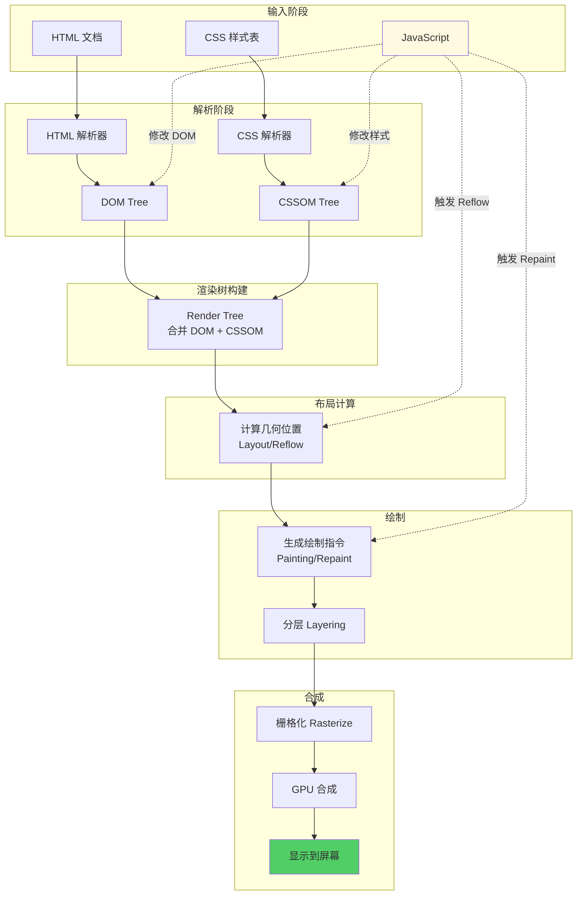

# 浏览器架构与渲染引擎

## 概述

了解浏览器的内部架构和渲染流程，有助于逆向工程师理解页面是如何从代码变成可视化的像素的，以及如何利用这些机制来检测自动化工具或反调试。

---

## 浏览器作为操作系统

现代浏览器（如 Chrome）不仅仅是一个简单的文档查看器，它更像是一个操作系统。

### 多进程架构 (Chrome 模型)

为了稳定性和安全性，现代浏览器采用多进程架构：

```mermaid
graph TB
subgraph Chrome["Chrome 浏览器"]
Browser[Browser Process<br/>主进程<br/>━━━━━━━━<br/>• UI 管理<br/>• 网络请求<br/>• 进程协调<br/>• 权限管理]

subgraph Renderers["Renderer Processes (渲染进程)"]
R1[Tab 1<br/>━━━━━━━<br/>• Blink 引擎<br/>• V8 引擎<br/>• DOM/CSSOM<br/>• JavaScript]
R2[Tab 2<br/>━━━━━━━<br/>• Blink 引擎<br/>• V8 引擎<br/>• DOM/CSSOM<br/>• JavaScript]
R3[Tab 3<br/>━━━━━━━<br/>• Blink 引擎<br/>• V8 引擎<br/>• DOM/CSSOM<br/>• JavaScript]
end

GPU[GPU Process<br/>GPU 进程<br/>━━━━━━━━<br/>• Canvas 渲染<br/>• WebGL<br/>• CSS 3D 变换<br/>• 视频解码]

Plugin[Plugin Process<br/>插件进程<br/>━━━━━━━━<br/>• Flash (已弃用)<br/>• PDF 阅读器<br/>• 其他插件]

Network[Network Service<br/>网络服务<br/>━━━━━━━━<br/>• HTTP/HTTPS<br/>• WebSocket<br/>• DNS 解析]
end

Browser --> R1
Browser --> R2
Browser --> R3
Browser --> GPU
Browser --> Plugin
Browser --> Network

R1 --> GPU
R2 --> GPU
R3 --> GPU

style Browser fill:#4a90e2
style R1 fill:#7ed321
style R2 fill:#7ed321
style R3 fill:#7ed321
style GPU fill:#f5a623
style Plugin fill:#bd10e0
style Network fill:#50e3c2
```

**各进程职责**:

1. **Browser Process (主进程)**: 负责地址栏、书签、前进/后退、协调其他进程。
2. **Renderer Process (渲染进程)**: **核心关注点**。负责将 HTML/CSS/JS 转换为网页。
- 通常每个 Tab 是一个独立的进程（Site Isolation）。
- JS 也是运行在这里（V8 引擎）。
3. **GPU Process**: 处理 GPU 任务（CSS 3D 变换、Canvas 绘图）。
4. **Plugin Process**: 运行 Flash 等插件。
5. **Network Service**: 处理所有网络请求。

### 逆向启示

- **内存隔离**: 由于不同 Tab 在不同进程，你不能简单地跨 Tab 直接读写内存数据（除非通过 DevTools 协议）。
- **Headless 检测**: 无头浏览器（Headless Chrome）在启动时某些图形相关的进程行为或 GPU 参数可能与正常浏览器不同，这常被用于反爬检测。

---

## 渲染流程 (Rendering Pipeline)

理解渲染流程对于分析反爬虫技术（如验证码的人机识别、DOM 混淆）很有帮助。

### 1. 解析 (Parsing)

- **HTML -> DOM**: 解析 HTML 文本生成 DOM 树。
- **CSS -> CSSOM**: 解析 CSS 生成 CSSOM 树。

### 2. 布局 (Layout / Reflow)

- DOM + CSSOM 合并为 **Render Tree**。
- 计算每个节点的确切几何位置（坐标、宽高）。
- **Reflow (回流)**: 当页面布局发生变化（如 JS 修改了宽高），浏览器需要重新计算布局。这很消耗性能。

### 3. 绘制 (Painting / Repaint)

- 将 Render Tree 转换为屏幕上的像素。
- **Repaint (重绘)**: 改变颜色但不变布局的操作。

### 4. 合成 (Compositing)

- 浏览器将页面分为多个图层（Layers），GPU 将这些图层合成一张图片。

### 完整渲染流程图



### [Reverse Engineering Context] 阻塞与检测

- **JS 阻塞渲染**: JS 引擎和渲染引擎通常是互斥的（运行在同一主线程）。如果 JS 执行死循环或繁重计算，页面会假死。
- **检测不可见元素**: 某些反爬虫会在页面插入 `opacity: 0` 或 `visibility: hidden` 的元素来迷惑爬虫。虽然人眼看不见，但它们存在于 DOM 和 CSSOM 中。如果爬虫尝试点击这些“不可见”的陷阱元素，就会暴露身份。

---

## JavaScript 引擎 (V8)

V8 是 Chrome 的 JS 引擎，也是 Node.js 的核心。

1. **JIT (Just-In-Time) 编译**: V8 不只是解释执行，还会将热点代码编译成机器码。
2. **垃圾回收 (GC)**: 自动管理内存。

---

## 浏览器指纹 (Browser Fingerprinting)

浏览器架构的微小差异导致了指纹的产生。

- **Canvas 指纹**: 不同 OS + 显卡 + 驱动在渲染字体和抗锯齿时有微小差异。
- **WebGL 指纹**: 同样利用 GPU 的差异。
- **Font 指纹**: 系统安装的字体列表。

逆向工程师需要识别这些指纹采集点，以便在自动化工具中进行伪造（Mock）。

---

## 总结

浏览器架构看似底层，但其实与上层的 JS 逆向息息相关。从进程模型到渲染流水线，每一个环节都可能隐藏着反爬虫的检测点或 Bypass 的切入点。
