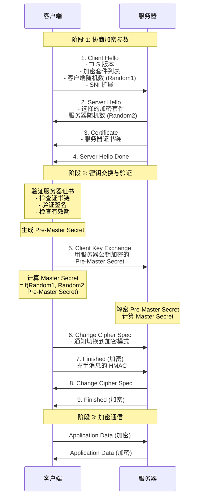
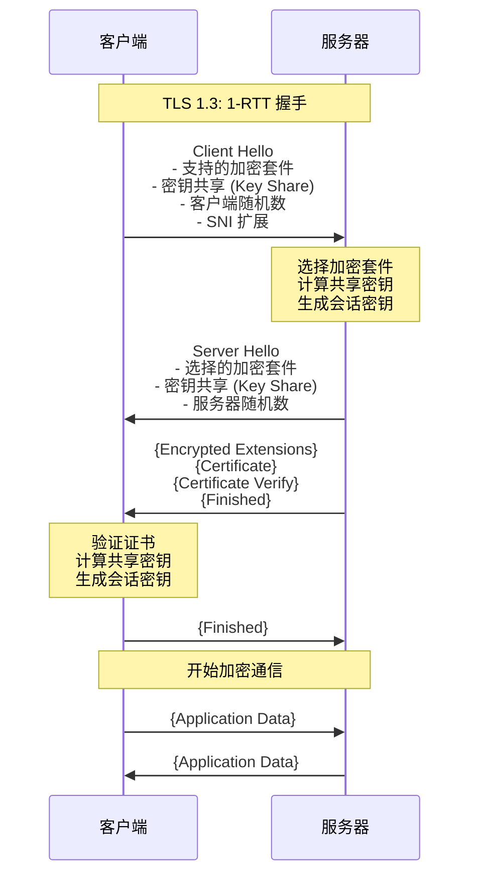
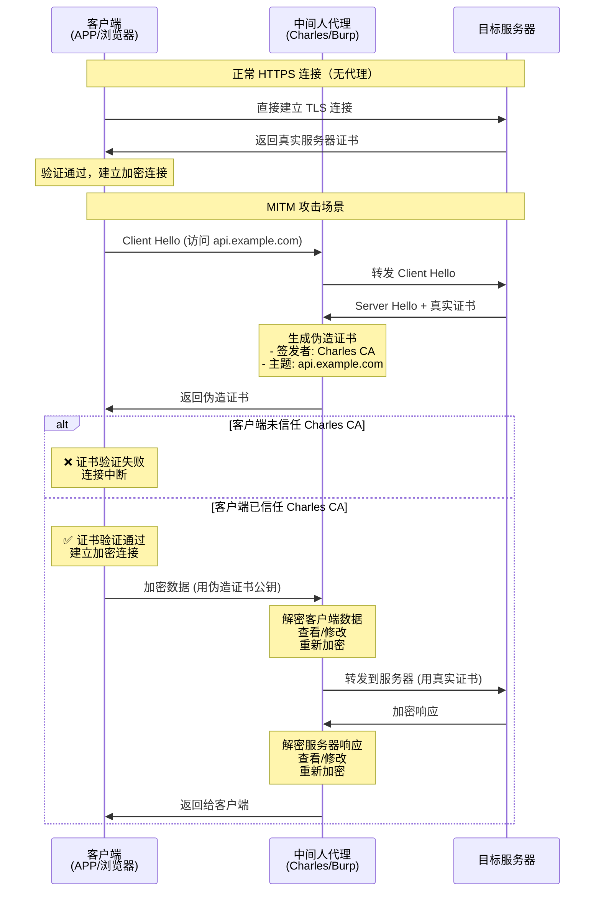
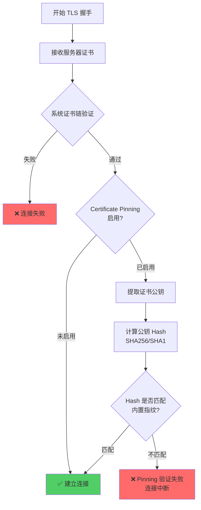
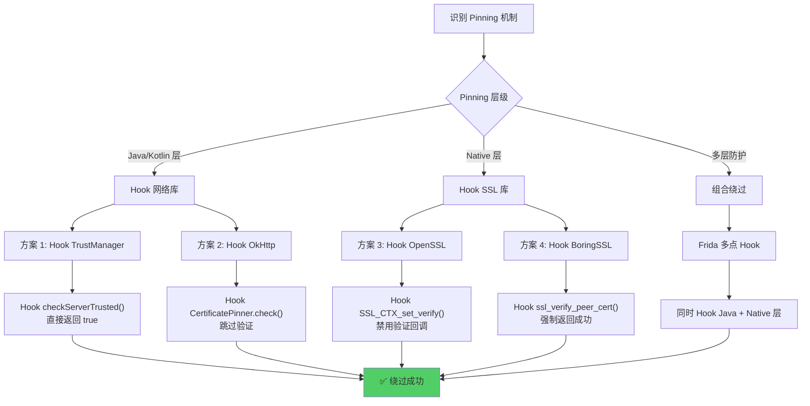

# TLS/SSL 握手过程

## 概述

在 HTTPS 通信中，TLS/SSL 握手是建立安全连接的第一个环节。对于逆向工程，理解握手过程是破解 SSL Pinning（证书固定）和进行流量解密（MITM）的基础。

---

## TLS 1.2 握手流程（详细）

### 握手序列图



### 1. 协商阶段 (Hello)

- **Client Hello**: 客户端发送支持的加密套件 (Cipher Suites)、TLS 版本、随机数 (Random1) 以及扩展字段（如 SNI 指明域名）。
- **JA3 指纹**: 这里的 Client Hello 特征（加密套件顺序、扩展字段等）常被用于识别客户端指纹（JA3），用于反爬虫。
- **Server Hello**: 服务器选择一组加密套件，发送自己的随机数 (Random2) 和 **数字证书**。

### 2. 验证与密钥交换 (Key Exchange)

- **证书验证**: 客户端验证服务器发来的证书是否可信（校验证书链、签名、有效期）。
- **密钥生成**: 客户端生成"预主密钥" (Pre-Master Secret)，用服务器证书中的公钥加密后发送给服务器。
- _注_: 在 TLS 1.3 或使用了 PFS (完美前向保密) 的算法中，密钥交换机制更复杂（Diffie-Hellman），不直接传输密钥。

### 3. 加密通信 (Finished)

- 双方利用 Random1 + Random2 + Pre-Master Secret 计算出最终的 **Session Key**。
- 后续数据全部用 Session Key 进行对称加密传输。

---

## TLS 1.3 握手流程（简化）

TLS 1.3 大幅简化了握手过程，减少了往返次数（1-RTT）：



**TLS 1.3 主要改进**:

- **1-RTT**: 只需一次往返即可建立加密连接（TLS 1.2 需要 2-RTT）
- **0-RTT**: 恢复会话时可实现零往返（但有重放攻击风险）
- **密钥交换**: 仅支持 PFS (完美前向保密) 算法，如 ECDHE
- **去除弱加密**: 移除 RSA 密钥交换、静态 DH 等不安全算法

---

## 逆向中的关键点

### 1. 为什么 Charles/Fiddler 抓不到 HTTPS 包？

因为中间人（Charles）发给客户端的是 Charles 自己签发的伪造证书。

- 如果客户端（APP/浏览器）不信任 Charles 的根证书，握手就会在"证书验证"阶段失败，连接断开。

#### MITM 攻击原理图



### 2. Certificate Pinning (证书固定)

为了防止中间人攻击，许多 APP 内置了服务器证书的指纹（Hash），在 TLS 握手时，不仅验证证书是否可信，还要比对公钥 Hash 是否与内置的一致。如果仅仅在系统中安装了 Charles 证书，APP 发现 Hash 不匹配，依然会报错。

#### Certificate Pinning 验证流程



#### Pinning 实现示例

**Android (OkHttp)**:

```java
// 内置证书公钥 Hash
CertificatePinner certificatePinner = new CertificatePinner.Builder()
.add("api.example.com", "sha256/AAAAAAAAAAAAAAAAAAAAAAAAAAAAAAAAAAAAAAAAAAA=")
.build();

OkHttpClient client = new OkHttpClient.Builder()
.certificatePinner(certificatePinner)
.build();
```

**iOS (Swift)**:

```swift
func urlSession(_ session: URLSession,
didReceive challenge: URLAuthenticationChallenge,
completionHandler: @escaping (URLSession.AuthChallengeDisposition, URLCredential?) -> Void) {

guard let serverTrust = challenge.protectionSpace.serverTrust,
let certificate = SecTrustGetCertificateAtIndex(serverTrust, 0) else {
completionHandler(.cancelAuthenticationChallenge, nil)
return
}

// 计算公钥 Hash
let serverPublicKeyHash = sha256(certificate)
let pinnedHash = "AAAAAAAAAAAAAAAAAAAAAAAAAAAAAAAAAAAAAAAAAAA="

if serverPublicKeyHash == pinnedHash {
completionHandler(.useCredential, URLCredential(trust: serverTrust))
} else {
completionHandler(.cancelAuthenticationChallenge, nil)
}
}
```

#### [Reverse Engineering Context] 绕过 Pinning

Pinning 逻辑通常在网络库（OkHttp, AFNetworking）或 Native 层（OpenSSL, BoringSSL）的回调中。



**绕过方法**:

- **Android (Java 层)**:
Hook `javax.net.ssl.X509TrustManager.checkServerTrusted`，让其永远不抛异常。

```javascript
// Frida Hook 示例
Java.perform(function () {
var TrustManager = Java.use("javax.net.ssl.X509TrustManager");
TrustManager.checkServerTrusted.implementation = function (
chain,
authType
) {
console.log("[+] Bypassing SSL Pinning - TrustManager");
// 直接返回，不抛出异常
};
});
```

- **Native 层 (so 修改)**:
Hook SSL 库的验证函数，如 `SSL_CTX_set_custom_verify` 或直接 Hook 握手结果。

```javascript
// Hook OpenSSL
Interceptor.attach(
Module.findExportByName("libssl.so", "SSL_CTX_set_verify"),
{
onEnter: function (args) {
console.log("[+] SSL_CTX_set_verify called");
// 将 verify_callback 设置为 NULL，禁用验证
args[1] = ptr(0);
},
}
);
```

### 3. 双向认证 (Mutual TLS / mTLS)

服务器要求客户端也出示证书。

- **表现**: 抓包看到服务器返回 `400 Bad Request (No Client Certificate)`。
- **逆向**: 需要从 APK/IPA 或设备文件系统中提取出 `.p12` 或 `.bks` 客户端证书，并导入到 Charles/Burp 中。

---

## 总结

TLS 握手是 HTTP 之前的“暗号对接”。

- **正向**: 保证数据不被窃听和篡改。
- **逆向**: 我们就是那个“窃听者”和“篡改者”。因此，我们的工作重心是让自己成为客户端信任的“中间人”（绕过证书校验/Pinning），或者直接拿到通信密钥（Hook OpenSSL）。
