# PWA 与 Service Worker 逆向

## 概述

渐进式 Web 应用 (Progressive Web Apps, PWA) 和 Service Worker 技术使得 Web 应用能够离线工作、接收推送通知并提供类似原生应用的体验。在逆向工程中，理解 Service Worker 的工作原理对于分析现代 Web 应用、绕过缓存策略和理解请求拦截机制至关重要。

---

## 📚 前置知识

在开始本配方之前，建议先掌握以下内容：

| 知识领域 | 重要程度 | 参考资料 |
|----------|---------|---------|
| DOM 与 BOM | 必需 | [DOM 与 BOM](../01-Foundations/dom_and_bom.md) |
| JavaScript 执行机制 | 必需 | [JavaScript 执行机制](../01-Foundations/javascript_execution_mechanism.md) |
| Web API 与 Ajax | 必需 | [Web API 与 Ajax](../01-Foundations/web_api_and_ajax.md) |
| Chrome DevTools | 推荐 | [浏览器开发者工具](../02-Tooling/browser_devtools.md) |
| Hook 技术 | 推荐 | [Hook 技术](../03-Basic-Recipes/hooking_techniques.md) |

> 💡 **提示**: Service Worker 可以**拦截所有网络请求**，这为逆向分析带来了新的挑战。理解 SW 的生命周期和缓存策略，有助于分析 PWA 应用的数据流向。

---

## 基础概念

### 定义

**PWA (Progressive Web App)** 是一种使用现代 Web 技术构建的应用，具有类似原生应用的体验：

- 可安装到主屏幕
- 离线工作
- 后台同步
- 推送通知
- 快速响应

**Service Worker** 是 PWA 的核心技术，是运行在浏览器后台的脚本：

- 独立于网页的生命周期
- 可以拦截和处理网络请求
- 实现离线缓存和策略
- 无法直接访问 DOM
- 使用 Promise 进行异步操作

### 核心原理

#### Service Worker 生命周期

```mermaid
stateDiagram-v2
[*] --> Parsed: 页面加载 SW 脚本

Parsed --> Installing: navigator.serviceWorker<br/>.register()
Installing --> Installed: install 事件完成<br/>waitUntil() Promise 解决

Installed --> Activating: 旧 SW 停止 或<br/>skipWaiting()
Activating --> Activated: activate 事件完成<br/>waitUntil() Promise 解决

Activated --> Idle: 准备就绪
Idle --> Fetch: 拦截网络请求
Idle --> Message: 接收页面消息
Idle --> Push: 接收推送通知
Idle --> Sync: 后台同步触发

Fetch --> Idle: 处理完成
Message --> Idle: 处理完成
Push --> Idle: 处理完成
Sync --> Idle: 处理完成

Idle --> Redundant: unregister() 或<br/>被新 SW 替换
Redundant --> [*]

note right of Installing
触发: install 事件
操作:
- 缓存静态资源
- 初始化数据库
end note

note right of Activating
触发: activate 事件
操作:
- 清理旧缓存
- 迁移数据
- clients.claim()
end note

note right of Idle
运行状态
监听事件:
- fetch (请求拦截)
- message (消息)
- push (推送)
- sync (后台同步)
end note
```



#### Service Worker 与页面交互流程

```mermaid
sequenceDiagram
participant Page as 网页<br/>(Main Thread)
participant SW as Service Worker<br/>(Worker Thread)
participant Cache as Cache Storage
participant Network as 网络服务器

Note over Page,Network: 1. 注册阶段
Page->>SW: navigator.serviceWorker.register('/sw.js')
activate SW
Note over SW: Parsed → Installing

SW->>SW: install 事件触发
SW->>Cache: cache.addAll([静态资源])
Cache-->>SW: 缓存完成
Note over SW: Installing → Installed

SW->>SW: activate 事件触发
SW->>Cache: 清理旧缓存版本
SW->>Page: clients.claim() 控制页面
Note over SW: Installed → Activated → Idle
deactivate SW

Note over Page,Network: 2. 运行阶段 - 请求拦截

Page->>SW: fetch('/api/data')
activate SW
Note over SW: fetch 事件触发

SW->>Cache: caches.match(request)
Cache-->>SW: 缓存命中/未命中

alt 缓存命中
SW-->>Page: 返回缓存响应 ⚡
else 缓存未命中
SW->>Network: fetch(request)
Network-->>SW: 网络响应
SW->>Cache: cache.put(request, response)
SW-->>Page: 返回网络响应
end
deactivate SW

Note over Page,Network: 3. 消息通信

Page->>SW: postMessage({type: 'SKIP_WAITING'})
activate SW
SW->>SW: message 事件触发
SW->>SW: self.skipWaiting()
SW-->>Page: postMessage({type: 'ACTIVATED'})
deactivate SW

Note over Page,Network: 4. 后台功能

Network->>SW: Push 通知
activate SW
SW->>SW: push 事件触发
SW->>Page: showNotification()
deactivate SW

SW->>SW: sync 事件触发
activate SW
SW->>Network: 后台数据同步
deactivate SW
```



**生命周期事件**:

1. **install**: Service Worker 首次安装时触发，用于缓存关键资源
2. **activate**: Service Worker 激活时触发，用于清理旧缓存和数据迁移
3. **fetch**: 每次网络请求时触发（如果注册了），实现请求拦截和缓存策略
4. **message**: 接收来自页面的消息，实现双向通信
5. **push**: 接收推送通知，即使页面未打开也能收到
6. **sync**: 后台同步，在网络恢复时同步数据

---

## 详细内容

### Service Worker 注册与检测

#### 1. **检测已注册的 Service Worker**

```javascript
// 检测当前页面是否有 Service Worker
if ("serviceWorker" in navigator) {
navigator.serviceWorker.getRegistrations().then((registrations) => {
console.log("Found Service Workers:", registrations.length);

registrations.forEach((registration, index) => {
console.log(`Service Worker ${index + 1}:`);
console.log(" Scope:", registration.scope);
console.log(" Active:", registration.active);
console.log(" Waiting:", registration.waiting);
console.log(" Installing:", registration.installing);

if (registration.active) {
console.log(" Script URL:", registration.active.scriptURL);
console.log(" State:", registration.active.state);
}
});
});
}
```

#### 2. **监控 Service Worker 状态**

```javascript
if ("serviceWorker" in navigator) {
navigator.serviceWorker.ready.then((registration) => {
console.log("Service Worker is ready");
console.log("Scope:", registration.scope);

// 监听状态变化
if (registration.active) {
registration.active.addEventListener("statechange", (e) => {
console.log("Service Worker state changed:", e.target.state);
});
}
});

// 监听更新
navigator.serviceWorker.addEventListener("updatefound", () => {
console.log("Service Worker update found");
});

// 监听控制器变化
navigator.serviceWorker.addEventListener("controllerchange", () => {
console.log("Service Worker controller changed");
});
}
```

### 拦截和分析请求

#### 1. **读取 Service Worker 脚本**

```javascript
// 获取 Service Worker 脚本内容
async function fetchServiceWorkerScript(registration) {
if (!registration.active) {
console.log("No active Service Worker");
return;
}

const scriptURL = registration.active.scriptURL;
console.log("Fetching Service Worker script:", scriptURL);

try {
const response = await fetch(scriptURL);
const script = await response.text();
console.log("Service Worker script:");
console.log(script);
return script;
} catch (e) {
console.error("Failed to fetch Service Worker:", e);
}
}

// 使用
navigator.serviceWorker.getRegistrations().then((registrations) => {
if (registrations.length > 0) {
fetchServiceWorkerScript(registrations[0]);
}
});
```

#### 2. **Hook Service Worker 注册**

```javascript
// 拦截 Service Worker 注册
(function () {
const originalRegister = navigator.serviceWorker.register;

navigator.serviceWorker.register = function (scriptURL, options) {
console.log("[SW Register] Intercepted:", scriptURL, options);

// 可以修改脚本 URL 或选项
return originalRegister
.call(this, scriptURL, options)
.then((registration) => {
console.log("[SW Register] Success:", registration);

// 监听安装和激活
if (registration.installing) {
registration.installing.addEventListener("statechange", function (e) {
console.log("[SW State]", e.target.state);
});
}

return registration;
});
};
})();
```

#### 3. **监听 Service Worker 消息**

```javascript
// 发送消息到 Service Worker
navigator.serviceWorker.controller?.postMessage({
type: "GET_CACHE_INFO",
timestamp: Date.now(),
});

// 接收来自 Service Worker 的消息
navigator.serviceWorker.addEventListener("message", (event) => {
console.log("Message from Service Worker:", event.data);
});
```

### 缓存分析

#### 1. **枚举所有缓存**

```javascript
async function listAllCaches() {
if (!("caches" in window)) {
console.log("Cache API not supported");
return;
}

const cacheNames = await caches.keys();
console.log("Found caches:", cacheNames);

for (const cacheName of cacheNames) {
console.log(`\n=== Cache: ${cacheName} ===`);
const cache = await caches.open(cacheName);
const keys = await cache.keys();

console.log(`Total entries: ${keys.length}`);
keys.forEach((request, i) => {
console.log(` ${i + 1}. ${request.url}`);
});
}
}

listAllCaches();
```

#### 2. **读取缓存内容**

```javascript
async function dumpCacheContent(cacheName, urlPattern) {
const cache = await caches.open(cacheName);
const keys = await cache.keys();

for (const request of keys) {
if (!urlPattern || request.url.includes(urlPattern)) {
const response = await cache.match(request);
const headers = {};
response.headers.forEach((value, key) => {
headers[key] = value;
});

console.log("URL:", request.url);
console.log("Status:", response.status);
console.log("Headers:", headers);

// 根据内容类型读取响应体
const contentType = response.headers.get("content-type");
if (contentType?.includes("json")) {
const json = await response.clone().json();
console.log("JSON:", json);
} else if (
contentType?.includes("text") ||
contentType?.includes("javascript")
) {
const text = await response.clone().text();
console.log("Text:", text.substring(0, 500));
} else {
const blob = await response.clone().blob();
console.log("Blob size:", blob.size, "bytes");
}
console.log("---");
}
}
}

// 使用
dumpCacheContent("my-cache-v1", "api");
```

#### 3. **清除特定缓存**

```javascript
async function clearCache(cacheName) {
const deleted = await caches.delete(cacheName);
console.log(`Cache "${cacheName}" deleted:`, deleted);
}

async function clearAllCaches() {
const cacheNames = await caches.keys();
await Promise.all(cacheNames.map((name) => caches.delete(name)));
console.log("All caches cleared");
}
```

### Service Worker 内部代码示例

#### 典型的 Service Worker 结构

```javascript
// service-worker.js

const CACHE_NAME = "my-app-v1";
const urlsToCache = ["/", "/styles/main.css", "/scripts/app.js"];

// 安装事件 - 缓存资源
self.addEventListener("install", (event) => {
console.log("[SW] Installing...");

event.waitUntil(
caches
.open(CACHE_NAME)
.then((cache) => {
console.log("[SW] Caching app shell");
return cache.addAll(urlsToCache);
})
.then(() => self.skipWaiting()) // 立即激活
);
});

// 激活事件 - 清理旧缓存
self.addEventListener("activate", (event) => {
console.log("[SW] Activating...");

event.waitUntil(
caches
.keys()
.then((cacheNames) => {
return Promise.all(
cacheNames.map((cacheName) => {
if (cacheName !== CACHE_NAME) {
console.log("[SW] Deleting old cache:", cacheName);
return caches.delete(cacheName);
}
})
);
})
.then(() => self.clients.claim()) // 立即控制页面
);
});

// Fetch 事件 - 网络请求拦截
self.addEventListener("fetch", (event) => {
console.log("[SW] Fetching:", event.request.url);

event.respondWith(
// 缓存优先策略
caches.match(event.request).then((response) => {
if (response) {
console.log("[SW] Cache hit:", event.request.url);
return response;
}

console.log("[SW] Cache miss, fetching:", event.request.url);
return fetch(event.request).then((response) => {
// 缓存新响应
if (response.status === 200) {
const responseClone = response.clone();
caches.open(CACHE_NAME).then((cache) => {
cache.put(event.request, responseClone);
});
}
return response;
});
})
);
});

// 消息处理
self.addEventListener("message", (event) => {
console.log("[SW] Message received:", event.data);

if (event.data.type === "SKIP_WAITING") {
self.skipWaiting();
}

// 回复消息
event.ports[0].postMessage({
type: "PONG",
timestamp: Date.now(),
});
});
```

---

## 实战示例

### 示例 1: Service Worker 调试工具

```javascript
class ServiceWorkerDebugger {
constructor() {
this.registrations = [];
}

async init() {
if (!('serviceWorker' in navigator)) {
console.error('Service Worker not supported');
return;
}

this.registrations = await navigator.serviceWorker.getRegistrations();
this.setupListeners();
await this.analyze();
}

setupListeners() {
// 监听新的 Service Worker
navigator.serviceWorker.addEventListener('controllerchange', () => {
console.log('[Debugger] Controller changed');
this.analyze();
});

// 监听消息
navigator.serviceWorker.addEventListener('message', event => {
console.log('[Debugger] Message:', event.data);
});
}

async analyze() {
console.log('=== Service Worker Analysis ===');
console.log(`Found ${this.registrations.length} registration(s)`);

for (const reg of this.registrations) {
console.log('\nRegistration:');
console.log(' Scope:', reg.scope);

if (reg.active) {
console.log(' Active:', reg.active.scriptURL);
await this.analyzeWorker(reg.active);
}

if (reg.waiting) {
console.log(' Waiting:', reg.waiting.scriptURL);
}

if (reg.installing) {
console.log(' Installing:', reg.installing.scriptURL);
}
}

await this.analyzeCaches();
}

async analyzeWorker(worker) {
try {
const response = await fetch(worker.scriptURL);
const code = await response.text();

console.log(' Script size:', code.length, 'bytes');

// 分析代码特征
const features = {
hasInstallListener: code.includes("addEventListener('install'"),
hasActivateListener: code.includes("addEventListener('activate'"),
hasFetchListener: code.includes("addEventListener('fetch'"),
hasMessageListener: code.includes("addEventListener('message'"),
hasPushListener: code.includes("addEventListener('push'"),
usesCacheAPI: code.includes('caches.'),
usesIndexedDB: code.includes('indexedDB'),
hasWorkbox: code.includes('workbox')
};

console.log(' Features:', features);
} catch(e) {
console.error(' Failed to analyze:', e);
}
}

async analyzeCaches() {
console.log('\n=== Cache Analysis ===');
const cacheNames = await caches.keys();
console.log(`Found ${cacheNames.length} cache(s)`);

for (const name of cacheNames) {
const cache = await caches.open(name);
const keys = await cache.keys();
console.log(`\n${name}: ${keys.length} entries`);

// 显示前5个条目
for (let i = 0; i < Math.min(5, keys.length); i++) {
console.log(` - ${keys[i].url}`);
}
if (keys.length > 5) {
console.log(` ... and ${keys.length - 5} more`);
}
}
}

async sendMessage(data) {
if (!navigator.serviceWorker.controller) {
console.error('No active Service Worker controller');
return;
}

const channel = new MessageChannel();

return new Promise((resolve, reject) => {
channel.port1.onmessage = event => {
resolve(event.data);
};

navigator.serviceWorker.controller.postMessage(data, [channel.port2]);

setTimeout(() => reject('Timeout'), 5000);
});
}

async unregisterAll() {
for (const reg of this.registrations) {
await reg.unregister();
console.log('Unregistered:', reg.scope);
}
}
}

// 使用
const debugger = new ServiceWorkerDebugger();
debugger.init();
```

### 示例 2: 绕过 Service Worker 缓存

```javascript
// 方法1: 强制绕过缓存
async function bypassServiceWorkerCache(url) {
return fetch(url, {
cache: "no-store",
headers: {
"Cache-Control": "no-cache",
Pragma: "no-cache",
},
});
}

// 方法2: 临时注销 Service Worker
async function fetchWithoutServiceWorker(url) {
const registrations = await navigator.serviceWorker.getRegistrations();

// 保存注册信息
const savedRegs = registrations.map((r) => ({
scriptURL: r.active?.scriptURL,
scope: r.scope,
}));

// 注销所有 Service Worker
await Promise.all(registrations.map((r) => r.unregister()));

// 执行请求
const response = await fetch(url);

// 重新注册 Service Worker
for (const reg of savedRegs) {
if (reg.scriptURL) {
await navigator.serviceWorker.register(reg.scriptURL, {
scope: reg.scope,
});
}
}

return response;
}

// 方法3: 使用 iframe 绕过
async function fetchInIframe(url) {
return new Promise((resolve, reject) => {
const iframe = document.createElement("iframe");
iframe.style.display = "none";
iframe.src = "about:blank";

iframe.onload = async () => {
try {
const response = await iframe.contentWindow.fetch(url);
const data = await response.text();
resolve(data);
} catch (e) {
reject(e);
} finally {
document.body.removeChild(iframe);
}
};

document.body.appendChild(iframe);
});
}
```

### 示例 3: Service Worker 代理

```javascript
// 注册一个自定义的 Service Worker 来拦截和修改请求

// proxy-sw.js
self.addEventListener("fetch", (event) => {
const url = new URL(event.request.url);

// 拦截 API 请求
if (url.pathname.startsWith("/api/")) {
event.respondWith(
fetch(event.request).then((response) => {
// 克隆响应以便读取
const clonedResponse = response.clone();

// 记录响应
clonedResponse.json().then((data) => {
console.log("[Proxy SW] API Response:", url.pathname, data);

// 发送到主线程
self.clients.matchAll().then((clients) => {
clients.forEach((client) => {
client.postMessage({
type: "API_RESPONSE",
url: url.href,
data: data,
});
});
});
});

return response;
})
);
return;
}

// 默认行为
event.respondWith(fetch(event.request));
});

// 主页面中注册
navigator.serviceWorker.register("/proxy-sw.js", { scope: "/" });

// 监听拦截的数据
navigator.serviceWorker.addEventListener("message", (event) => {
if (event.data.type === "API_RESPONSE") {
console.log("Intercepted API call:", event.data.url);
console.log("Data:", event.data.data);
}
});
```

---

## 最佳实践

### 逆向分析流程

1. **检测 Service Worker 存在**

- 检查 `navigator.serviceWorker` API
- 查看开发者工具 Application 面板
- 枚举所有注册

2. **提取 Service Worker 脚本**

- 获取脚本 URL
- 下载并分析代码
- 识别缓存策略

3. **分析缓存内容**

- 枚举所有缓存
- 提取缓存的 API 响应
- 寻找敏感数据

4. **监控网络拦截**
- 识别被拦截的请求
- 分析请求/响应修改
- 绕过缓存机制

### 安全考虑

**作为开发者**:

1. **不要缓存敏感数据**

- 避免缓存包含 Token 的 API 响应
- 不要缓存用户个人信息

2. **实施缓存版本控制**

- 更新时清理旧缓存
- 使用版本号命名缓存

3. **验证 Service Worker 来源**
- 使用 HTTPS
- 实施 CSP 限制

**作为研究者**:

1. **合法授权**

- 仅在授权范围内分析
- 遵守负责任披露原则

2. **隐私保护**
- 不要泄露用户数据
- 测试时使用测试账号

---

## 常见问题

### Q: Service Worker 能访问 Cookie 吗？

**A**: Service Worker 无法直接访问 `document.cookie`，但：

- Fetch 请求会自动携带 Cookie
- 可以通过拦截请求读取 `Cookie` 头
- 可以设置响应的 `Set-Cookie` 头（受同源策略限制）

### Q: 如何调试 Service Worker？

**A**:

1. **Chrome DevTools**:

- Application → Service Workers
- 可以启动/停止、更新、注销
- 可以在 Sources 中设置断点

2. **Firefox DevTools**:

- about:debugging → This Firefox → Service Workers
- 可以启动和注销

3. **编程方式**:

```
chrome://inspect/#service-workers // Chrome
about:debugging#/runtime/this-firefox // Firefox
```

### Q: Service Worker 能被禁用吗？

**A**:

- 用户可以在浏览器设置中禁用
- 开发者可以通过 `unregister()` 注销
- 某些浏览器扩展可以阻止 Service Worker

### Q: Service Worker 的作用域是什么？

**A**:
Service Worker 的作用域（scope）决定了它能控制哪些页面：

```javascript
// 只能控制 /app/ 下的页面
navigator.serviceWorker.register("/sw.js", { scope: "/app/" });

// 默认作用域是脚本所在目录
navigator.serviceWorker.register("/scripts/sw.js"); // scope = '/scripts/'
```

---

## 进阶阅读

### 官方文档

- [Service Worker API - MDN](https://developer.mozilla.org/en-US/docs/Web/API/Service_Worker_API)
- [PWA 文档 - web.dev](https://web.dev/progressive-web-apps/)
- [Cache API - MDN](https://developer.mozilla.org/en-US/docs/Web/API/Cache)

### 工具与库

- [Workbox](https://developers.google.com/web/tools/workbox) - Google 的 Service Worker 库
- [sw-toolbox](https://github.com/GoogleChromeLabs/sw-toolbox) - Service Worker 工具箱
- [PWA Builder](https://www.pwabuilder.com/) - PWA 生成器

### 安全研究

- [Service Worker Security](https://w3c.github.io/ServiceWorker/#security-considerations)
- [PWA Security Best Practices](https://web.dev/pwa-security/)

---

## 相关章节

- [浏览器调试技巧](../02-Techniques/browser_debugging.md)
- [离线存储分析](../02-Techniques/offline_storage.md)
- [CSP 绕过技术](./csp_bypass.md)
- [Web Worker 分析](../02-Techniques/web_worker_analysis.md)
