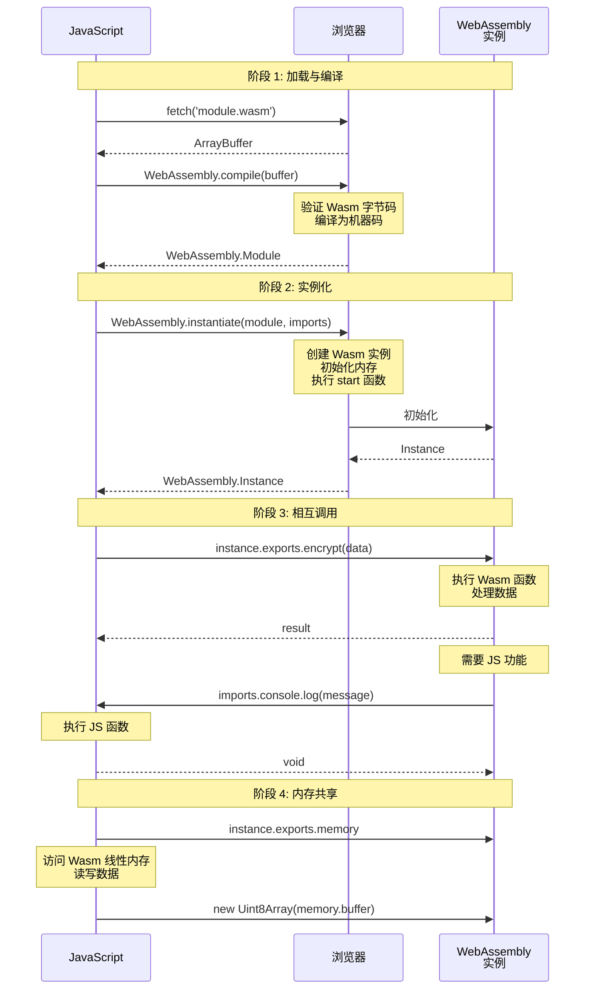
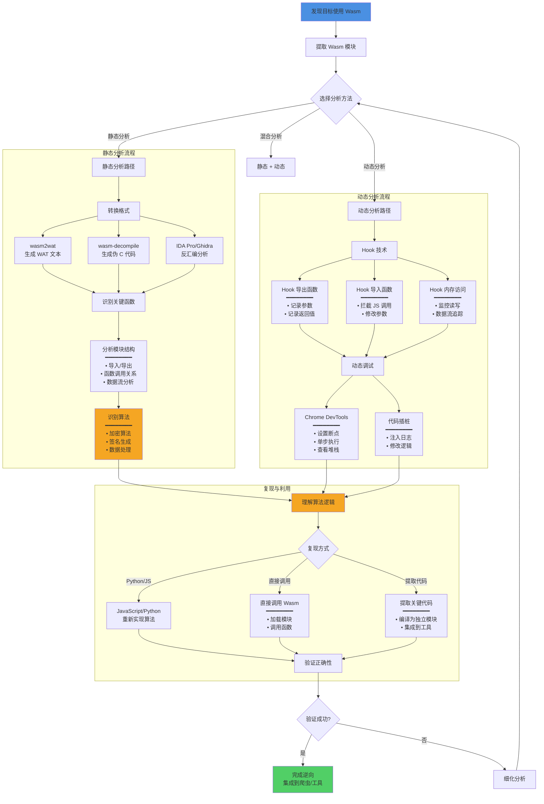

# WebAssembly 逆向

## 思考时刻

在深入 WebAssembly 逆向之前，先挑战一下你的认知：

1. **为什么 JavaScript 还不够快？** 什么场景下需要用到 WebAssembly？
2. **编译后的代码就安全了吗？** 二进制格式真的比 JavaScript 更难逆向吗？
3. **你能反编译 .exe 文件吗？** WebAssembly 和传统的二进制文件有什么区别？
4. **实战场景：** 某视频网站把解密算法编译成了 WebAssembly，加密参数经过 Wasm 处理后发送给服务器。你会如何下手分析？

WebAssembly 并不是逆向的终点，而是新的起点。

---

## 📚 前置知识

在开始本配方之前，建议先掌握以下内容：

| 知识领域 | 重要程度 | 参考资料 |
|----------|---------|---------|
| WebAssembly 基础 | 必需 | [WebAssembly 基础](../01-Foundations/webassembly_basics.md) |
| JavaScript 基础 | 必需 | [JavaScript 基础](../01-Foundations/javascript_basics.md) |
| V8 引擎工具 | 必需 | [V8 工具](../02-Tooling/v8_tools.md) |
| Chrome DevTools | 必需 | [浏览器开发者工具](../02-Tooling/browser_devtools.md) |
| 二进制分析基础 | 推荐 | 了解基本的汇编和二进制格式 |

> 💡 **提示**: WebAssembly 逆向需要一定的**底层知识**。如果没有汇编语言基础，建议先了解 WebAssembly 的指令集和内存模型，再进行实战分析。

---

## 概述

WebAssembly (Wasm) 是一种低级字节码格式，旨在在 Web 浏览器中以接近原生的性能运行代码。越来越多的 Web 应用使用 WebAssembly 来保护核心算法和提升性能，这也给逆向工程带来了新的挑战。

---

## 基础概念

### 定义

**WebAssembly (Wasm)** 是一种面向堆栈的虚拟机的二进制指令格式。它被设计为 C/C++/Rust 等高级语言的可移植编译目标，能够在 Web 上以接近原生性能运行。

**关键特点**:

- 二进制格式，体积小，加载快
- 基于堆栈的虚拟机
- 强类型系统
- 沙箱执行环境
- 与 JavaScript 互操作

### 核心原理

#### 1. 模块结构

WebAssembly 模块由多个部分组成：

```mermaid
graph TD
subgraph Wasm["WebAssembly 模块结构"]
Header[Magic Number<br/>0x00 0x61 0x73 0x6d<br/>Version: 0x01 0x00 0x00 0x00]

Type[Type Section<br/>类型定义<br/>━━━━━━━━<br/>• 函数签名<br/>• 参数类型<br/>• 返回值类型]

Import[Import Section<br/>导入声明<br/>━━━━━━━━<br/>• 导入函数<br/>• 导入内存<br/>• 导入表<br/>• 导入全局变量]

Function[Function Section<br/>函数签名索引<br/>━━━━━━━━<br/>引用 Type Section]

Table[Table Section<br/>间接函数表<br/>━━━━━━━━<br/>• 函数指针<br/>• 表大小]

Memory[Memory Section<br/>线性内存<br/>━━━━━━━━<br/>• 初始页数<br/>• 最大页数<br/>• 页大小: 64KB]

Global[Global Section<br/>全局变量<br/>━━━━━━━━<br/>• 类型<br/>• 初始值<br/>• 可变性]

Export[Export Section<br/>导出声明<br/>━━━━━━━━<br/>• 导出函数<br/>• 导出内存<br/>• 导出表<br/>• 导出全局变量]

Start[Start Section<br/>启动函数<br/>━━━━━━━━<br/>模块实例化时调用]

Element[Element Section<br/>表初始化<br/>━━━━━━━━<br/>初始化函数表]

Code[Code Section<br/>函数体<br/>━━━━━━━━<br/>• 局部变量<br/>• 指令序列]

Data[Data Section<br/>数据段<br/>━━━━━━━━<br/>• 静态数据<br/>• 字符串常量]
end

Header --> Type
Type --> Import
Import --> Function
Function --> Table
Table --> Memory
Memory --> Global
Global --> Export
Export --> Start
Start --> Element
Element --> Code
Code --> Data

style Header fill:#4a90e2
style Code fill:#f5a623
style Export fill:#7ed321
style Memory fill:#bd10e0
```



#### 2. 指令集架构

WebAssembly 使用基于堆栈的指令集：

- **数值操作**: `i32.add`, `i64.mul`, `f32.div`, `f64.sqrt`
- **内存操作**: `i32.load`, `i64.store`, `memory.grow`
- **控制流**: `block`, `loop`, `if`, `br`, `call`
- **变量操作**: `local.get`, `local.set`, `global.get`

#### 3. 与 JavaScript 交互



**代码示例**:

```javascript
// 加载 WebAssembly 模块
const response = await fetch("module.wasm");
const buffer = await response.arrayBuffer();

// 准备导入对象（Wasm 需要的 JS 功能）
const imports = {
env: {
console_log: (ptr, len) => {
// 从 Wasm 内存读取字符串
const memory = instance.exports.memory;
const bytes = new Uint8Array(memory.buffer, ptr, len);
const text = new TextDecoder().decode(bytes);
console.log(text);
},
},
};

// 编译并实例化
const module = await WebAssembly.compile(buffer);
const instance = await WebAssembly.instantiate(module, imports);

// 调用导出的函数
const result = instance.exports.myFunction(42);

// 访问导出的内存
const memory = instance.exports.memory;
const dataView = new DataView(memory.buffer);
```

---

## 详细内容

### WebAssembly 逆向工作流程



### 主要逆向方法

#### 1. **静态分析**

##### 工具链

- **wasm2wat**: 将二进制 Wasm 转换为可读的 WAT (WebAssembly Text Format)

```bash
wasm2wat module.wasm -o module.wat
```

- **wasm-objdump**: 查看模块结构和反汇编

```bash
wasm-objdump -x module.wasm # 显示所有段
wasm-objdump -d module.wasm # 反汇编
```

- **wasm-decompile**: 将 Wasm 反编译为伪 C 代码

```bash
wasm-decompile module.wasm -o output.c
```

- **IDA Pro / Ghidra**: 支持 WebAssembly 的反汇编和反编译
- IDA Pro 7.5+ 原生支持 Wasm
- Ghidra 需要安装 Wasm 插件

##### 分析步骤

1. **提取 Wasm 模块**

```javascript
// 从网页中拦截 Wasm 加载
const originalFetch = window.fetch;
window.fetch = function (...args) {
return originalFetch.apply(this, args).then((response) => {
if (args[0].endsWith(".wasm")) {
response
.clone()
.arrayBuffer()
.then((buffer) => {
// 保存到本地
const blob = new Blob([buffer], { type: "application/wasm" });
const url = URL.createObjectURL(blob);
console.log("Wasm module:", url);
});
}
return response;
});
};
```

2. **识别导出函数**

```bash
wasm-objdump -j export module.wasm
```

3. **分析函数调用关系**
- 查看 Import/Export Section
- 追踪 call 指令
- 分析间接调用 (call_indirect)

#### 2. **动态调试**

##### Chrome DevTools

Chrome DevTools 支持 WebAssembly 调试：

1. 在 Sources 面板中可以看到 Wasm 模块
2. 设置断点（显示为 WAT 格式）
3. 单步执行
4. 查看堆栈和变量

##### Wasmer/Wasmtime 调试

使用独立运行时调试：

```bash
# 使用 Wasmtime 运行并调试
wasmtime run --invoke function_name module.wasm

# 使用 Wasmer
wasmer run module.wasm --invoke function_name
```

##### 内存检查

```javascript
// 访问 Wasm 线性内存
const memory = instance.exports.memory;
const buffer = new Uint8Array(memory.buffer);

// 读取特定地址的数据
const dataView = new DataView(memory.buffer);
const value = dataView.getInt32(address, true); // true = little-endian

// Hook 内存访问
const originalMemory = instance.exports.memory;
Object.defineProperty(instance.exports, "memory", {
get: function () {
console.log("Memory accessed");
return originalMemory;
},
});
```

#### 3. **Hook 技术**

##### Hook 导出函数

```javascript
// Hook Wasm 导出函数
const originalFunc = instance.exports.encrypt;
instance.exports.encrypt = function (...args) {
console.log("encrypt called with:", args);
const result = originalFunc.apply(this, args);
console.log("encrypt returned:", result);
return result;
};
```

##### Hook 导入函数

```javascript
// 在实例化时提供 Hook 的导入
const imports = {
env: {
// Hook 原本由 JavaScript 提供的函数
console_log: function (ptr, len) {
const memory = instance.exports.memory;
const bytes = new Uint8Array(memory.buffer, ptr, len);
const str = new TextDecoder().decode(bytes);
console.log("[Wasm Log]:", str);
},
},
};

const instance = await WebAssembly.instantiate(module, imports);
```

##### Frida Hook

```javascript
// 使用 Frida Hook WebAssembly
Interceptor.attach(Module.findExportByName(null, "wasm_function"), {
onEnter: function (args) {
console.log("Arguments:", args[0], args[1]);
},
onLeave: function (retval) {
console.log("Return value:", retval);
},
});
```

---

## 实战示例

### 示例 1: 反编译加密函数

假设某网站使用 Wasm 实现加密算法：

```javascript
// 1. 拦截并保存 Wasm 模块
let wasmModule;
const originalInstantiate = WebAssembly.instantiate;
WebAssembly.instantiate = async function (bytes, imports) {
wasmModule = bytes;
console.log("Captured Wasm module, size:", bytes.byteLength);

// 保存到 IndexedDB 以便后续分析
const blob = new Blob([bytes], { type: "application/wasm" });
const url = URL.createObjectURL(blob);
console.log("Download URL:", url);

return originalInstantiate.call(this, bytes, imports);
};

// 2. 使用 wasm2wat 转换
// $ wasm2wat crypto.wasm -o crypto.wat

// 3. 分析 WAT 代码找到加密逻辑
// (func $encrypt (param $0 i32) (param $1 i32) (result i32)
// local.get $0
// local.get $1
// i32.xor
// i32.const 0x5A5A5A5A
// i32.add
// )

// 4. 在 JavaScript 中重新实现
function decryptedEncrypt(data, key) {
return (data ^ key) + 0x5a5a5a5a;
}
```

### 示例 2: 修改 Wasm 行为

```javascript
// 修改 Wasm 函数的返回值
const instance = await WebAssembly.instantiate(module);

// 保存原始函数
const originalCheckLicense = instance.exports.checkLicense;

// 替换函数让其总是返回 true
instance.exports.checkLicense = function () {
console.log("License check bypassed");
return 1; // 返回 true
};
```

### 示例 3: 内存 Dump 分析

```javascript
// Dump Wasm 线性内存
function dumpMemory(instance, start, length) {
const memory = new Uint8Array(instance.exports.memory.buffer);
const data = memory.slice(start, start + length);

// 转换为十六进制字符串
const hex = Array.from(data)
.map((b) => b.toString(16).padStart(2, "0"))
.join(" ");

console.log(
`Memory [${start.toString(16)}-${(start + length).toString(16)}]:`,
hex
);

// 尝试作为字符串解析
try {
const str = new TextDecoder().decode(data);
console.log("As string:", str);
} catch (e) {}

return data;
}

// 使用
dumpMemory(instance, 0x1000, 256);
```

---

## 最佳实践

### 逆向分析流程

1. **信息收集**

- 识别 Wasm 模块的加载方式
- 确定模块与 JavaScript 的交互接口
- 记录导入/导出函数

2. **静态分析优先**

- 使用 wasm2wat 获取可读格式
- 使用 wasm-decompile 获得伪代码
- 在 IDA Pro/Ghidra 中深入分析

3. **动态验证**

- 使用 Chrome DevTools 调试
- Hook 关键函数验证假设
- 监控内存变化

4. **文档化发现**
- 记录函数签名和用途
- 绘制调用关系图
- 标注关键算法

### 常用技巧

1. **识别字符串**: Wasm 没有字符串类型，通常存储在线性内存中

```bash
strings module.wasm | grep -i "password"
```

2. **寻找密钥**: 在 Data Section 中查找可疑常量

```bash
wasm-objdump -s -j data module.wasm
```

3. **追踪算法**: 识别常见加密算法的特征模式
- AES: S-box 查找表
- RSA: 大整数运算
- SHA: 固定的初始化向量

---

## 常见问题

### Q: 如何从网页中提取 Wasm 模块？

**A**: 有多种方法：

1. **Network 面板**: 在 Chrome DevTools 的 Network 标签中过滤 `.wasm` 文件
2. **覆盖 WebAssembly API**: 拦截 `fetch` 或 `WebAssembly.instantiate`
3. **浏览器扩展**: 使用 Wasm Dumper 等扩展
4. **代理工具**: 使用 Burp Suite 或 mitmproxy 拦截

### Q: Wasm 能否被混淆？

**A**: 可以，但效果有限：

- 变量名在编译后会丢失
- 函数可以被重命名
- 控制流可以被混淆（插入死代码、拆分基本块）
- 常量可以被加密
- 但指令集有限，模式识别相对容易

### Q: 如何处理加密的 Wasm 模块？

**A**:

1. 在 `WebAssembly.compile` 或 `instantiate` 处下断点
2. 此时模块已解密，从内存中提取
3. 或者 Hook 解密函数，记录解密后的字节

### Q: Wasm 逆向比 JavaScript 逆向更难吗？

**A**: 各有特点：

- **Wasm 优势**: 指令集简单、类型明确、无动态特性
- **Wasm 劣势**: 缺少符号信息、编译优化导致代码复杂
- **总体**: 小型 Wasm 模块通常更容易分析，大型模块需要专业工具

---

## 进阶阅读

### 官方资源

- [WebAssembly 官方规范](https://webassembly.github.io/spec/)
- [MDN WebAssembly 文档](https://developer.mozilla.org/en-US/docs/WebAssembly)
- [WebAssembly 指令集参考](https://webassembly.github.io/spec/core/exec/instructions.html)

### 工具与项目

- [WABT (WebAssembly Binary Toolkit)](https://github.com/WebAssembly/wabt) - 官方工具集
- [Binaryen](https://github.com/WebAssembly/binaryen) - 优化和编译工具
- [wasmtime](https://wasmtime.dev/) - 独立 Wasm 运行时
- [wasmer](https://wasmer.io/) - 另一个 Wasm 运行时

### 安全研究

- [WebAssembly Security: Potentials and Pitfalls](https://www.ndss-symposium.org/wp-content/uploads/2020/02/23071-paper.pdf)
- [Everything Old is New Again: Binary Security of WebAssembly](https://www.usenix.org/system/files/sec20-lehmann.pdf)
- [Analyzing WebAssembly Binaries](https://webassembly-security.com/)

---

## 相关章节

- [JavaScript 虚拟机保护](./javascript_vm_protection.md)
- [前端加固技术](./frontend_hardening.md)
- [JavaScript 反混淆](../04-Advanced-Recipes/javascript_deobfuscation.md)
- [浏览器调试技巧](../02-Techniques/browser_debugging.md)
