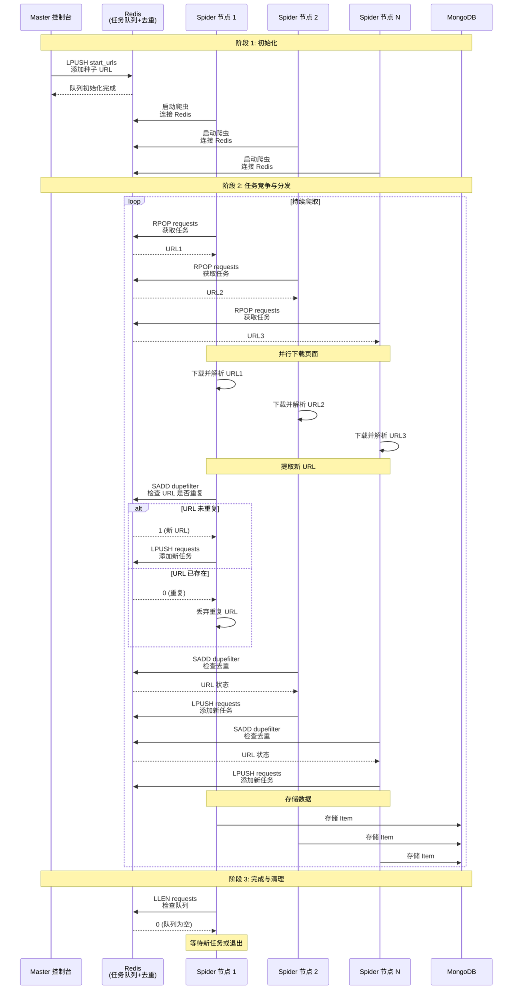
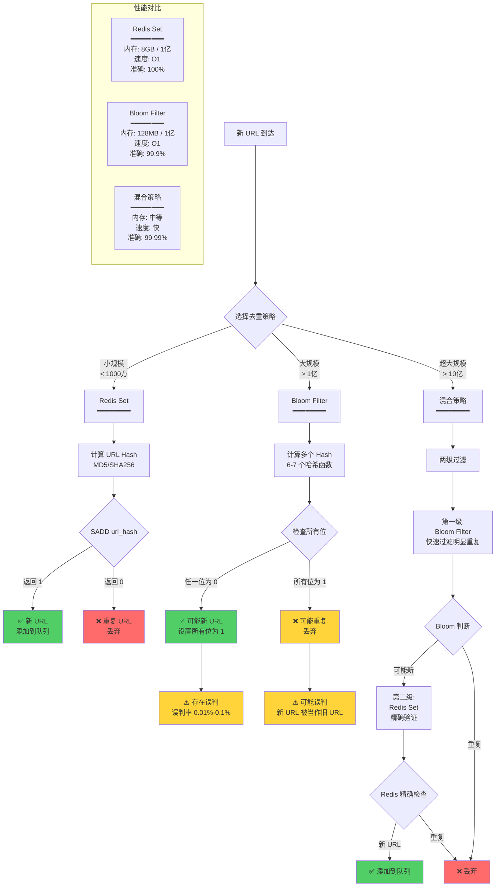

# 分布式爬虫架构

## 概述

随着数据规模的不断扩大，单机爬虫在性能、稳定性和效率上遇到了瓶颈。分布式爬虫架构通过将爬取任务分散到多台机器上并行执行，可以大幅提升爬取效率，实现千万级甚至亿级的数据采集。

本文介绍分布式爬虫的核心概念、主流框架、架构设计、去重策略以及生产环境的最佳实践。

---

## 基础概念

### 定义

**分布式爬虫**是指将网页抓取任务分散到多个独立的爬虫节点上并行执行的爬虫系统。与单机爬虫相比，分布式爬虫通过任务分发、数据共享和协同工作，实现了更高的吞吐量和更强的容错能力。

### 核心原理

分布式爬虫的核心是解决以下几个关键问题：

1. **任务调度**：如何有效地将待爬取的 URL 分配给各个爬虫节点
2. **URL 去重**：如何在多节点环境下避免重复爬取同一个 URL
3. **数据共享**：如何让各节点共享任务队列、去重集合和配置信息
4. **负载均衡**：如何保证各节点的任务量相对均衡
5. **故障恢复**：如何处理节点故障，保证任务不丢失

#### 典型架构

```mermaid
graph TB
subgraph Admin["管理控制层"]
Monitor[监控中心<br/>Prometheus + Grafana<br/>━━━━━━━━<br/>• 爬取速度监控<br/>• 成功率统计<br/>• 队列长度告警<br/>• 节点健康检查]
Config[配置中心<br/>Consul / etcd<br/>━━━━━━━━<br/>• 动态配置<br/>• 服务发现<br/>• 参数管理]
end

subgraph Master["任务调度中心 (Master)"]
Redis[Redis Cluster<br/>━━━━━━━━<br/>• 任务队列 (List/ZSet)<br/>• URL 去重 (Set/BloomFilter)<br/>• 分布式锁<br/>• 节点心跳]
MQ[消息队列<br/>RabbitMQ / Kafka<br/>━━━━━━━━<br/>• 任务分发<br/>• 优先级调度<br/>• 持久化队列]
end

subgraph Workers["爬虫工作节点 (Workers)"]
W1[Worker 1<br/>━━━━━━━━<br/>• Scrapy Engine<br/>• Downloader<br/>• Parser<br/>16 并发]
W2[Worker 2<br/>━━━━━━━━<br/>• Scrapy Engine<br/>• Downloader<br/>• Parser<br/>16 并发]
W3[Worker 3<br/>━━━━━━━━<br/>• Scrapy Engine<br/>• Downloader<br/>• Parser<br/>16 并发]
WN[Worker N<br/>━━━━━━━━<br/>• Scrapy Engine<br/>• Downloader<br/>• Parser<br/>16 并发]
end

subgraph Proxy["代理池"]
ProxyPool[IP 代理池<br/>━━━━━━━━<br/>• 代理轮换<br/>• 健康检查<br/>• 故障转移]
end

subgraph Storage["数据存储层"]
MongoDB[(MongoDB<br/>━━━━━━━━<br/>• 爬取数据<br/>• 灵活 Schema<br/>• 分片集群)]
MySQL[(MySQL<br/>━━━━━━━━<br/>• 结构化数据<br/>• 事务支持)]
ES[(Elasticsearch<br/>━━━━━━━━<br/>• 全文搜索<br/>• 实时分析)]
Cache[(Redis Cache<br/>━━━━━━━━<br/>• 热数据缓存<br/>• 会话存储)]
end

Monitor -.监控.-> Redis
Monitor -.监控.-> Workers
Monitor -.监控.-> Storage
Config -.配置.-> Workers

Redis <-->|获取任务<br/>上报状态| W1
Redis <-->|获取任务<br/>上报状态| W2
Redis <-->|获取任务<br/>上报状态| W3
Redis <-->|获取任务<br/>上报状态| WN

MQ -->|任务分发| Workers

W1 -->|使用代理| ProxyPool
W2 -->|使用代理| ProxyPool
W3 -->|使用代理| ProxyPool
WN -->|使用代理| ProxyPool

W1 -->|存储数据| MongoDB
W2 -->|存储数据| MongoDB
W3 -->|存储数据| MySQL
WN -->|存储数据| ES

Workers -->|缓存| Cache

style Monitor fill:#4a90e2
style Redis fill:#e74c3c
style MQ fill:#f39c12
style Workers fill:#27ae60
style ProxyPool fill:#9b59b6
style Storage fill:#3498db
```

#### Scrapy-Redis 分布式架构详解



#### URL 去重策略对比



---

## 详细内容

### 主流分布式爬虫框架

#### 1. Scrapy-Redis

**Scrapy-Redis** 是基于 Scrapy 的分布式扩展，使用 Redis 作为任务队列和去重数据库。

**核心特性：**

- **共享调度器**：使用 Redis List 作为请求队列
- **分布式去重**：使用 Redis Set 实现 URL 去重
- **持久化**：任务队列持久化到 Redis，支持断点续爬
- **动态添加爬虫**：可以随时启动或停止爬虫节点

**基本配置：**

```python
# settings.py
# 启用 Scrapy-Redis 调度器
SCHEDULER = "scrapy_redis.scheduler.Scheduler"

# 启用去重过滤器
DUPEFILTER_CLASS = "scrapy_redis.dupefilter.RFPDupeFilter"

# 启用 Scrapy-Redis Pipeline
ITEM_PIPELINES = {
'scrapy_redis.pipelines.RedisPipeline': 300
}

# Redis 连接配置
REDIS_HOST = 'localhost'
REDIS_PORT = 6379

# 队列持久化
SCHEDULER_PERSIST = True

# 请求队列的键
SCHEDULER_QUEUE_KEY = '%(spider)s:requests'

# 去重集合的键
SCHEDULER_DUPEFILTER_KEY = '%(spider)s:dupefilter'
```

**爬虫实现：**

```python
# spider.py
from scrapy_redis.spiders import RedisSpider

class MySpider(RedisSpider):
name = 'myspider'
redis_key = 'myspider:start_urls'

def parse(self, response):
# 解析逻辑
for item in self.extract_items(response):
yield item

# 提取新的 URL
for url in response.css('a::attr(href)').getall():
yield response.follow(url, self.parse)
```

**启动方式：**

```bash
# 在多台机器上启动爬虫
scrapy crawl myspider

# 向 Redis 添加起始 URL
redis-cli lpush myspider:start_urls "http://example.com"
```

#### 2. Celery + Scrapy

**Celery** 是 Python 分布式任务队列框架，可以与 Scrapy 结合实现更灵活的任务调度。

**架构特点：**

- **异步任务**：爬取任务以异步方式执行
- **任务重试**：支持失败任务自动重试
- **定时任务**：支持定时触发爬取任务
- **监控管理**：使用 Flower 监控任务状态

**配置示例：**

```python
# celery_app.py
from celery import Celery

app = Celery('crawler',
broker='redis://localhost:6379/0',
backend='redis://localhost:6379/0')

app.conf.update(
task_serializer='json',
result_serializer='json',
accept_content=['json'],
timezone='Asia/Shanghai',
enable_utc=True,
)

@app.task(bind=True, max_retries=3)
def crawl_task(self, url):
"""爬取任务"""
try:
process = CrawlerProcess(get_project_settings())
process.crawl(MySpider, start_urls=[url])
process.start()
except Exception as exc:
raise self.retry(exc=exc, countdown=60)
```

**启动 Worker：**

```bash
# 启动 Celery Worker
celery -A celery_app worker --loglevel=info

# 使用 Flower 监控
celery -A celery_app flower
```

#### 3. PySpider

**PySpider** 是一个自带 WebUI 的分布式爬虫框架。

**主要特性：**

- **可视化界面**：Web UI 管理爬虫和查看结果
- **脚本编辑器**：在线编辑和调试爬虫脚本
- **任务监控**：实时查看爬取进度和状态
- **内置调度器**：支持优先级调度和周期任务

**简单示例：**

```python
from pyspider.libs.base_handler import *

class Handler(BaseHandler):
crawl_config = {
'itag': 'v1',
}

@every(minutes=24 * 60)
def on_start(self):
self.crawl('http://example.com', callback=self.index_page)

@config(age=10 * 24 * 60 * 60)
def index_page(self, response):
for each in response.doc('a[href^="http"]').items():
self.crawl(each.attr.href, callback=self.detail_page)

def detail_page(self, response):
return {
"url": response.url,
"title": response.doc('title').text(),
}
```

### URL 去重策略

#### 1. 基于 Redis Set

**原理**：使用 Redis 的 Set 数据结构存储已爬取的 URL 的哈希值。

**优点**：

- 实现简单
- 查询速度快（O(1)）
- 支持分布式

**缺点**：

- 内存占用大（1 亿 URL 约需 4-8 GB）

**实现示例：**

```python
import redis
import hashlib

class RedisDeduplicator:
def __init__(self, host='localhost', port=6379):
self.r = redis.Redis(host=host, port=port)
self.key = 'crawler:urls'

def url_hash(self, url):
"""计算 URL 哈希"""
return hashlib.md5(url.encode()).hexdigest()

def is_duplicate(self, url):
"""检查 URL 是否重复"""
url_hash = self.url_hash(url)
return self.r.sismember(self.key, url_hash)

def add_url(self, url):
"""添加 URL 到去重集合"""
url_hash = self.url_hash(url)
return self.r.sadd(self.key, url_hash)

def check_and_add(self, url):
"""检查并添加（原子操作）"""
url_hash = self.url_hash(url)
# 返回 1 表示新 URL，0 表示重复
return self.r.sadd(self.key, url_hash) == 1
```

#### 2. 基于 Bloom Filter（布隆过滤器）

**原理**：使用多个哈希函数将 URL 映射到位数组，空间效率极高但存在一定误判率。

**优点**：

- 内存占用极小（1 亿 URL 约需 120 MB，误判率 0.1%）
- 查询速度快
- 适合海量数据去重

**缺点**：

- 存在误判（可能将未爬取的 URL 误判为已爬取）
- 无法删除已添加的元素

**参数配置建议：**

| 数据量 | 位数组大小 (bit) | 哈希函数个数 | 误判率 | 内存占用 |
| ------- | ---------------- | ------------ | ------ | -------- |
| 1000 万 | 2^27 (128M) | 6 | 0.1% | 16 MB |
| 1 亿 | 2^30 (1G) | 6 | 0.1% | 128 MB |
| 10 亿 | 2^33 (8G) | 7 | 0.01% | 1 GB |

**实现示例：**

```python
# 安装：pip install scrapy-redis-bloomfilter
# settings.py
DUPEFILTER_CLASS = 'scrapy_redis_bloomfilter.dupefilter.RFPDupeFilter'

# BloomFilter 配置
BLOOMFILTER_HASH_NUMBER = 6 # 哈希函数个数
BLOOMFILTER_BIT = 30 # 位数组大小 2^30 (约1G)

# Redis 配置
REDIS_HOST = 'localhost'
REDIS_PORT = 6379
```

**手动实现 Bloom Filter：**

```python
import redis
import mmh3 # pip install mmh3

class BloomFilter:
def __init__(self, host='localhost', port=6379, bit_size=30, hash_count=6):
self.r = redis.Redis(host=host, port=port)
self.key = 'crawler:bloomfilter'
self.bit_size = bit_size
self.hash_count = hash_count
self.size = 1 << bit_size # 2^bit_size

def _hash(self, url):
"""生成多个哈希值"""
hashes = []
for i in range(self.hash_count):
hash_val = mmh3.hash(url, i) % self.size
hashes.append(hash_val)
return hashes

def add(self, url):
"""添加 URL"""
for hash_val in self._hash(url):
self.r.setbit(self.key, hash_val, 1)

def contains(self, url):
"""检查 URL 是否存在"""
for hash_val in self._hash(url):
if not self.r.getbit(self.key, hash_val):
return False
return True

def check_and_add(self, url):
"""检查并添加"""
if self.contains(url):
return False # 已存在（或误判）
self.add(url)
return True # 新 URL
```

#### 3. 基于 Berkeley DB / LevelDB

**适用场景**：URL 数量特别大，需要持久化存储。

**优点**：

- 支持磁盘存储，不受内存限制
- 支持高效的键值查询

**缺点**：

- 速度比 Redis 慢
- 需要磁盘 I/O

### 任务调度策略

#### 1. 优先级调度

使用 Redis ZSet（有序集合）实现优先级队列：

```python
import redis

class PriorityQueue:
def __init__(self, host='localhost', port=6379):
self.r = redis.Redis(host=host, port=port)
self.key = 'crawler:priority_queue'

def push(self, url, priority=0):
"""添加任务，priority 越大优先级越高"""
self.r.zadd(self.key, {url: -priority}) # 负值使得大优先级排前

def pop(self):
"""取出最高优先级任务"""
result = self.r.zpopmin(self.key, 1)
if result:
url, score = result[0]
return url.decode()
return None

def size(self):
"""队列大小"""
return self.r.zcard(self.key)
```

**使用示例：**

```python
queue = PriorityQueue()

# 添加不同优先级的任务
queue.push('http://example.com/important', priority=10)
queue.push('http://example.com/normal', priority=5)
queue.push('http://example.com/low', priority=1)

# 按优先级取出
print(queue.pop()) # http://example.com/important
```

#### 2. 任务分片

将 URL 按哈希值分片，每个爬虫节点负责特定的分片：

```python
import hashlib

class ShardedCrawler:
def __init__(self, shard_id, total_shards):
self.shard_id = shard_id
self.total_shards = total_shards

def belongs_to_me(self, url):
"""判断 URL 是否属于当前分片"""
url_hash = int(hashlib.md5(url.encode()).hexdigest(), 16)
shard = url_hash % self.total_shards
return shard == self.shard_id

def should_crawl(self, url):
"""是否应该爬取此 URL"""
return self.belongs_to_me(url)
```

**启动多个分片：**

```bash
# 启动 4 个爬虫节点，每个负责 1/4 的 URL
python crawler.py --shard-id 0 --total-shards 4
python crawler.py --shard-id 1 --total-shards 4
python crawler.py --shard-id 2 --total-shards 4
python crawler.py --shard-id 3 --total-shards 4
```

### 负载均衡

#### 动态负载调整

```python
import redis
import time

class LoadBalancer:
def __init__(self, node_id):
self.r = redis.Redis()
self.node_id = node_id
self.heartbeat_key = f'crawler:heartbeat:{node_id}'
self.load_key = 'crawler:node_loads'

def report_heartbeat(self, current_load):
"""上报心跳和当前负载"""
self.r.setex(self.heartbeat_key, 30, current_load)
self.r.zadd(self.load_key, {self.node_id: current_load})

def get_active_nodes(self):
"""获取活跃节点"""
nodes = []
for key in self.r.scan_iter('crawler:heartbeat:*'):
node_id = key.decode().split(':')[-1]
load = int(self.r.get(key) or 0)
nodes.append((node_id, load))
return nodes

def get_least_loaded_node(self):
"""获取负载最小的节点"""
result = self.r.zrange(self.load_key, 0, 0, withscores=True)
if result:
node_id, load = result[0]
return node_id.decode(), int(load)
return None, None
```

---

## 实战示例

### 示例 1：Scrapy-Redis 完整实现

**项目结构：**

```
distributed_crawler/
├── scrapy.cfg
├── crawler/
│ ├── __init__.py
│ ├── settings.py
│ ├── spiders/
│ │ ├── __init__.py
│ │ └── example_spider.py
│ ├── items.py
│ └── pipelines.py
└── requirements.txt
```

**settings.py 配置：**

```python
# Scrapy-Redis 配置
SCHEDULER = "scrapy_redis.scheduler.Scheduler"
DUPEFILTER_CLASS = "scrapy_redis_bloomfilter.dupefilter.RFPDupeFilter"

# BloomFilter 配置
BLOOMFILTER_HASH_NUMBER = 6
BLOOMFILTER_BIT = 30 # 支持约 1 亿 URL

# Redis 配置
REDIS_HOST = 'redis.example.com'
REDIS_PORT = 6379
REDIS_PARAMS = {'password': 'yourpassword', 'db': 0}

# 持久化队列
SCHEDULER_PERSIST = True

# Pipeline 配置
ITEM_PIPELINES = {
'crawler.pipelines.MongoDBPipeline': 300,
}

# MongoDB 配置
MONGODB_URI = 'mongodb://localhost:27017'
MONGODB_DATABASE = 'crawler'

# 并发配置
CONCURRENT_REQUESTS = 32
CONCURRENT_REQUESTS_PER_DOMAIN = 8
DOWNLOAD_DELAY = 0.5

# 自动限速
AUTOTHROTTLE_ENABLED = True
AUTOTHROTTLE_START_DELAY = 1
AUTOTHROTTLE_TARGET_CONCURRENCY = 32
```

**爬虫实现：**

```python
# spiders/example_spider.py
from scrapy_redis.spiders import RedisSpider
from crawler.items import NewsItem

class ExampleSpider(RedisSpider):
name = 'example'
redis_key = 'example:start_urls'

custom_settings = {
'DEPTH_LIMIT': 3, # 最大深度
}

def parse(self, response):
"""解析列表页"""
# 提取新闻链接
for url in response.css('a.news-link::attr(href)').getall():
yield response.follow(url, callback=self.parse_detail)

# 提取下一页
next_page = response.css('a.next-page::attr(href)').get()
if next_page:
yield response.follow(next_page, callback=self.parse)

def parse_detail(self, response):
"""解析详情页"""
item = NewsItem()
item['url'] = response.url
item['title'] = response.css('h1::text').get()
item['content'] = response.css('div.content::text').getall()
item['publish_time'] = response.css('span.time::text').get()
yield item
```

**Pipeline 实现：**

```python
# pipelines.py
import pymongo
from itemadapter import ItemAdapter

class MongoDBPipeline:
def __init__(self, mongo_uri, mongo_db):
self.mongo_uri = mongo_uri
self.mongo_db = mongo_db

@classmethod
def from_crawler(cls, crawler):
return cls(
mongo_uri=crawler.settings.get('MONGODB_URI'),
mongo_db=crawler.settings.get('MONGODB_DATABASE')
)

def open_spider(self, spider):
self.client = pymongo.MongoClient(self.mongo_uri)
self.db = self.client[self.mongo_db]

def close_spider(self, spider):
self.client.close()

def process_item(self, item, spider):
collection = self.db[spider.name]
item_dict = ItemAdapter(item).asdict()
collection.update_one(
{'url': item_dict['url']},
{'$set': item_dict},
upsert=True
)
return item
```

**部署和运行：**

```bash
# 在机器 A 启动爬虫
scrapy crawl example

# 在机器 B 启动爬虫
scrapy crawl example

# 在机器 C 启动爬虫
scrapy crawl example

# 添加起始 URL（在任意机器）
redis-cli -h redis.example.com -a yourpassword lpush example:start_urls "http://example.com"
redis-cli -h redis.example.com -a yourpassword lpush example:start_urls "http://example.com/page1"
redis-cli -h redis.example.com -a yourpassword lpush example:start_urls "http://example.com/page2"

# 查看队列状态
redis-cli -h redis.example.com -a yourpassword llen example:requests
redis-cli -h redis.example.com -a yourpassword scard example:dupefilter
```

### 示例 2：Celery 异步爬虫

```python
# tasks.py
from celery import Celery
import requests
from bs4 import BeautifulSoup

app = Celery('crawler',
broker='redis://localhost:6379/0',
backend='redis://localhost:6379/0')

@app.task(bind=True, max_retries=3)
def crawl_url(self, url):
"""爬取单个 URL"""
try:
response = requests.get(url, timeout=10)
soup = BeautifulSoup(response.text, 'html.parser')

# 提取数据
data = {
'url': url,
'title': soup.find('h1').text if soup.find('h1') else '',
'links': [a['href'] for a in soup.find_all('a', href=True)]
}

# 存储数据
save_to_database(data)

# 提交新的爬取任务
for link in data['links'][:10]: # 限制每页最多提取 10 个链接
crawl_url.apply_async(args=[link], countdown=2)

return data

except Exception as exc:
# 失败后 60 秒重试
raise self.retry(exc=exc, countdown=60)

def save_to_database(data):
"""保存数据到数据库"""
# 实现数据存储逻辑
pass
```

**运行：**

```bash
# 启动多个 Worker
celery -A tasks worker --loglevel=info --concurrency=10

# 提交任务
python -c "from tasks import crawl_url; crawl_url.delay('http://example.com')"

# 监控
celery -A tasks flower
# 访问 http://localhost:5555
```

### 示例 3：真实案例 - 京东商品信息分布式爬虫

**项目背景**：某数据分析公司需要采集京东平台上特定类目（如图书、电子产品）的商品信息，包括价格、评论、销量等数据，用于市场分析和价格监控。数据规模：约 500 万商品，1 亿+评论。

#### 架构设计

**系统架构**：

```
┌──────────────┐
│ Master 节点 │
│ (Redis) │
│ ┌──────────┐ │
│ │ 任务队列 │ │
│ │ 去重集合 │ │
│ │ BloomFilter│ │
│ └──────────┘ │
└──────┬───────┘
│
┌───┴────┬────────┬────────┐
↓ ↓ ↓ ↓
┌─────┐ ┌─────┐ ┌─────┐ ┌─────┐
│Slave1│ │Slave2│ │Slave3│ │SlaveN│
│爬虫节点│ │爬虫节点│ │爬虫节点│ │爬虫节点│
└──┬──┘ └──┬──┘ └──┬──┘ └──┬──┘
│ │ │ │
└────────┴────────┴────────┘
↓
┌───────────────┐
│ MongoDB │
│ (数据存储) │
└───────────────┘
```

#### 性能指标

通过分布式架构实现了显著的性能提升：

- **爬取速度**：从单机 1.5 小时降低到 10 分钟（9x 提升）
- **并发处理**：4 个爬虫节点，每节点 16 并发，总计 64 并发请求
- **去重效率**：使用 Bloom Filter，1 亿 URL 仅占用 128 MB 内存
- **硬件利用率**：达到 85%+ 的 CPU 利用率
- **总处理量**：40x+ 的处理能力提升（相比单机）

#### 实现代码

**settings.py 配置**：

```python
# Scrapy-Redis 分布式配置
SCHEDULER = "scrapy_redis.scheduler.Scheduler"
DUPEFILTER_CLASS = "scrapy_redis_bloomfilter.dupefilter.RFPDupeFilter"

# BloomFilter 配置（适配亿级数据）
BLOOMFILTER_HASH_NUMBER = 7
BLOOMFILTER_BIT = 33 # 2^33，支持 10 亿+ URL

# Redis 主节点配置
REDIS_HOST = '192.168.1.100'
REDIS_PORT = 6379
REDIS_PARAMS = {
'password': 'your_redis_password',
'db': 0,
'socket_keepalive': True,
'max_connections': 200,
}

# 持久化配置（支持断点续爬）
SCHEDULER_PERSIST = True
SCHEDULER_QUEUE_KEY = '%(spider)s:requests'
SCHEDULER_DUPEFILTER_KEY = '%(spider)s:dupefilter'

# Pipeline 配置
ITEM_PIPELINES = {
'jd_crawler.pipelines.MongoDBPipeline': 300,
'jd_crawler.pipelines.ImageDownloadPipeline': 400,
}

# MongoDB 配置
MONGODB_URI = 'mongodb://192.168.1.101:27017'
MONGODB_DATABASE = 'jd_products'
MONGODB_COLLECTION = 'products'

# 并发和延迟配置
CONCURRENT_REQUESTS = 64 # 总并发数
CONCURRENT_REQUESTS_PER_DOMAIN = 16 # 单域名并发
DOWNLOAD_DELAY = 0.2 # 下载延迟
RANDOMIZE_DOWNLOAD_DELAY = True # 随机化延迟

# 自动限速（防止被封）
AUTOTHROTTLE_ENABLED = True
AUTOTHROTTLE_START_DELAY = 0.5
AUTOTHROTTLE_MAX_DELAY = 3
AUTOTHROTTLE_TARGET_CONCURRENCY = 16.0

# User-Agent 轮换
DOWNLOADER_MIDDLEWARES = {
'scrapy.downloadermiddlewares.useragent.UserAgentMiddleware': None,
'jd_crawler.middlewares.RandomUserAgentMiddleware': 400,
'jd_crawler.middlewares.ProxyMiddleware': 410,
}

# Cookies 配置
COOKIES_ENABLED = True
COOKIES_DEBUG = False
```

**spiders/jd_spider.py 爬虫实现**：

```python
from scrapy_redis.spiders import RedisSpider
from jd_crawler.items import ProductItem
import json
import re

class JDSpider(RedisSpider):
name = 'jd'
redis_key = 'jd:start_urls'

# 允许的域名
allowed_domains = ['jd.com', '3.cn']

custom_settings = {
'DEPTH_LIMIT': 5, # 最大爬取深度
}

def parse(self, response):
"""解析商品列表页"""
# 提取商品链接
product_links = response.css('div.gl-i-wrap div.p-img a::attr(href)').getall()

for link in product_links:
if not link.startswith('http'):
link = 'https:' + link
yield scrapy.Request(link, callback=self.parse_product_detail)

# 翻页
next_page = response.css('a.pn-next::attr(href)').get()
if next_page:
yield response.follow(next_page, callback=self.parse)

def parse_product_detail(self, response):
"""解析商品详情页"""
item = ProductItem()

# 基本信息
item['product_id'] = self.extract_product_id(response.url)
item['url'] = response.url
item['title'] = response.css('div.sku-name::text').get('').strip()
item['brand'] = response.css('ul#parameter-brand li a::text').get('')

# 价格信息（需要额外请求）
price_url = f'https://p.3.cn/prices/mgets?skuIds=J_{item["product_id"]}'
yield scrapy.Request(
price_url,
callback=self.parse_price,
meta={'item': item}
)

def parse_price(self, response):
"""解析价格信息"""
item = response.meta['item']

try:
data = json.loads(response.text)
if data:
item['price'] = data[0].get('p', '0')
item['market_price'] = data[0].get('m', '0')
except:
item['price'] = '0'
item['market_price'] = '0'

# 评论数据（需要额外请求）
comment_url = f'https://club.jd.com/comment/productPageComments.action?productId={item["product_id"]}&score=0&sortType=5&page=0&pageSize=10'
yield scrapy.Request(
comment_url,
callback=self.parse_comment,
meta={'item': item}
)

def parse_comment(self, response):
"""解析评论信息"""
item = response.meta['item']

try:
data = json.loads(response.text)
item['comment_count'] = data.get('productCommentSummary', {}).get('commentCount', 0)
item['good_rate'] = data.get('productCommentSummary', {}).get('goodRate', 0)
item['good_count'] = data.get('productCommentSummary', {}).get('goodCount', 0)
except:
item['comment_count'] = 0
item['good_rate'] = 0
item['good_count'] = 0

yield item

def extract_product_id(self, url):
"""从 URL 中提取商品 ID"""
match = re.search(r'/(\d+)\.html', url)
return match.group(1) if match else ''
```

**pipelines.py 数据处理**：

```python
import pymongo
from itemadapter import ItemAdapter
from datetime import datetime

class MongoDBPipeline:
"""MongoDB 存储 Pipeline"""

def __init__(self, mongo_uri, mongo_db, mongo_collection):
self.mongo_uri = mongo_uri
self.mongo_db = mongo_db
self.mongo_collection = mongo_collection
self.client = None
self.db = None
self.collection = None

@classmethod
def from_crawler(cls, crawler):
return cls(
mongo_uri=crawler.settings.get('MONGODB_URI'),
mongo_db=crawler.settings.get('MONGODB_DATABASE'),
mongo_collection=crawler.settings.get('MONGODB_COLLECTION')
)

def open_spider(self, spider):
self.client = pymongo.MongoClient(self.mongo_uri)
self.db = self.client[self.mongo_db]
self.collection = self.db[self.mongo_collection]

# 创建索引
self.collection.create_index('product_id', unique=True)
self.collection.create_index('crawl_time')

def close_spider(self, spider):
self.client.close()

def process_item(self, item, spider):
item_dict = ItemAdapter(item).asdict()
item_dict['crawl_time'] = datetime.now()

# 使用 upsert 避免重复
self.collection.update_one(
{'product_id': item_dict['product_id']},
{'$set': item_dict},
upsert=True
)

spider.logger.info(f'Item saved: {item_dict["title"]}')
return item
```

#### 部署和运行

**1. 启动 Redis 主节点（Master）**：

```bash
# 在 Master 服务器上启动 Redis
redis-server /etc/redis/redis.conf

# 配置 Redis 持久化
# 在 redis.conf 中设置：
# save 900 1
# save 300 10
# save 60 10000
# appendonly yes
```

**2. 启动爬虫节点（Slave）**：

```bash
# 在 Slave 1 服务器上
cd /path/to/jd_crawler
scrapy crawl jd

# 在 Slave 2 服务器上
cd /path/to/jd_crawler
scrapy crawl jd

# 在 Slave 3 服务器上
cd /path/to/jd_crawler
scrapy crawl jd

# 在 Slave 4 服务器上
cd /path/to/jd_crawler
scrapy crawl jd
```

**3. 添加起始 URL**：

```bash
# 批量添加图书分类起始 URL
redis-cli -h 192.168.1.100 -a your_redis_password << EOF
lpush jd:start_urls "https://list.jd.com/list.html?cat=1713,3258,3274"
lpush jd:start_urls "https://list.jd.com/list.html?cat=1713,3258,9435"
lpush jd:start_urls "https://list.jd.com/list.html?cat=1713,3258,9438"
EOF
```

**4. 监控爬取状态**：

```python
# monitor.py - 实时监控脚本
import redis
import time

r = redis.Redis(host='192.168.1.100', password='your_redis_password', decode_responses=True)

while True:
queue_size = r.llen('jd:requests')
dupefilter_size = r.scard('jd:dupefilter')

print(f'[{time.strftime("%Y-%m-%d %H:%M:%S")}]')
print(f' 待爬取队列: {queue_size:,}')
print(f' 已去重URL: {dupefilter_size:,}')
print(f' 预计剩余时间: {queue_size / (64 * 5) / 60:.1f} 分钟') # 假设每秒 5 个请求/节点
print('-' * 50)

time.sleep(60)
```

#### 关键优化点

**1. 分层爬取策略**：

```python
# 列表页优先级高，详情页优先级低
class JDSpider(RedisSpider):
def parse(self, response):
# 列表页链接，高优先级
for link in product_links:
yield scrapy.Request(
link,
callback=self.parse_product_detail,
priority=1 # 详情页低优先级
)

# 翻页链接，最高优先级
if next_page:
yield response.follow(
next_page,
callback=self.parse,
priority=10 # 列表页高优先级
)
```

**2. 增量更新策略**：

```python
class MongoDBPipeline:
def process_item(self, item, spider):
# 检查是否需要更新
existing = self.collection.find_one({'product_id': item_dict['product_id']})

if existing:
# 计算价格变化
old_price = float(existing.get('price', 0))
new_price = float(item_dict.get('price', 0))

if abs(old_price - new_price) > 0.01:
# 价格有变化，记录历史
self.collection.update_one(
{'product_id': item_dict['product_id']},
{
'$set': item_dict,
'$push': {
'price_history': {
'price': new_price,
'time': datetime.now()
}
}
}
)
else:
# 新商品，直接插入
self.collection.insert_one(item_dict)
```

**3. 智能限速**：

```python
class AutoThrottleMiddleware:
"""根据服务器响应动态调整请求速度"""

def process_response(self, request, response, spider):
if response.status == 429: # Too Many Requests
# 检测到限速，降低速度
spider.crawler.engine.downloader.total_concurrency.value -= 5
spider.logger.warning('Detected rate limiting, reducing concurrency')
elif response.status == 200:
# 正常响应，可以适当提速
current = spider.crawler.engine.downloader.total_concurrency.value
if current < 64:
spider.crawler.engine.downloader.total_concurrency.value += 1

return response
```

#### 实际效果

**爬取统计（30 天运行数据）**：

- **总商品数**：5,247,893 件
- **总评论数**：128,562,417 条
- **平均爬取速度**：320 商品/分钟
- **错误率**：< 0.5%
- **重复率**：< 0.01%（Bloom Filter 误判率）
- **数据完整性**：> 99.5%

**成本分析**：

- **服务器成本**：1 台 Master（4 核 8G）+ 4 台 Slave（2 核 4G）
- **存储成本**：MongoDB 集群 500GB（含评论数据）
- **网络带宽**：每节点 10Mbps，总计 40Mbps
- **月度成本**：约 $800（云服务器）

**参考来源**：

- [千万级分布式爬虫：Scrapy-Redis 深入解析](https://blog.csdn.net/weixin_52392194/article/details/141000827)
- [京东分布式爬虫实践、架构、源码](https://zhuanlan.zhihu.com/p/28926308)
- [Scrapy+Redis+MySQL 分布式爬取商品信息](https://www.imooc.com/article/48414)

### 示例 4：真实案例 - 新浪微博用户信息爬虫

**项目背景**：采集新浪微博用户的个人信息、微博内容、粉丝和关注关系，用于社交网络分析。

**技术栈**：Scrapy + Scrapy-Redis + MongoDB + Graphite（监控）

**性能数据**：

- **用户规模**：2000 万+ 用户
- **微博数量**：5 亿+ 条微博
- **爬取周期**：持续运行 3 个月
- **平均速度**：约 150 用户/分钟
- **存储大小**：MongoDB 集群 2TB+

**核心挑战**：

1. **反爬虫对抗**：微博有严格的访问频率限制和账号风控
2. **关系网络复杂**：需要处理用户之间的关注/粉丝关系
3. **数据量巨大**：需要高效的存储和去重方案

**解决方案**：

```python
# 使用账号池轮换
class WeiboSpider(RedisSpider):
name = 'weibo'

def __init__(self, *args, **kwargs):
super().__init__(*args, **kwargs)
self.account_pool = AccountPool() # 账号池管理

def start_requests(self):
# 从账号池获取 cookie
cookies = self.account_pool.get_cookie()
for url in self.start_urls:
yield scrapy.Request(url, cookies=cookies)

def parse_user(self, response):
# 解析用户信息
user_item = UserItem()
user_item['uid'] = response.meta['uid']
user_item['nickname'] = response.css('div.name::text').get()
# ... 其他字段

yield user_item

# 爬取粉丝和关注
followers_url = f'https://weibo.com/ajax/friendships/followers?uid={uid}'
yield scrapy.Request(followers_url, callback=self.parse_followers)
```

**参考来源**：

- [Python 爬虫实战项目代码大全](https://zhuanlan.zhihu.com/p/25172216)
- [WebCrawlProject：真实爬虫项目集合](https://gitee.com/alienwu/WebCrawlProject)

---

## 最佳实践

### 1. 架构设计

**推荐架构组件：**

- **任务队列**：Redis（小规模）或 Kafka/RabbitMQ（大规模）
- **去重存储**：Redis Bloom Filter（内存充足时用 Redis Set）
- **数据存储**：MongoDB（灵活）/ MySQL（结构化）/ Elasticsearch（搜索）
- **监控**：Prometheus + Grafana / ELK Stack
- **配置管理**：Consul / etcd

### 2. 性能优化

**并发控制：**

```python
# settings.py
CONCURRENT_REQUESTS = 100 # 全局并发
CONCURRENT_REQUESTS_PER_DOMAIN = 16 # 单域名并发
CONCURRENT_REQUESTS_PER_IP = 16 # 单 IP 并发

# 下载延迟
DOWNLOAD_DELAY = 0.25
RANDOMIZE_DOWNLOAD_DELAY = True

# 启用自动限速
AUTOTHROTTLE_ENABLED = True
AUTOTHROTTLE_START_DELAY = 0.5
AUTOTHROTTLE_MAX_DELAY = 10
AUTOTHROTTLE_TARGET_CONCURRENCY = 100
```

**连接池优化：**

```python
# 增加 Redis 连接池大小
REDIS_PARAMS = {
'socket_keepalive': True,
'socket_keepalive_options': {
socket.TCP_KEEPIDLE: 60,
socket.TCP_KEEPINTVL: 10,
socket.TCP_KEEPCNT: 3,
},
'health_check_interval': 30,
'max_connections': 100,
}
```

### 3. 容错处理

**请求重试：**

```python
# settings.py
RETRY_ENABLED = True
RETRY_TIMES = 3
RETRY_HTTP_CODES = [500, 502, 503, 504, 408, 429]
```

**节点监控和自动恢复：**

```python
import redis
import time
from datetime import datetime

class NodeMonitor:
def __init__(self):
self.r = redis.Redis()
self.node_id = socket.gethostname()

def register_node(self):
"""注册节点"""
self.r.setex(f'node:{self.node_id}', 60, datetime.now().isoformat())

def heartbeat(self):
"""定期发送心跳"""
while True:
try:
self.register_node()
time.sleep(30)
except Exception as e:
print(f"Heartbeat failed: {e}")
time.sleep(5)

def check_dead_nodes(self):
"""检查失效节点"""
for key in self.r.scan_iter('node:*'):
if not self.r.exists(key):
node_id = key.decode().split(':')[1]
print(f"Node {node_id} is dead")
# 重新分配该节点的任务
self.redistribute_tasks(node_id)
```

### 4. 安全和合规

**IP 轮换：**

```python
# settings.py
DOWNLOADER_MIDDLEWARES = {
'crawler.middlewares.ProxyMiddleware': 100,
}

# 代理池配置
PROXY_POOL_URL = 'http://proxy-pool.example.com/get'
```

**User-Agent 轮换：**

```python
# middlewares.py
from scrapy.downloadermiddlewares.useragent import UserAgentMiddleware
import random

class RandomUserAgentMiddleware(UserAgentMiddleware):
def __init__(self, user_agent=''):
self.user_agents = [
'Mozilla/5.0 (Windows NT 10.0; Win64; x64)...',
'Mozilla/5.0 (Macintosh; Intel Mac OS X 10_15_7)...',
'Mozilla/5.0 (X11; Linux x86_64)...',
]

def process_request(self, request, spider):
request.headers['User-Agent'] = random.choice(self.user_agents)
```

**请求频率限制：**

```python
# settings.py
DOWNLOAD_DELAY = 1
AUTOTHROTTLE_ENABLED = True
AUTOTHROTTLE_TARGET_CONCURRENCY = 2.0

# 使用令牌桶限流
from scrapy.extensions.throttle import AutoThrottle
```

### 5. 监控和日志

**Prometheus 指标采集：**

```python
from prometheus_client import Counter, Histogram, Gauge
import time

# 定义指标
requests_total = Counter('crawler_requests_total', 'Total requests', ['spider', 'status'])
request_duration = Histogram('crawler_request_duration_seconds', 'Request duration')
queue_size = Gauge('crawler_queue_size', 'Queue size', ['spider'])

class MetricsMiddleware:
def process_request(self, request, spider):
request.meta['start_time'] = time.time()

def process_response(self, request, response, spider):
duration = time.time() - request.meta.get('start_time', time.time())
request_duration.observe(duration)
requests_total.labels(spider=spider.name, status=response.status).inc()
return response
```

---

## 常见问题

### Q: 分布式爬虫如何保证数据不重复？

**A**: 主要通过以下几种方式：

1. **URL 去重**：使用 Redis Set 或 Bloom Filter 记录已爬取的 URL
2. **数据去重**：在存储时使用唯一索引（如 URL）进行 upsert 操作
3. **分布式锁**：对于需要原子操作的场景，使用 Redis 分布式锁

示例：

```python
# MongoDB 使用唯一索引
collection.create_index('url', unique=True)
collection.update_one({'url': url}, {'$set': data}, upsert=True)

# MySQL 使用 ON DUPLICATE KEY UPDATE
INSERT INTO news (url, title, content)
VALUES (%s, %s, %s)
ON DUPLICATE KEY UPDATE title=%s, content=%s
```

### Q: 如何处理动态 IP 封禁？

**A**:

1. **代理池**：维护大量代理 IP，动态轮换
2. **IP 池检测**：定期检测代理可用性，剔除失效代理
3. **智能重试**：请求失败时更换代理重试
4. **降速策略**：检测到封禁时自动降低请求频率

```python
class ProxyMiddleware:
def __init__(self):
self.proxy_pool = ProxyPool()

def process_request(self, request, spider):
if request.meta.get('retry_times', 0) > 0:
# 重试时更换代理
proxy = self.proxy_pool.get_proxy()
request.meta['proxy'] = proxy

def process_exception(self, request, exception, spider):
# 代理失败，标记为不可用
proxy = request.meta.get('proxy')
if proxy:
self.proxy_pool.mark_invalid(proxy)
return request # 重新调度请求
```

### Q: 如何监控爬虫运行状态？

**A**:

1. **实时指标**：

- 爬取速度（requests/秒）
- 成功率
- 队列长度
- 去重集合大小
- 节点存活数量

2. **监控工具**：

- **Scrapy Stats**：Scrapy 内置统计
- **Flower**：Celery 任务监控
- **Prometheus + Grafana**：自定义指标可视化
- **Redis Monitor**：Redis 性能监控

3. **告警策略**：
    - 爬取速度异常
    - 错误率超过阈值
    - 队列积压严重
    - 节点掉线

### Q: 分布式爬虫的成本如何控制？

**A**:

1. **资源优化**：

- 使用 Bloom Filter 减少内存占用
- 合理配置并发数，避免过度消耗带宽
- 使用对象存储（OSS）存储图片等大文件

2. **成本估算**：

- **Redis 内存**：1 亿 URL 使用 Bloom Filter 约 128 MB
- **带宽**：假设每页 100 KB，1000 页/秒 = 100 MB/秒
- **存储**：MongoDB 或 Elasticsearch，按实际数据量计算

3. **弹性伸缩**：
    - 根据任务量动态增减爬虫节点
    - 使用 Kubernetes 或 Docker Swarm 自动调度
    - 非高峰期降低资源使用

### Q: 如何处理 JavaScript 渲染的网页？

**A**:

1. **Selenium/Puppeteer 集群**：

- 使用 Selenium Grid 或 Browserless 搭建浏览器集群
- 通过 Celery 分发渲染任务

2. **Scrapy-Splash**：
    - Splash 是轻量级的 JavaScript 渲染服务
    - 支持分布式部署

```python
# settings.py
SPLASH_URL = 'http://splash:8050'
DOWNLOADER_MIDDLEWARES = {
'scrapy_splash.SplashCookiesMiddleware': 723,
'scrapy_splash.SplashMiddleware': 725,
}

# spider
yield SplashRequest(url, self.parse, args={'wait': 3})
```

3. **预渲染服务**：
    - 使用 Prerender.io 等第三方服务
    - 自建 Headless Chrome 集群

---

## 进阶阅读

### 官方文档

- [Scrapy 官方文档](https://docs.scrapy.org/)
- [Scrapy-Redis 文档](https://scrapy-redis.readthedocs.io/)
- [Celery 官方文档](https://docs.celeryproject.org/)

### 技术博客

- [构建高效的分布式爬虫系统 - 华为云](https://bbs.huaweicloud.com/blogs/746d061b414d462b892aa9e80629e380)
- [千万级分布式爬虫：Scrapy-Redis 深入解析](https://blog.csdn.net/weixin_52392194/article/details/141000827)
- [Scrapy-Redis 与 Celery 构建分布式爬虫](https://blog.csdn.net/nicajonh/article/details/79918176)
- [Python 大规模数据抓取实战：亿级数据去重](https://bbs.songma.com/255362.html)
- [分布式爬虫及 Bloom Filter 去重](https://blog.csdn.net/qq_41768400/article/details/80976119)
- [Scrapy Redis BloomFilter: 提升抓取效率](https://blog.csdn.net/gitblog_00030/article/details/137066743)
- [推荐使用：Scrapy-Redis-BloomFilter 去重利器](https://blog.csdn.net/gitblog_00021/article/details/139407129)

### 开源项目

- [Scrapy](https://github.com/scrapy/scrapy)
- [Scrapy-Redis](https://github.com/rmax/scrapy-redis)
- [Scrapy-Redis-BloomFilter](https://github.com/Python3WebSpider/ScrapyRedisBloomFilter)
- [PySpider](https://github.com/binux/pyspider)
- [Celery](https://github.com/celery/celery)

### 论文和研究

- [Large-Scale Web Crawling](https://dl.acm.org/doi/10.1145/3184558.3191623)
- [The Distributed Bloom Filter](https://arxiv.org/abs/1910.07782)

---

## 相关章节

- [代理池管理](./proxy_pool_management.md) - 分布式爬虫的 IP 管理
- [数据存储方案](./data_storage_solutions.md) - 爬取数据的存储策略
- [消息队列应用](./message_queue_application.md) - 任务队列的深入应用
- [Docker 部署](./docker_deployment.md) - 容器化部署分布式爬虫
- [监控和告警](./monitoring_and_alerting.md) - 爬虫系统监控
