# TLS/SSL 握手过程

## 概述

在 HTTPS 通信中，TLS/SSL 握手是建立安全连接的第一个环节。对于逆向工程，理解握手过程是破解 SSL Pinning（证书固定）和进行流量解密（MITM）的基础。

---

## TLS 1.2 握手流程（详细）

### 握手序列图

```mermaid
sequenceDiagram
    participant Client as 客户端
    participant Server as 服务器

    Note over Client,Server: 阶段 1: 协商加密参数
    Client->>Server: 1. Client Hello<br/>- TLS 版本<br/>- 加密套件列表<br/>- 客户端随机数 (Random1)<br/>- SNI 扩展

    Server->>Client: 2. Server Hello<br/>- 选择的加密套件<br/>- 服务器随机数 (Random2)
    Server->>Client: 3. Certificate<br/>- 服务器证书链
    Server->>Client: 4. Server Hello Done

    Note over Client,Server: 阶段 2: 密钥交换与验证
    Note over Client: 验证服务器证书<br/>- 检查证书链<br/>- 验证签名<br/>- 检查有效期

    Note over Client: 生成 Pre-Master Secret
    Client->>Server: 5. Client Key Exchange<br/>- 用服务器公钥加密的<br/>Pre-Master Secret

    Note over Client: 计算 Master Secret<br/>= f(Random1, Random2,<br/>Pre-Master Secret)
    Note over Server: 解密 Pre-Master Secret<br/>计算 Master Secret

    Client->>Server: 6. Change Cipher Spec<br/>- 通知切换到加密模式
    Client->>Server: 7. Finished (加密)<br/>- 握手消息的 HMAC

    Server->>Client: 8. Change Cipher Spec
    Server->>Client: 9. Finished (加密)

    Note over Client,Server: 阶段 3: 加密通信
    Client->>Server: Application Data (加密)
    Server->>Client: Application Data (加密)
```



### 1. 协商阶段 (Hello)

- **Client Hello**: 客户端发送支持的加密套件 (Cipher Suites)、TLS 版本、随机数 (Random1) 以及扩展字段（如 SNI 指明域名）。
  - **JA3 指纹**: 这里的 Client Hello 特征（加密套件顺序、扩展字段等）常被用于识别客户端指纹（JA3），用于反爬虫。
- **Server Hello**: 服务器选择一组加密套件，发送自己的随机数 (Random2) 和 **数字证书**。

### 2. 验证与密钥交换 (Key Exchange)

- **证书验证**: 客户端验证服务器发来的证书是否可信（校验证书链、签名、有效期）。
- **密钥生成**: 客户端生成"预主密钥" (Pre-Master Secret)，用服务器证书中的公钥加密后发送给服务器。
  - _注_: 在 TLS 1.3 或使用了 PFS (完美前向保密) 的算法中，密钥交换机制更复杂（Diffie-Hellman），不直接传输密钥。

### 3. 加密通信 (Finished)

- 双方利用 Random1 + Random2 + Pre-Master Secret 计算出最终的 **Session Key**。
- 后续数据全部用 Session Key 进行对称加密传输。

---

## TLS 1.3 握手流程（简化）

TLS 1.3 大幅简化了握手过程，减少了往返次数（1-RTT）：

```mermaid
sequenceDiagram
    participant Client as 客户端
    participant Server as 服务器

    Note over Client,Server: TLS 1.3: 1-RTT 握手

    Client->>Server: Client Hello<br/>- 支持的加密套件<br/>- 密钥共享 (Key Share)<br/>- 客户端随机数<br/>- SNI 扩展

    Note over Server: 选择加密套件<br/>计算共享密钥<br/>生成会话密钥

    Server->>Client: Server Hello<br/>- 选择的加密套件<br/>- 密钥共享 (Key Share)<br/>- 服务器随机数
    Server->>Client: {Encrypted Extensions}<br/>{Certificate}<br/>{Certificate Verify}<br/>{Finished}

    Note over Client: 验证证书<br/>计算共享密钥<br/>生成会话密钥

    Client->>Server: {Finished}

    Note over Client,Server: 开始加密通信
    Client->>Server: {Application Data}
    Server->>Client: {Application Data}
```



**TLS 1.3 主要改进**:

- **1-RTT**: 只需一次往返即可建立加密连接（TLS 1.2 需要 2-RTT）
- **0-RTT**: 恢复会话时可实现零往返（但有重放攻击风险）
- **密钥交换**: 仅支持 PFS (完美前向保密) 算法，如 ECDHE
- **去除弱加密**: 移除 RSA 密钥交换、静态 DH 等不安全算法

---

## 逆向中的关键点

### 1. 为什么 Charles/Fiddler 抓不到 HTTPS 包？

因为中间人（Charles）发给客户端的是 Charles 自己签发的伪造证书。

- 如果客户端（APP/浏览器）不信任 Charles 的根证书，握手就会在"证书验证"阶段失败，连接断开。

#### MITM 攻击原理图

```mermaid
sequenceDiagram
    participant Client as 客户端<br/>(APP/浏览器)
    participant Proxy as 中间人代理<br/>(Charles/Burp)
    participant Server as 目标服务器

    Note over Client,Server: 正常 HTTPS 连接（无代理）
    Client->>Server: 直接建立 TLS 连接
    Server->>Client: 返回真实服务器证书
    Note over Client: 验证通过，建立加密连接

    Note over Client,Server: MITM 攻击场景
    Client->>Proxy: Client Hello (访问 api.example.com)
    Proxy->>Server: 转发 Client Hello
    Server->>Proxy: Server Hello + 真实证书

    Note over Proxy: 生成伪造证书<br/>- 签发者: Charles CA<br/>- 主题: api.example.com

    Proxy->>Client: 返回伪造证书

    alt 客户端未信任 Charles CA
        Note over Client: ❌ 证书验证失败<br/>连接中断
    else 客户端已信任 Charles CA
        Note over Client: ✅ 证书验证通过<br/>建立加密连接
        Client->>Proxy: 加密数据 (用伪造证书公钥)
        Note over Proxy: 🔓 解密客户端数据<br/>🔍 查看/修改<br/>🔒 重新加密
        Proxy->>Server: 转发到服务器 (用真实证书)
        Server->>Proxy: 加密响应
        Note over Proxy: 🔓 解密服务器响应<br/>🔍 查看/修改<br/>🔒 重新加密
        Proxy->>Client: 返回给客户端
    end
```



### 2. Certificate Pinning (证书固定)

为了防止中间人攻击，许多 APP 内置了服务器证书的指纹（Hash），在 TLS 握手时，不仅验证证书是否可信，还要比对公钥 Hash 是否与内置的一致。如果仅仅在系统中安装了 Charles 证书，APP 发现 Hash 不匹配，依然会报错。

#### Certificate Pinning 验证流程

```mermaid
flowchart TD
    A[开始 TLS 握手] --> B[接收服务器证书]
    B --> C{系统证书链验证}
    C -->|失败| D[❌ 连接失败]
    C -->|通过| E{Certificate Pinning<br/>启用?}

    E -->|未启用| F[✅ 建立连接]
    E -->|已启用| G[提取证书公钥]

    G --> H[计算公钥 Hash<br/>SHA256/SHA1]
    H --> I{Hash 是否匹配<br/>内置指纹?}

    I -->|匹配| F
    I -->|不匹配| J[❌ Pinning 验证失败<br/>连接中断]

    style D fill:#ff6b6b
    style F fill:#51cf66
    style J fill:#ff6b6b
```



#### Pinning 实现示例

**Android (OkHttp)**:

```java
// 内置证书公钥 Hash
CertificatePinner certificatePinner = new CertificatePinner.Builder()
    .add("api.example.com", "sha256/AAAAAAAAAAAAAAAAAAAAAAAAAAAAAAAAAAAAAAAAAAA=")
    .build();

OkHttpClient client = new OkHttpClient.Builder()
    .certificatePinner(certificatePinner)
    .build();
```

**iOS (Swift)**:

```swift
func urlSession(_ session: URLSession,
                didReceive challenge: URLAuthenticationChallenge,
                completionHandler: @escaping (URLSession.AuthChallengeDisposition, URLCredential?) -> Void) {

    guard let serverTrust = challenge.protectionSpace.serverTrust,
          let certificate = SecTrustGetCertificateAtIndex(serverTrust, 0) else {
        completionHandler(.cancelAuthenticationChallenge, nil)
        return
    }

    // 计算公钥 Hash
    let serverPublicKeyHash = sha256(certificate)
    let pinnedHash = "AAAAAAAAAAAAAAAAAAAAAAAAAAAAAAAAAAAAAAAAAAA="

    if serverPublicKeyHash == pinnedHash {
        completionHandler(.useCredential, URLCredential(trust: serverTrust))
    } else {
        completionHandler(.cancelAuthenticationChallenge, nil)
    }
}
```

#### [Reverse Engineering Context] 绕过 Pinning

Pinning 逻辑通常在网络库（OkHttp, AFNetworking）或 Native 层（OpenSSL, BoringSSL）的回调中。

```mermaid
flowchart TD
    A[识别 Pinning 机制] --> B{Pinning 层级}

    B -->|Java/Kotlin 层| C[Hook 网络库]
    B -->|Native 层| D[Hook SSL 库]
    B -->|多层防护| E[组合绕过]

    C --> C1[方案 1: Hook TrustManager]
    C1 --> C1A["Hook checkServerTrusted()<br/>直接返回 true"]

    C --> C2[方案 2: Hook OkHttp]
    C2 --> C2A["Hook CertificatePinner.check()<br/>跳过验证"]

    D --> D1[方案 3: Hook OpenSSL]
    D1 --> D1A["Hook SSL_CTX_set_verify()<br/>禁用验证回调"]

    D --> D2[方案 4: Hook BoringSSL]
    D2 --> D2A["Hook ssl_verify_peer_cert()<br/>强制返回成功"]

    E --> E1[Frida 多点 Hook]
    E1 --> E1A[同时 Hook Java + Native 层]

    C1A --> F[✅ 绕过成功]
    C2A --> F
    D1A --> F
    D2A --> F
    E1A --> F

    style F fill:#51cf66
```



**绕过方法**:

- **Android (Java 层)**:
  Hook `javax.net.ssl.X509TrustManager.checkServerTrusted`，让其永远不抛异常。

  ```javascript
  // Frida Hook 示例
  Java.perform(function () {
    var TrustManager = Java.use("javax.net.ssl.X509TrustManager");
    TrustManager.checkServerTrusted.implementation = function (
      chain,
      authType
    ) {
      console.log("[+] Bypassing SSL Pinning - TrustManager");
      // 直接返回，不抛出异常
    };
  });
  ```

- **Native 层 (so 修改)**:
  Hook SSL 库的验证函数，如 `SSL_CTX_set_custom_verify` 或直接 Hook 握手结果。

  ```javascript
  // Hook OpenSSL
  Interceptor.attach(
    Module.findExportByName("libssl.so", "SSL_CTX_set_verify"),
    {
      onEnter: function (args) {
        console.log("[+] SSL_CTX_set_verify called");
        // 将 verify_callback 设置为 NULL，禁用验证
        args[1] = ptr(0);
      },
    }
  );
  ```

### 3. 双向认证 (Mutual TLS / mTLS)

服务器要求客户端也出示证书。

- **表现**: 抓包看到服务器返回 `400 Bad Request (No Client Certificate)`。
- **逆向**: 需要从 APK/IPA 或设备文件系统中提取出 `.p12` 或 `.bks` 客户端证书，并导入到 Charles/Burp 中。

---

## 总结

TLS 握手是 HTTP 之前的“暗号对接”。

- **正向**: 保证数据不被窃听和篡改。
- **逆向**: 我们就是那个“窃听者”和“篡改者”。因此，我们的工作重心是让自己成为客户端信任的“中间人”（绕过证书校验/Pinning），或者直接拿到通信密钥（Hook OpenSSL）。
