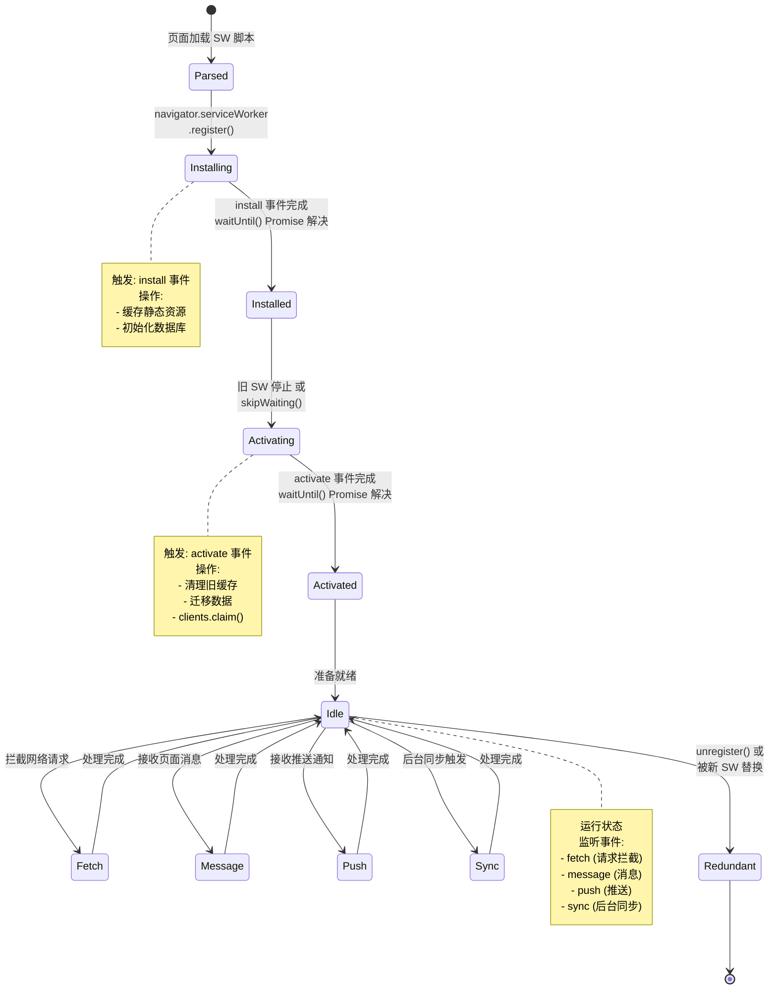
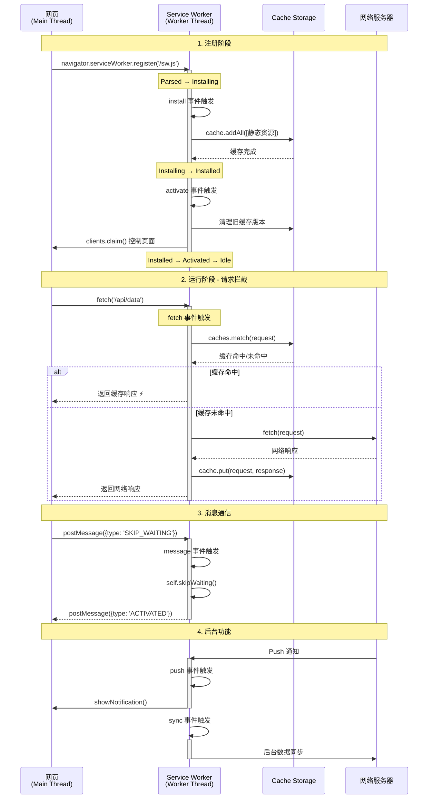

# PWA 与 Service Worker 逆向

## 概述

渐进式 Web 应用 (Progressive Web Apps, PWA) 和 Service Worker 技术使得 Web 应用能够离线工作、接收推送通知并提供类似原生应用的体验。在逆向工程中，理解 Service Worker 的工作原理对于分析现代 Web 应用、绕过缓存策略和理解请求拦截机制至关重要。

---

## 基础概念

### 定义

**PWA (Progressive Web App)** 是一种使用现代 Web 技术构建的应用，具有类似原生应用的体验：

- 可安装到主屏幕
- 离线工作
- 后台同步
- 推送通知
- 快速响应

**Service Worker** 是 PWA 的核心技术，是运行在浏览器后台的脚本：

- 独立于网页的生命周期
- 可以拦截和处理网络请求
- 实现离线缓存和策略
- 无法直接访问 DOM
- 使用 Promise 进行异步操作

### 核心原理

#### Service Worker 生命周期



#### Service Worker 与页面交互流程



**生命周期事件**:

1. **install**: Service Worker 首次安装时触发，用于缓存关键资源
2. **activate**: Service Worker 激活时触发，用于清理旧缓存和数据迁移
3. **fetch**: 每次网络请求时触发（如果注册了），实现请求拦截和缓存策略
4. **message**: 接收来自页面的消息，实现双向通信
5. **push**: 接收推送通知，即使页面未打开也能收到
6. **sync**: 后台同步，在网络恢复时同步数据

---

## 详细内容

### Service Worker 注册与检测

#### 1. **检测已注册的 Service Worker**

```javascript
// 检测当前页面是否有 Service Worker
if ("serviceWorker" in navigator) {
  navigator.serviceWorker.getRegistrations().then((registrations) => {
    console.log("Found Service Workers:", registrations.length);

    registrations.forEach((registration, index) => {
      console.log(`Service Worker ${index + 1}:`);
      console.log("  Scope:", registration.scope);
      console.log("  Active:", registration.active);
      console.log("  Waiting:", registration.waiting);
      console.log("  Installing:", registration.installing);

      if (registration.active) {
        console.log("  Script URL:", registration.active.scriptURL);
        console.log("  State:", registration.active.state);
      }
    });
  });
}
```

#### 2. **监控 Service Worker 状态**

```javascript
if ("serviceWorker" in navigator) {
  navigator.serviceWorker.ready.then((registration) => {
    console.log("Service Worker is ready");
    console.log("Scope:", registration.scope);

    // 监听状态变化
    if (registration.active) {
      registration.active.addEventListener("statechange", (e) => {
        console.log("Service Worker state changed:", e.target.state);
      });
    }
  });

  // 监听更新
  navigator.serviceWorker.addEventListener("updatefound", () => {
    console.log("Service Worker update found");
  });

  // 监听控制器变化
  navigator.serviceWorker.addEventListener("controllerchange", () => {
    console.log("Service Worker controller changed");
  });
}
```

### 拦截和分析请求

#### 1. **读取 Service Worker 脚本**

```javascript
// 获取 Service Worker 脚本内容
async function fetchServiceWorkerScript(registration) {
  if (!registration.active) {
    console.log("No active Service Worker");
    return;
  }

  const scriptURL = registration.active.scriptURL;
  console.log("Fetching Service Worker script:", scriptURL);

  try {
    const response = await fetch(scriptURL);
    const script = await response.text();
    console.log("Service Worker script:");
    console.log(script);
    return script;
  } catch (e) {
    console.error("Failed to fetch Service Worker:", e);
  }
}

// 使用
navigator.serviceWorker.getRegistrations().then((registrations) => {
  if (registrations.length > 0) {
    fetchServiceWorkerScript(registrations[0]);
  }
});
```

#### 2. **Hook Service Worker 注册**

```javascript
// 拦截 Service Worker 注册
(function () {
  const originalRegister = navigator.serviceWorker.register;

  navigator.serviceWorker.register = function (scriptURL, options) {
    console.log("[SW Register] Intercepted:", scriptURL, options);

    // 可以修改脚本 URL 或选项
    return originalRegister
      .call(this, scriptURL, options)
      .then((registration) => {
        console.log("[SW Register] Success:", registration);

        // 监听安装和激活
        if (registration.installing) {
          registration.installing.addEventListener("statechange", function (e) {
            console.log("[SW State]", e.target.state);
          });
        }

        return registration;
      });
  };
})();
```

#### 3. **监听 Service Worker 消息**

```javascript
// 发送消息到 Service Worker
navigator.serviceWorker.controller?.postMessage({
  type: "GET_CACHE_INFO",
  timestamp: Date.now(),
});

// 接收来自 Service Worker 的消息
navigator.serviceWorker.addEventListener("message", (event) => {
  console.log("Message from Service Worker:", event.data);
});
```

### 缓存分析

#### 1. **枚举所有缓存**

```javascript
async function listAllCaches() {
  if (!("caches" in window)) {
    console.log("Cache API not supported");
    return;
  }

  const cacheNames = await caches.keys();
  console.log("Found caches:", cacheNames);

  for (const cacheName of cacheNames) {
    console.log(`\n=== Cache: ${cacheName} ===`);
    const cache = await caches.open(cacheName);
    const keys = await cache.keys();

    console.log(`Total entries: ${keys.length}`);
    keys.forEach((request, i) => {
      console.log(`  ${i + 1}. ${request.url}`);
    });
  }
}

listAllCaches();
```

#### 2. **读取缓存内容**

```javascript
async function dumpCacheContent(cacheName, urlPattern) {
  const cache = await caches.open(cacheName);
  const keys = await cache.keys();

  for (const request of keys) {
    if (!urlPattern || request.url.includes(urlPattern)) {
      const response = await cache.match(request);
      const headers = {};
      response.headers.forEach((value, key) => {
        headers[key] = value;
      });

      console.log("URL:", request.url);
      console.log("Status:", response.status);
      console.log("Headers:", headers);

      // 根据内容类型读取响应体
      const contentType = response.headers.get("content-type");
      if (contentType?.includes("json")) {
        const json = await response.clone().json();
        console.log("JSON:", json);
      } else if (
        contentType?.includes("text") ||
        contentType?.includes("javascript")
      ) {
        const text = await response.clone().text();
        console.log("Text:", text.substring(0, 500));
      } else {
        const blob = await response.clone().blob();
        console.log("Blob size:", blob.size, "bytes");
      }
      console.log("---");
    }
  }
}

// 使用
dumpCacheContent("my-cache-v1", "api");
```

#### 3. **清除特定缓存**

```javascript
async function clearCache(cacheName) {
  const deleted = await caches.delete(cacheName);
  console.log(`Cache "${cacheName}" deleted:`, deleted);
}

async function clearAllCaches() {
  const cacheNames = await caches.keys();
  await Promise.all(cacheNames.map((name) => caches.delete(name)));
  console.log("All caches cleared");
}
```

### Service Worker 内部代码示例

#### 典型的 Service Worker 结构

```javascript
// service-worker.js

const CACHE_NAME = "my-app-v1";
const urlsToCache = ["/", "/styles/main.css", "/scripts/app.js"];

// 安装事件 - 缓存资源
self.addEventListener("install", (event) => {
  console.log("[SW] Installing...");

  event.waitUntil(
    caches
      .open(CACHE_NAME)
      .then((cache) => {
        console.log("[SW] Caching app shell");
        return cache.addAll(urlsToCache);
      })
      .then(() => self.skipWaiting()) // 立即激活
  );
});

// 激活事件 - 清理旧缓存
self.addEventListener("activate", (event) => {
  console.log("[SW] Activating...");

  event.waitUntil(
    caches
      .keys()
      .then((cacheNames) => {
        return Promise.all(
          cacheNames.map((cacheName) => {
            if (cacheName !== CACHE_NAME) {
              console.log("[SW] Deleting old cache:", cacheName);
              return caches.delete(cacheName);
            }
          })
        );
      })
      .then(() => self.clients.claim()) // 立即控制页面
  );
});

// Fetch 事件 - 网络请求拦截
self.addEventListener("fetch", (event) => {
  console.log("[SW] Fetching:", event.request.url);

  event.respondWith(
    // 缓存优先策略
    caches.match(event.request).then((response) => {
      if (response) {
        console.log("[SW] Cache hit:", event.request.url);
        return response;
      }

      console.log("[SW] Cache miss, fetching:", event.request.url);
      return fetch(event.request).then((response) => {
        // 缓存新响应
        if (response.status === 200) {
          const responseClone = response.clone();
          caches.open(CACHE_NAME).then((cache) => {
            cache.put(event.request, responseClone);
          });
        }
        return response;
      });
    })
  );
});

// 消息处理
self.addEventListener("message", (event) => {
  console.log("[SW] Message received:", event.data);

  if (event.data.type === "SKIP_WAITING") {
    self.skipWaiting();
  }

  // 回复消息
  event.ports[0].postMessage({
    type: "PONG",
    timestamp: Date.now(),
  });
});
```

---

## 实战示例

### 示例 1: Service Worker 调试工具

```javascript
class ServiceWorkerDebugger {
    constructor() {
        this.registrations = [];
    }

    async init() {
        if (!('serviceWorker' in navigator)) {
            console.error('Service Worker not supported');
            return;
        }

        this.registrations = await navigator.serviceWorker.getRegistrations();
        this.setupListeners();
        await this.analyze();
    }

    setupListeners() {
        // 监听新的 Service Worker
        navigator.serviceWorker.addEventListener('controllerchange', () => {
            console.log('[Debugger] Controller changed');
            this.analyze();
        });

        // 监听消息
        navigator.serviceWorker.addEventListener('message', event => {
            console.log('[Debugger] Message:', event.data);
        });
    }

    async analyze() {
        console.log('=== Service Worker Analysis ===');
        console.log(`Found ${this.registrations.length} registration(s)`);

        for (const reg of this.registrations) {
            console.log('\nRegistration:');
            console.log('  Scope:', reg.scope);

            if (reg.active) {
                console.log('  Active:', reg.active.scriptURL);
                await this.analyzeWorker(reg.active);
            }

            if (reg.waiting) {
                console.log('  Waiting:', reg.waiting.scriptURL);
            }

            if (reg.installing) {
                console.log('  Installing:', reg.installing.scriptURL);
            }
        }

        await this.analyzeCaches();
    }

    async analyzeWorker(worker) {
        try {
            const response = await fetch(worker.scriptURL);
            const code = await response.text();

            console.log('  Script size:', code.length, 'bytes');

            // 分析代码特征
            const features = {
                hasInstallListener: code.includes("addEventListener('install'"),
                hasActivateListener: code.includes("addEventListener('activate'"),
                hasFetchListener: code.includes("addEventListener('fetch'"),
                hasMessageListener: code.includes("addEventListener('message'"),
                hasPushListener: code.includes("addEventListener('push'"),
                usesCacheAPI: code.includes('caches.'),
                usesIndexedDB: code.includes('indexedDB'),
                hasWorkbox: code.includes('workbox')
            };

            console.log('  Features:', features);
        } catch(e) {
            console.error('  Failed to analyze:', e);
        }
    }

    async analyzeCaches() {
        console.log('\n=== Cache Analysis ===');
        const cacheNames = await caches.keys();
        console.log(`Found ${cacheNames.length} cache(s)`);

        for (const name of cacheNames) {
            const cache = await caches.open(name);
            const keys = await cache.keys();
            console.log(`\n${name}: ${keys.length} entries`);

            // 显示前5个条目
            for (let i = 0; i < Math.min(5, keys.length); i++) {
                console.log(`  - ${keys[i].url}`);
            }
            if (keys.length > 5) {
                console.log(`  ... and ${keys.length - 5} more`);
            }
        }
    }

    async sendMessage(data) {
        if (!navigator.serviceWorker.controller) {
            console.error('No active Service Worker controller');
            return;
        }

        const channel = new MessageChannel();

        return new Promise((resolve, reject) => {
            channel.port1.onmessage = event => {
                resolve(event.data);
            };

            navigator.serviceWorker.controller.postMessage(data, [channel.port2]);

            setTimeout(() => reject('Timeout'), 5000);
        });
    }

    async unregisterAll() {
        for (const reg of this.registrations) {
            await reg.unregister();
            console.log('Unregistered:', reg.scope);
        }
    }
}

// 使用
const debugger = new ServiceWorkerDebugger();
debugger.init();
```

### 示例 2: 绕过 Service Worker 缓存

```javascript
// 方法1: 强制绕过缓存
async function bypassServiceWorkerCache(url) {
  return fetch(url, {
    cache: "no-store",
    headers: {
      "Cache-Control": "no-cache",
      Pragma: "no-cache",
    },
  });
}

// 方法2: 临时注销 Service Worker
async function fetchWithoutServiceWorker(url) {
  const registrations = await navigator.serviceWorker.getRegistrations();

  // 保存注册信息
  const savedRegs = registrations.map((r) => ({
    scriptURL: r.active?.scriptURL,
    scope: r.scope,
  }));

  // 注销所有 Service Worker
  await Promise.all(registrations.map((r) => r.unregister()));

  // 执行请求
  const response = await fetch(url);

  // 重新注册 Service Worker
  for (const reg of savedRegs) {
    if (reg.scriptURL) {
      await navigator.serviceWorker.register(reg.scriptURL, {
        scope: reg.scope,
      });
    }
  }

  return response;
}

// 方法3: 使用 iframe 绕过
async function fetchInIframe(url) {
  return new Promise((resolve, reject) => {
    const iframe = document.createElement("iframe");
    iframe.style.display = "none";
    iframe.src = "about:blank";

    iframe.onload = async () => {
      try {
        const response = await iframe.contentWindow.fetch(url);
        const data = await response.text();
        resolve(data);
      } catch (e) {
        reject(e);
      } finally {
        document.body.removeChild(iframe);
      }
    };

    document.body.appendChild(iframe);
  });
}
```

### 示例 3: Service Worker 代理

```javascript
// 注册一个自定义的 Service Worker 来拦截和修改请求

// proxy-sw.js
self.addEventListener("fetch", (event) => {
  const url = new URL(event.request.url);

  // 拦截 API 请求
  if (url.pathname.startsWith("/api/")) {
    event.respondWith(
      fetch(event.request).then((response) => {
        // 克隆响应以便读取
        const clonedResponse = response.clone();

        // 记录响应
        clonedResponse.json().then((data) => {
          console.log("[Proxy SW] API Response:", url.pathname, data);

          // 发送到主线程
          self.clients.matchAll().then((clients) => {
            clients.forEach((client) => {
              client.postMessage({
                type: "API_RESPONSE",
                url: url.href,
                data: data,
              });
            });
          });
        });

        return response;
      })
    );
    return;
  }

  // 默认行为
  event.respondWith(fetch(event.request));
});

// 主页面中注册
navigator.serviceWorker.register("/proxy-sw.js", { scope: "/" });

// 监听拦截的数据
navigator.serviceWorker.addEventListener("message", (event) => {
  if (event.data.type === "API_RESPONSE") {
    console.log("Intercepted API call:", event.data.url);
    console.log("Data:", event.data.data);
  }
});
```

---

## 最佳实践

### 逆向分析流程

1. **检测 Service Worker 存在**

   - 检查 `navigator.serviceWorker` API
   - 查看开发者工具 Application 面板
   - 枚举所有注册

2. **提取 Service Worker 脚本**

   - 获取脚本 URL
   - 下载并分析代码
   - 识别缓存策略

3. **分析缓存内容**

   - 枚举所有缓存
   - 提取缓存的 API 响应
   - 寻找敏感数据

4. **监控网络拦截**
   - 识别被拦截的请求
   - 分析请求/响应修改
   - 绕过缓存机制

### 安全考虑

**作为开发者**:

1. **不要缓存敏感数据**

   - 避免缓存包含 Token 的 API 响应
   - 不要缓存用户个人信息

2. **实施缓存版本控制**

   - 更新时清理旧缓存
   - 使用版本号命名缓存

3. **验证 Service Worker 来源**
   - 使用 HTTPS
   - 实施 CSP 限制

**作为研究者**:

1. **合法授权**

   - 仅在授权范围内分析
   - 遵守负责任披露原则

2. **隐私保护**
   - 不要泄露用户数据
   - 测试时使用测试账号

---

## 常见问题

### Q: Service Worker 能访问 Cookie 吗？

**A**: Service Worker 无法直接访问 `document.cookie`，但：

- Fetch 请求会自动携带 Cookie
- 可以通过拦截请求读取 `Cookie` 头
- 可以设置响应的 `Set-Cookie` 头（受同源策略限制）

### Q: 如何调试 Service Worker？

**A**:

1. **Chrome DevTools**:

   - Application → Service Workers
   - 可以启动/停止、更新、注销
   - 可以在 Sources 中设置断点

2. **Firefox DevTools**:

   - about:debugging → This Firefox → Service Workers
   - 可以启动和注销

3. **编程方式**:
   ```javascript
   chrome://inspect/#service-workers  // Chrome
   about:debugging#/runtime/this-firefox  // Firefox
   ```

### Q: Service Worker 能被禁用吗？

**A**:

- 用户可以在浏览器设置中禁用
- 开发者可以通过 `unregister()` 注销
- 某些浏览器扩展可以阻止 Service Worker

### Q: Service Worker 的作用域是什么？

**A**:
Service Worker 的作用域（scope）决定了它能控制哪些页面：

```javascript
// 只能控制 /app/ 下的页面
navigator.serviceWorker.register("/sw.js", { scope: "/app/" });

// 默认作用域是脚本所在目录
navigator.serviceWorker.register("/scripts/sw.js"); // scope = '/scripts/'
```

---

## 进阶阅读

### 官方文档

- [Service Worker API - MDN](https://developer.mozilla.org/en-US/docs/Web/API/Service_Worker_API)
- [PWA 文档 - web.dev](https://web.dev/progressive-web-apps/)
- [Cache API - MDN](https://developer.mozilla.org/en-US/docs/Web/API/Cache)

### 工具与库

- [Workbox](https://developers.google.com/web/tools/workbox) - Google 的 Service Worker 库
- [sw-toolbox](https://github.com/GoogleChromeLabs/sw-toolbox) - Service Worker 工具箱
- [PWA Builder](https://www.pwabuilder.com/) - PWA 生成器

### 安全研究

- [Service Worker Security](https://w3c.github.io/ServiceWorker/#security-considerations)
- [PWA Security Best Practices](https://web.dev/pwa-security/)

---

## 相关章节

- [浏览器调试技巧](../02-Techniques/browser_debugging.md)
- [离线存储分析](../02-Techniques/offline_storage.md)
- [CSP 绕过技术](./csp_bypass.md)
- [Web Worker 分析](../02-Techniques/web_worker_analysis.md)
