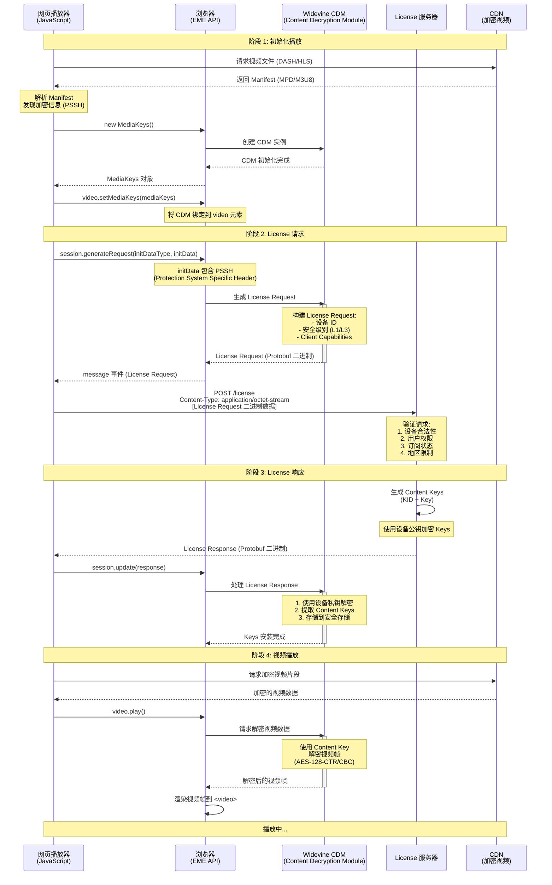
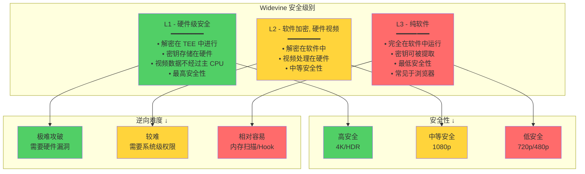
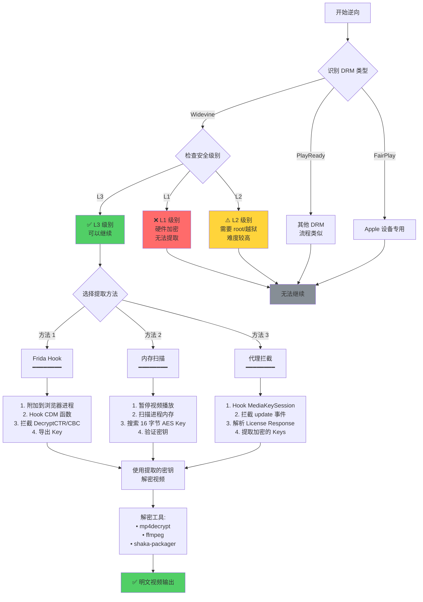

# 视频网站逆向

## 概述

视频网站是最具挑战性的逆向工程目标之一。本文通过 5 个真实案例，深入讲解视频平台的核心防护机制及其逆向方法。

---

## 案例 1: 视频 URL 解密与防盗链绕过

### 背景

某视频平台使用加密 URL 和时间戳签名来防止视频盗链。视频播放时，客户端需要动态生成带签名的播放地址。

### 逆向步骤

#### 1. 抓包分析

**网络请求**:

```
GET /video/play?vid=abc123&t=1702800000&sign=e3b0c44298fc
Host: video.example.com
Referer: https://video.example.com/watch/abc123
```

**响应**:

```json
{
  "code": 0,
  "data": {
    "url": "https://cdn.example.com/stream/abc123.m3u8?token=xxx&expires=1702803600"
  }
}
```

#### 2. JavaScript 分析

在 `player.js` 中找到签名生成逻辑:

```javascript
function generateSign(vid, timestamp) {
  const key = "secret_key_2024";
  const str = `${vid}|${timestamp}|${key}`;
  return md5(str).substr(0, 12);
}

function getPlayUrl(vid) {
  const timestamp = Math.floor(Date.now() / 1000);
  const sign = generateSign(vid, timestamp);

  return fetch(`/video/play?vid=${vid}&t=${timestamp}&sign=${sign}`, {
    headers: {
      Referer: "https://video.example.com/watch/" + vid,
    },
  }).then((r) => r.json());
}
```

#### 3. 密钥提取

通过搜索 `secret_key` 关键词，在混淆代码中定位:

```javascript
// 混淆后
var _0x1a2b = [
  "s",
  "e",
  "c",
  "r",
  "e",
  "t",
  "_",
  "k",
  "e",
  "y",
  "_",
  "2",
  "0",
  "2",
  "4",
];
var key = _0x1a2b.join("");
```

### Python 实现

```python
import hashlib
import time
import requests

class VideoDownloader:
    def __init__(self):
        self.base_url = "https://video.example.com"
        self.secret_key = "secret_key_2024"

    def generate_sign(self, vid, timestamp):
        """生成视频签名"""
        str_to_sign = f"{vid}|{timestamp}|{self.secret_key}"
        return hashlib.md5(str_to_sign.encode()).hexdigest()[:12]

    def get_play_url(self, vid):
        """获取播放地址"""
        timestamp = int(time.time())
        sign = self.generate_sign(vid, timestamp)

        url = f"{self.base_url}/video/play"
        params = {
            'vid': vid,
            't': timestamp,
            'sign': sign
        }
        headers = {
            'Referer': f'{self.base_url}/watch/{vid}',
            'User-Agent': 'Mozilla/5.0 (Windows NT 10.0; Win64; x64) AppleWebKit/537.36'
        }

        response = requests.get(url, params=params, headers=headers)
        data = response.json()

        if data['code'] == 0:
            return data['data']['url']
        else:
            raise Exception(f"Failed to get play url: {data}")

    def download_video(self, vid, output_path):
        """下载视频"""
        play_url = self.get_play_url(vid)
        print(f"Play URL: {play_url}")

        # 下载 M3U8 或直接视频
        response = requests.get(play_url, stream=True)
        with open(output_path, 'wb') as f:
            for chunk in response.iter_content(chunk_size=8192):
                f.write(chunk)

# 使用示例
downloader = VideoDownloader()
downloader.download_video('abc123', 'video.mp4')
```

### 防护与对抗

**防护方**:

- 密钥定期轮换
- 使用设备指纹绑定签名
- 添加播放次数限制
- IP 限速和频率检测

**绕过方**:

- 实时提取最新密钥（通过 Hook）
- 模拟真实播放器的设备指纹
- 使用代理池分散请求

---

## 案例 2: M3U8/HLS 流解析与下载

### 背景

主流视频平台使用 HLS (HTTP Live Streaming) 协议，视频被切分成多个 TS 片段，通过 M3U8 索引文件组织。

### 逆向步骤

#### 1. M3U8 文件结构

**Master Playlist** (多码率):

```m3u8
#EXTM3U
#EXT-X-STREAM-INF:BANDWIDTH=1280000,RESOLUTION=1280x720
https://cdn.example.com/video/720p.m3u8
#EXT-X-STREAM-INF:BANDWIDTH=2560000,RESOLUTION=1920x1080
https://cdn.example.com/video/1080p.m3u8
```

**Media Playlist** (TS 片段列表):

```m3u8
#EXTM3U
#EXT-X-VERSION:3
#EXT-X-TARGETDURATION:10
#EXT-X-KEY:METHOD=AES-128,URI="https://cdn.example.com/key/abc123",IV=0x12345678901234567890123456789012
#EXTINF:10.0,
segment0.ts
#EXTINF:10.0,
segment1.ts
#EXTINF:10.0,
segment2.ts
#EXT-X-ENDLIST
```

#### 2. AES-128 加密解析

TS 片段通常使用 AES-128-CBC 加密，需要获取解密密钥:

```javascript
// 在播放器代码中找到密钥获取逻辑
function getDecryptionKey(keyUri) {
  return fetch(keyUri, {
    headers: {
      "X-Key-Token": generateKeyToken(),
    },
  }).then((r) => r.arrayBuffer());
}

function generateKeyToken() {
  const timestamp = Date.now();
  const nonce = Math.random().toString(36);
  return btoa(timestamp + ":" + nonce);
}
```

### Python 实现

```python
import re
import os
import requests
from Crypto.Cipher import AES
from concurrent.futures import ThreadPoolExecutor
from urllib.parse import urljoin

class M3U8Downloader:
    def __init__(self, m3u8_url):
        self.m3u8_url = m3u8_url
        self.session = requests.Session()
        self.session.headers.update({
            'User-Agent': 'Mozilla/5.0 (Windows NT 10.0; Win64; x64) AppleWebKit/537.36'
        })

    def parse_m3u8(self, content, base_url):
        """解析 M3U8 文件"""
        lines = content.strip().split('\n')
        segments = []
        key_info = None

        for i, line in enumerate(lines):
            line = line.strip()

            # 解析加密密钥
            if line.startswith('#EXT-X-KEY'):
                match = re.search(r'METHOD=([^,]+),URI="([^"]+)"(?:,IV=(.+))?', line)
                if match:
                    method, uri, iv = match.groups()
                    key_url = urljoin(base_url, uri)
                    key_info = {
                        'method': method,
                        'uri': key_url,
                        'iv': iv
                    }

            # 解析 TS 片段
            elif line.startswith('#EXTINF'):
                if i + 1 < len(lines):
                    segment_url = urljoin(base_url, lines[i + 1].strip())
                    segments.append(segment_url)

        return segments, key_info

    def get_decryption_key(self, key_url):
        """获取解密密钥"""
        # 添加必要的请求头
        import time
        import random
        import base64

        timestamp = int(time.time() * 1000)
        nonce = ''.join(random.choices('abcdefghijklmnopqrstuvwxyz0123456789', k=8))
        token = base64.b64encode(f"{timestamp}:{nonce}".encode()).decode()

        headers = {'X-Key-Token': token}
        response = self.session.get(key_url, headers=headers)
        return response.content

    def decrypt_segment(self, encrypted_data, key, iv):
        """解密 TS 片段"""
        if iv.startswith('0x'):
            iv_bytes = bytes.fromhex(iv[2:])
        else:
            iv_bytes = iv.encode()[:16].ljust(16, b'\0')

        cipher = AES.new(key, AES.MODE_CBC, iv_bytes)
        decrypted = cipher.decrypt(encrypted_data)

        # 移除 PKCS7 填充
        padding_length = decrypted[-1]
        return decrypted[:-padding_length]

    def download_segment(self, url, index, key_info=None):
        """下载并解密单个片段"""
        try:
            response = self.session.get(url, timeout=30)
            data = response.content

            # 如果有加密，进行解密
            if key_info and key_info['method'] == 'AES-128':
                key = self.get_decryption_key(key_info['uri'])
                iv = key_info.get('iv', f'0x{index:032x}')
                data = self.decrypt_segment(data, key, iv)

            return index, data
        except Exception as e:
            print(f"Failed to download segment {index}: {e}")
            return index, None

    def download(self, output_path, max_workers=10):
        """下载完整视频"""
        # 获取 M3U8 内容
        response = self.session.get(self.m3u8_url)
        m3u8_content = response.text

        # 检查是否是 Master Playlist
        if '#EXT-X-STREAM-INF' in m3u8_content:
            # 选择最高质量
            lines = m3u8_content.strip().split('\n')
            for i, line in enumerate(lines):
                if line.startswith('#EXT-X-STREAM-INF'):
                    if i + 1 < len(lines):
                        best_quality_url = urljoin(self.m3u8_url, lines[i + 1].strip())
                        response = self.session.get(best_quality_url)
                        m3u8_content = response.text
                        break

        # 解析 M3U8
        base_url = self.m3u8_url.rsplit('/', 1)[0] + '/'
        segments, key_info = self.parse_m3u8(m3u8_content, base_url)

        print(f"Found {len(segments)} segments")
        if key_info:
            print(f"Encryption: {key_info['method']}")

        # 并发下载所有片段
        with ThreadPoolExecutor(max_workers=max_workers) as executor:
            futures = [
                executor.submit(self.download_segment, url, i, key_info)
                for i, url in enumerate(segments)
            ]

            results = [future.result() for future in futures]

        # 按顺序合并片段
        results.sort(key=lambda x: x[0])

        with open(output_path, 'wb') as f:
            for index, data in results:
                if data:
                    f.write(data)

        print(f"Video saved to: {output_path}")

# 使用示例
downloader = M3U8Downloader('https://cdn.example.com/video/1080p.m3u8')
downloader.download('output.mp4', max_workers=20)
```

### 高级技巧

**1. 处理动态 M3U8**:
某些直播流的 M3U8 会实时更新，需要循环获取:

```python
def download_live_stream(self, output_path, duration=3600):
    """下载直播流（指定时长）"""
    downloaded_segments = set()
    start_time = time.time()

    with open(output_path, 'wb') as f:
        while time.time() - start_time < duration:
            response = self.session.get(self.m3u8_url)
            segments, key_info = self.parse_m3u8(response.text, self.m3u8_url)

            for i, url in enumerate(segments):
                if url not in downloaded_segments:
                    _, data = self.download_segment(url, i, key_info)
                    if data:
                        f.write(data)
                        downloaded_segments.add(url)

            time.sleep(5)  # 等待新片段
```

**2. 解析 MPEG-DASH** (替代 HLS):

```python
from xml.etree import ElementTree as ET

def parse_mpd(mpd_url):
    """解析 MPEG-DASH MPD 文件"""
    response = requests.get(mpd_url)
    root = ET.fromstring(response.content)

    # 提取视频和音频流
    video_urls = []
    audio_urls = []

    for adaptation_set in root.findall('.//{urn:mpeg:dash:schema:mpd:2011}AdaptationSet'):
        content_type = adaptation_set.get('contentType')

        for representation in adaptation_set.findall('.//{urn:mpeg:dash:schema:mpd:2011}Representation'):
            base_url = representation.find('.//{urn:mpeg:dash:schema:mpd:2011}BaseURL').text

            if content_type == 'video':
                video_urls.append(base_url)
            elif content_type == 'audio':
                audio_urls.append(base_url)

    return video_urls, audio_urls
```

---

## 案例 3: DRM 保护分析 (Widevine)

### 背景

Netflix、Disney+ 等平台使用 Widevine DRM 保护视频内容。本案例分析 Widevine L3 级别的工作原理。

### Widevine 工作流程

#### EME (Encrypted Media Extensions) + Widevine 完整流程



#### DRM 安全级别对比



#### Widevine L3 密钥提取流程



### 逆向步骤

#### 1. 抓包分析 License 请求

```python
# License Request
POST /widevine/license HTTP/1.1
Host: license.example.com
Content-Type: application/octet-stream

[Binary Protobuf Data: License Request]
```

**License Request 结构** (Protobuf):

```protobuf
message LicenseRequest {
    ClientIdentification client_id = 1;
    ContentIdentification content_id = 2;
    bytes encrypted_client_id = 3;
}
```

#### 2. JavaScript Hook 拦截

```javascript
// Hook MediaKeySession
(function () {
  const originalGenerateRequest = MediaKeySession.prototype.generateRequest;

  MediaKeySession.prototype.generateRequest = function (
    initDataType,
    initData
  ) {
    console.log("=== License Request ===");
    console.log("Init Data Type:", initDataType);
    console.log("Init Data:", new Uint8Array(initData));

    // 拦截 PSSH (Protection System Specific Header)
    const pssh = new Uint8Array(initData);
    console.log(
      "PSSH:",
      Array.from(pssh)
        .map((b) => b.toString(16).padStart(2, "0"))
        .join(" ")
    );

    return originalGenerateRequest.call(this, initDataType, initData);
  };

  const originalUpdate = MediaKeySession.prototype.update;

  MediaKeySession.prototype.update = function (response) {
    console.log("=== License Response ===");
    console.log("Response:", new Uint8Array(response));

    return originalUpdate.call(this, response);
  };
})();
```

#### 3. Frida Hook Native CDM

对于 L3 级别，Content Decryption Module 在浏览器进程中运行:

```javascript
// Frida script to hook Widevine CDM
Interceptor.attach(
  Module.findExportByName("widevinecdm.dll", "DecryptAndDecode"),
  {
    onEnter: function (args) {
      console.log("DecryptAndDecode called");
      console.log("Encrypted buffer:", args[0]);
      console.log("Buffer size:", args[1].toInt32());
    },
    onLeave: function (retval) {
      console.log("Decrypted successfully:", retval);
    },
  }
);
```

### L3 密钥提取工具

```python
import frida
import sys

class WidevineL3Extractor:
    def __init__(self):
        self.keys = []

    def on_message(self, message, data):
        """处理 Frida 消息"""
        if message['type'] == 'send':
            payload = message['payload']
            if 'key' in payload:
                print(f"Found key: {payload['key']}")
                self.keys.append(payload)

    def extract_keys(self, process_name='chrome.exe'):
        """从浏览器进程提取密钥"""
        session = frida.attach(process_name)

        script_code = """
        // Hook Widevine OEMCrypto functions
        var oemcrypto = Process.findModuleByName('widevinecdm.dll');

        if (oemcrypto) {
            var decrypt_func = oemcrypto.findExportByName('OEMCrypto_DecryptCTR');

            Interceptor.attach(decrypt_func, {
                onEnter: function(args) {
                    // args[2] is the key
                    var key = args[2];
                    var keyBuffer = Memory.readByteArray(key, 16);

                    send({
                        'type': 'key',
                        'key': Array.from(new Uint8Array(keyBuffer)).map(b =>
                            b.toString(16).padStart(2, '0')
                        ).join('')
                    });
                }
            });
        }
        """

        script = session.create_script(script_code)
        script.on('message', self.on_message)
        script.load()

        print("Waiting for keys... (play some DRM content)")
        sys.stdin.read()

        return self.keys

# 使用示例
extractor = WidevineL3Extractor()
keys = extractor.extract_keys('chrome.exe')

# 使用提取的密钥解密视频
for key_info in keys:
    print(f"KID: {key_info.get('kid', 'N/A')}")
    print(f"Key: {key_info['key']}")
```

### 使用密钥解密视频

```python
from Crypto.Cipher import AES

def decrypt_video_with_key(encrypted_file, output_file, key_hex, iv_hex=None):
    """使用提取的密钥解密视频"""
    key = bytes.fromhex(key_hex)

    if iv_hex:
        iv = bytes.fromhex(iv_hex)
    else:
        # 默认 IV (全 0)
        iv = b'\x00' * 16

    cipher = AES.new(key, AES.MODE_CTR, nonce=iv[:8], initial_value=int.from_bytes(iv[8:], 'big'))

    with open(encrypted_file, 'rb') as f_in:
        with open(output_file, 'wb') as f_out:
            while True:
                chunk = f_in.read(64 * 1024)
                if not chunk:
                    break
                decrypted_chunk = cipher.decrypt(chunk)
                f_out.write(decrypted_chunk)

# 使用示例
decrypt_video_with_key(
    'encrypted_video.mp4',
    'decrypted_video.mp4',
    key_hex='0123456789abcdef0123456789abcdef'
)
```

### 注意事项

- **L1 vs L3**: L1 级别的密钥存储在硬件安全模块中，无法直接提取
- **法律风险**: 绕过 DRM 可能违反 DMCA 等法律
- **仅用于研究**: 本案例仅用于教育目的

---

## 案例 4: 视频清晰度选择算法逆向

### 背景

视频平台根据网络状况自动调整视频清晰度。逆向这个算法可以强制播放最高质量视频。

### 逆向步骤

#### 1. 定位 ABR (Adaptive Bitrate) 逻辑

在播放器代码中搜索 `bandwidth`、`quality`、`resolution`:

```javascript
class AdaptiveBitrateController {
  constructor() {
    this.currentLevel = 0;
    this.levels = [
      { width: 640, height: 360, bitrate: 800000 },
      { width: 1280, height: 720, bitrate: 2500000 },
      { width: 1920, height: 1080, bitrate: 5000000 },
      { width: 3840, height: 2160, bitrate: 15000000 },
    ];
  }

  selectLevel(bandwidth, bufferLevel) {
    /**
     * 选择算法:
     * 1. 如果缓冲区低于 5 秒，降低质量
     * 2. 如果带宽 > 比特率 * 1.5，可以升级
     * 3. 考虑切换成本（避免频繁切换）
     */

    if (bufferLevel < 5) {
      // 缓冲区不足，降级
      return Math.max(0, this.currentLevel - 1);
    }

    // 找到最高可用质量
    for (let i = this.levels.length - 1; i >= 0; i--) {
      if (bandwidth >= this.levels[i].bitrate * 1.5) {
        // 避免频繁切换
        if (Math.abs(i - this.currentLevel) <= 1) {
          return i;
        }
      }
    }

    return this.currentLevel;
  }

  measureBandwidth() {
    /**
     * 带宽测量:
     * 使用最近下载片段的速度估算
     */
    const recentDownloads = this.downloadHistory.slice(-5);
    const totalBytes = recentDownloads.reduce((sum, d) => sum + d.bytes, 0);
    const totalTime = recentDownloads.reduce((sum, d) => sum + d.duration, 0);

    return (totalBytes * 8) / totalTime; // bps
  }
}
```

#### 2. Hook 强制最高质量

```javascript
// 方法 1: 覆盖 selectLevel 方法
(function () {
  const originalSelectLevel = AdaptiveBitrateController.prototype.selectLevel;

  AdaptiveBitrateController.prototype.selectLevel = function (
    bandwidth,
    bufferLevel
  ) {
    // 总是返回最高质量索引
    return this.levels.length - 1;
  };

  console.log("Forced highest quality");
})();

// 方法 2: 修改带宽测量结果
(function () {
  const originalMeasureBandwidth =
    AdaptiveBitrateController.prototype.measureBandwidth;

  AdaptiveBitrateController.prototype.measureBandwidth = function () {
    // 返回一个很大的带宽值
    return 100000000; // 100 Mbps
  };
})();
```

#### 3. Tampermonkey 用户脚本

```javascript
// ==UserScript==
// @name         Force Highest Video Quality
// @namespace    http://tampermonkey.net/
// @version      1.0
// @description  强制视频播放最高质量
// @match        https://video.example.com/*
// @grant        none
// ==/UserScript==

(function () {
  "use strict";

  // 等待播放器加载
  const observer = new MutationObserver((mutations, obs) => {
    const player = document.querySelector("video");
    if (player) {
      obs.disconnect();
      forceHighestQuality();
    }
  });

  observer.observe(document.body, {
    childList: true,
    subtree: true,
  });

  function forceHighestQuality() {
    // 方法 1: 修改 HTMLMediaElement
    const video = document.querySelector("video");

    Object.defineProperty(video, "playbackQuality", {
      get: function () {
        return {
          totalVideoFrames: 10000,
          droppedVideoFrames: 0,
          corruptedVideoFrames: 0,
        };
      },
    });

    // 方法 2: Hook hls.js
    if (window.Hls) {
      const originalLoadSource = Hls.prototype.loadSource;

      Hls.prototype.loadSource = function (url) {
        // 强制加载最高质量的 m3u8
        url = url.replace(/\d+p\.m3u8/, "2160p.m3u8");
        return originalLoadSource.call(this, url);
      };

      // 禁用自动质量切换
      const player = new Hls({
        autoStartLoad: true,
        startLevel: -1, // -1 表示最高质量
        capLevelToPlayerSize: false, // 不限制质量
      });
    }

    console.log("Forced to highest quality");
  }
})();
```

### Python 实现 - 模拟 ABR 算法

```python
class VideoQualitySelector:
    def __init__(self):
        self.qualities = [
            {'name': '360p', 'width': 640, 'height': 360, 'bitrate': 800000},
            {'name': '720p', 'width': 1280, 'height': 720, 'bitrate': 2500000},
            {'name': '1080p', 'width': 1920, 'height': 1080, 'bitrate': 5000000},
            {'name': '4K', 'width': 3840, 'height': 2160, 'bitrate': 15000000},
        ]
        self.current_quality = 1  # 默认 720p

    def estimate_bandwidth(self, download_history):
        """估算当前带宽"""
        if not download_history:
            return 5000000  # 默认 5 Mbps

        # 使用最近 5 次下载的平均速度
        recent = download_history[-5:]
        total_bytes = sum(d['bytes'] for d in recent)
        total_time = sum(d['time'] for d in recent)

        if total_time == 0:
            return 5000000

        return (total_bytes * 8) / total_time  # bps

    def select_quality(self, bandwidth, buffer_level, force_highest=False):
        """选择合适的视频质量"""
        if force_highest:
            return len(self.qualities) - 1

        # 缓冲区不足，降级
        if buffer_level < 5:
            return max(0, self.current_quality - 1)

        # 选择最高可用质量（带宽 > 比特率 * 1.5）
        for i in range(len(self.qualities) - 1, -1, -1):
            if bandwidth >= self.qualities[i]['bitrate'] * 1.5:
                # 避免频繁切换（最多一次变化一级）
                if abs(i - self.current_quality) <= 1:
                    self.current_quality = i
                    return i

        return self.current_quality

    def get_quality_url(self, base_url, quality_index):
        """获取指定质量的播放地址"""
        quality = self.qualities[quality_index]
        return f"{base_url}/{quality['name']}.m3u8"

# 使用示例
selector = VideoQualitySelector()

# 模拟下载历史
download_history = [
    {'bytes': 1000000, 'time': 1.5},  # ~5.3 Mbps
    {'bytes': 1200000, 'time': 1.8},  # ~5.3 Mbps
    {'bytes': 1500000, 'time': 2.0},  # 6 Mbps
]

bandwidth = selector.estimate_bandwidth(download_history)
quality_index = selector.select_quality(
    bandwidth=bandwidth,
    buffer_level=10,  # 10 秒缓冲
    force_highest=True  # 强制最高质量
)

print(f"Selected quality: {selector.qualities[quality_index]['name']}")
```

---

## 案例 5: CDN 节点发现与优选

### 背景

视频平台使用多个 CDN 节点分发内容。逆向节点选择逻辑，可以找到最快的下载节点。

### 逆向步骤

#### 1. 抓包分析 CDN 调度

**DNS 解析**:

```
cdn.example.com -> CNAME -> geo.cdn.example.com
geo.cdn.example.com -> A 记录:
  - 1.2.3.4 (北京节点)
  - 5.6.7.8 (上海节点)
  - 9.10.11.12 (广州节点)
```

**HTTP 重定向**:

```
GET /video/abc123.mp4
HTTP/1.1 302 Found
Location: https://bj-cdn01.example.com/video/abc123.mp4
```

#### 2. JavaScript 节点选择逻辑

```javascript
class CDNSelector {
  constructor() {
    this.nodes = [
      { id: "bj-01", url: "https://bj-cdn01.example.com", region: "beijing" },
      { id: "sh-01", url: "https://sh-cdn01.example.com", region: "shanghai" },
      { id: "gz-01", url: "https://gz-cdn01.example.com", region: "guangzhou" },
    ];
    this.selectedNode = null;
  }

  async selectBestNode(testFile = "/ping.txt") {
    /**
     * 节点选择策略:
     * 1. 并发测试所有节点的延迟
     * 2. 选择延迟最低的节点
     * 3. 缓存结果 5 分钟
     */

    const results = await Promise.all(
      this.nodes.map((node) => this.testNode(node, testFile))
    );

    // 按延迟排序
    results.sort((a, b) => a.latency - b.latency);

    this.selectedNode = results[0].node;
    console.log(
      `Selected CDN node: ${this.selectedNode.id} (${results[0].latency}ms)`
    );

    return this.selectedNode;
  }

  async testNode(node, testFile) {
    const start = performance.now();

    try {
      await fetch(node.url + testFile, {
        method: "HEAD",
        cache: "no-cache",
      });

      const latency = performance.now() - start;
      return { node, latency };
    } catch (error) {
      return { node, latency: Infinity };
    }
  }

  getVideoUrl(path) {
    if (!this.selectedNode) {
      throw new Error("No CDN node selected");
    }

    return this.selectedNode.url + path;
  }
}
```

#### 3. 多 CDN 源探测

某些平台会在不同 CDN 提供商之间分发:

```javascript
async function discoverCDNSources(videoId) {
  /**
   * 探测多个可能的 CDN 源
   */
  const cdnProviders = [
    "akamai.example.com",
    "cloudflare.example.com",
    "cloudfront.example.com",
    "fastly.example.com",
  ];

  const sources = [];

  for (const provider of cdnProviders) {
    const url = `https://${provider}/video/${videoId}.mp4`;

    try {
      const response = await fetch(url, { method: "HEAD" });
      if (response.ok) {
        sources.push({
          provider: provider,
          url: url,
          size: response.headers.get("Content-Length"),
          server: response.headers.get("Server"),
        });
      }
    } catch (e) {
      // 该 CDN 不可用
    }
  }

  return sources;
}
```

### Python 实现 - CDN 节点测速

```python
import time
import asyncio
import aiohttp
from typing import List, Dict

class CDNOptimizer:
    def __init__(self, cdn_nodes: List[Dict]):
        """
        cdn_nodes: [
            {'id': 'bj-01', 'url': 'https://bj-cdn.example.com'},
            {'id': 'sh-01', 'url': 'https://sh-cdn.example.com'},
            ...
        ]
        """
        self.cdn_nodes = cdn_nodes
        self.best_node = None

    async def test_node_latency(self, session, node, test_file='/ping.txt'):
        """测试单个节点的延迟"""
        url = node['url'] + test_file

        try:
            start = time.time()
            async with session.head(url, timeout=5) as response:
                latency = (time.time() - start) * 1000  # ms

                return {
                    'node': node,
                    'latency': latency,
                    'status': response.status,
                    'server': response.headers.get('Server', 'Unknown')
                }
        except Exception as e:
            return {
                'node': node,
                'latency': float('inf'),
                'status': 0,
                'error': str(e)
            }

    async def test_node_bandwidth(self, session, node, test_size_mb=1):
        """测试节点带宽"""
        # 下载测试文件（例如 1MB）
        test_url = f"{node['url']}/speedtest/{test_size_mb}mb.bin"

        try:
            start = time.time()
            async with session.get(test_url, timeout=30) as response:
                data = await response.read()
                duration = time.time() - start

                # 计算带宽 (Mbps)
                bandwidth = (len(data) * 8) / (duration * 1_000_000)

                return {
                    'node': node,
                    'bandwidth': bandwidth,
                    'duration': duration
                }
        except Exception as e:
            return {
                'node': node,
                'bandwidth': 0,
                'error': str(e)
            }

    async def select_best_node(self, mode='latency'):
        """选择最佳节点"""
        async with aiohttp.ClientSession() as session:
            if mode == 'latency':
                # 基于延迟选择
                tasks = [
                    self.test_node_latency(session, node)
                    for node in self.cdn_nodes
                ]
                results = await asyncio.gather(*tasks)

                # 排序并选择延迟最低的
                results.sort(key=lambda x: x['latency'])
                self.best_node = results[0]['node']

                print(f"Best node (latency): {self.best_node['id']}")
                for r in results[:3]:  # 显示前 3 个
                    print(f"  {r['node']['id']}: {r['latency']:.2f}ms")

            elif mode == 'bandwidth':
                # 基于带宽选择
                tasks = [
                    self.test_node_bandwidth(session, node)
                    for node in self.cdn_nodes
                ]
                results = await asyncio.gather(*tasks)

                # 排序并选择带宽最高的
                results.sort(key=lambda x: x['bandwidth'], reverse=True)
                self.best_node = results[0]['node']

                print(f"Best node (bandwidth): {self.best_node['id']}")
                for r in results[:3]:
                    print(f"  {r['node']['id']}: {r['bandwidth']:.2f} Mbps")

        return self.best_node

    def get_video_url(self, video_path):
        """获取使用最佳节点的视频 URL"""
        if not self.best_node:
            raise Exception("Please select best node first")

        return self.best_node['url'] + video_path

# 使用示例
async def main():
    cdn_nodes = [
        {'id': 'bj-01', 'url': 'https://bj-cdn.example.com'},
        {'id': 'sh-01', 'url': 'https://sh-cdn.example.com'},
        {'id': 'gz-01', 'url': 'https://gz-cdn.example.com'},
        {'id': 'sz-01', 'url': 'https://sz-cdn.example.com'},
    ]

    optimizer = CDNOptimizer(cdn_nodes)

    # 方法 1: 基于延迟选择
    await optimizer.select_best_node(mode='latency')

    # 方法 2: 基于带宽选择
    # await optimizer.select_best_node(mode='bandwidth')

    # 获取视频 URL
    video_url = optimizer.get_video_url('/video/abc123.mp4')
    print(f"Video URL: {video_url}")

# 运行
asyncio.run(main())
```

### 高级技巧: 反向解析 CDN 节点

```python
import dns.resolver
import socket

def discover_all_cdn_nodes(domain):
    """通过 DNS 查询发现所有 CDN 节点"""
    nodes = []

    try:
        # 解析 CNAME
        answers = dns.resolver.resolve(domain, 'CNAME')
        for rdata in answers:
            print(f"CNAME: {rdata.target}")

            # 解析 A 记录
            a_records = dns.resolver.resolve(str(rdata.target), 'A')
            for a_rdata in a_records:
                ip = str(a_rdata)

                # 反向 DNS 查询获取节点名称
                try:
                    hostname = socket.gethostbyaddr(ip)[0]
                except:
                    hostname = ip

                nodes.append({
                    'ip': ip,
                    'hostname': hostname
                })

                print(f"  -> {ip} ({hostname})")

    except Exception as e:
        print(f"Error: {e}")

    return nodes

# 使用示例
nodes = discover_all_cdn_nodes('cdn.example.com')
```

---

## 防护与对抗总结

### 平台防护措施

1. **URL 签名**: 时间戳 + 密钥签名
2. **设备指纹**: 绑定设备，限制并发
3. **播放次数限制**: 单个视频播放次数
4. **DRM 保护**: Widevine、PlayReady
5. **动态密钥**: 定期轮换加密密钥
6. **水印技术**: 溯源盗版视频
7. **CDN 鉴权**: Token 验证
8. **流量分析**: 检测异常下载行为

### 逆向对抗技巧

1. **自动化脚本**: Selenium、Playwright 模拟真实用户
2. **密钥提取**: Frida Hook、内存扫描
3. **协议分析**: Wireshark、mitmproxy
4. **代码混淆还原**: AST 分析、符号执行
5. **CDN 优选**: 多节点测速、智能选择
6. **分布式下载**: 多账号、多 IP 并发
7. **浏览器指纹伪造**: 绕过设备检测

---

## 法律与道德声明

**本文仅用于技术研究和教育目的**。绕过视频平台的保护措施可能违反:

- 服务条款 (ToS)
- 数字千年版权法案 (DMCA)
- 计算机欺诈和滥用法 (CFAA)
- 各国知识产权法律

请仅在授权环境下进行安全测试，尊重内容创作者的权益。

---

## 工具推荐

### 视频下载工具

- **yt-dlp**: 支持 1000+ 网站
- **you-get**: 国内视频平台
- **N_m3u8DL-CLI**: M3U8 专业下载器
- **streamlink**: 直播流下载

### 分析工具

- **Wireshark**: 网络协议分析
- **Chrome DevTools**: 浏览器调试
- **Frida**: 动态分析
- **mitmproxy**: HTTPS 代理

### 解密工具

- **ffmpeg**: 视频处理、转码
- **mp4decrypt**: MP4 解密（Bento4）
- **shaka-packager**: DRM 封装/解封

---

## 相关章节

- [浏览器 DevTools 使用](../01-Tools/browser_devtools.md)
- [抓包与代理工具](../01-Tools/packet_capture.md)
- [JavaScript 混淆与反混淆](../02-Techniques/js_obfuscation.md)
- [WebAssembly 逆向](../04-Advanced-Recipes/webassembly_reversing.md)
- [DRM 保护机制](../03-Advanced-Topics/drm_protection.md)
