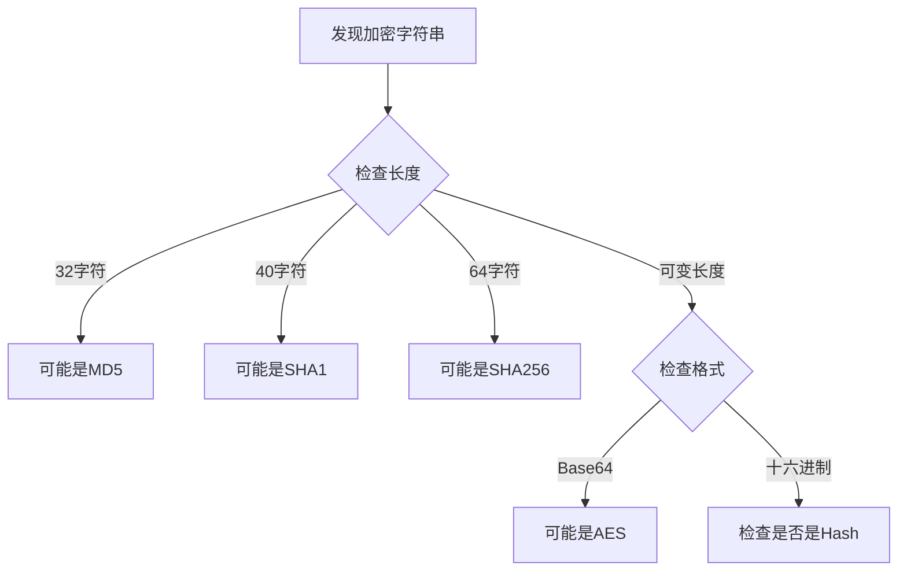

# 加密算法特征速查表

## 输出长度特征

| 算法         | 输出长度 | 输出格式 | 示例                                       |
| ------------ | -------- | -------- | ------------------------------------------ |
| **MD5**      | 32 字符  | 十六进制 | `5d41402abc4b2a76b9719d911017c592`         |
| **SHA1**     | 40 字符  | 十六进制 | `aaf4c61ddcc5e8a2dabede0f3b482cd9aea9434d` |
| **SHA256**   | 64 字符  | 十六进制 | `e3b0c44298fc1c149afbf4c8996fb...`         |
| **SHA512**   | 128 字符 | 十六进制 | `cf83e1357eefb8bdf1542850d66d8...`         |
| **AES**      | 可变     | Base64   | `U2FsdGVkX1+LpXMIpGBwDA==`                 |
| **RSA-2048** | 256 字节 | Base64   | 长字符串                                   |

## JavaScript 库特征

### CryptoJS

```javascript
// 特征代码
CryptoJS.MD5(text);
CryptoJS.SHA256(text);
CryptoJS.AES.encrypt(text, key);
CryptoJS.enc.Base64.stringify();
CryptoJS.lib.WordArray;
```

**识别要点**:

- 全局变量 `CryptoJS`
- 引入 CDN: `crypto-js.min.js`
- 方法调用格式: `CryptoJS.算法名.方法`

### crypto (Node.js)

```javascript
const crypto = require("crypto");

// MD5
crypto.createHash("md5").update(text).digest("hex");

// HMAC
crypto.createHmac("sha256", key).update(text).digest("hex");

// AES
const cipher = crypto.createCipheriv("aes-256-cbc", key, iv);
```

### Web Crypto API

```javascript
// 特征代码
window.crypto.subtle.digest("SHA-256", data);
window.crypto.subtle.encrypt(algorithm, key, data);
window.crypto.getRandomValues(array);
```

## 常见加密模式

### 对称加密（AES）

| 模式        | 特征           | 参数           |
| ----------- | -------------- | -------------- |
| **AES-ECB** | 最简单，不安全 | 只需 key       |
| **AES-CBC** | 需要 IV        | key + iv       |
| **AES-CTR** | 计数器模式     | key + counter  |
| **AES-GCM** | 认证加密       | key + iv + tag |

**识别示例**:

```javascript
// CBC 模式
CryptoJS.AES.encrypt(text, key, {
  iv: iv,
  mode: CryptoJS.mode.CBC,
  padding: CryptoJS.pad.Pkcs7,
});
```

### 非对称加密（RSA）

```javascript
// JSEncrypt 特征
const encrypt = new JSEncrypt();
encrypt.setPublicKey(publicKey);
const encrypted = encrypt.encrypt(text);
```

## Hash 算法特征表

| 输入            | MD5                   | SHA1                  | SHA256                |
| --------------- | --------------------- | --------------------- | --------------------- |
| `""` (空字符串) | `d41d8cd98f00b204...` | `da39a3ee5e6b4b0d...` | `e3b0c44298fc1c14...` |
| `"a"`           | `0cc175b9c0f1b6a8...` | `86f7e437faa5a7fc...` | `ca978112ca1bbdca...` |
| `"123456"`      | `e10adc3949ba59ab...` | `7c4a8d09ca3762af...` | `8d969eef6ecad3c2...` |

**快速验证**:

```python
import hashlib
hashlib.md5(b'123456').hexdigest()
# 'e10adc3949ba59abbe56e057f20f883e'
```

## 混淆后的识别

### 特征字符串

搜索这些关键字：

```
"MD5"
"SHA"
"AES"
"RSA"
"encrypt"
"decrypt"
"cipher"
"hash"
"digest"
"0123456789ABCDEF"  // 十六进制字符集
"ABCDEFGHIJKLMNOPQRSTUVWXYZabcdefghijklmnopqrstuvwxyz0123456789+/"  // Base64
```

### 特征函数

```javascript
// MD5 特征 - 常量
0x67452301, 0xefcdab89, 0x98badcfe, 0x10325476

// AES 特征 - S-Box
[0x63, 0x7c, 0x77, 0x7b, ...]

// Base64 特征
"ABCDEFGHIJKLMNOPQRSTUVWXYZabcdefghijklmnopqrstuvwxyz0123456789+/"
```

## 加密参数常见名称

| 用途         | 常见变量名                               |
| ------------ | ---------------------------------------- |
| **密钥**     | `key`, `secret`, `secretKey`, `password` |
| **初始向量** | `iv`, `ivBytes`, `nonce`                 |
| **盐**       | `salt`, `randomSalt`                     |
| **签名**     | `sign`, `signature`, `hash`              |
| **时间戳**   | `timestamp`, `ts`, `time`, `nonce`       |

## 快速识别流程



## Python 实现对照

```python
import hashlib
from Crypto.Cipher import AES
from Crypto.Util.Padding import pad, unpad
import base64

# MD5
hashlib.md5(b'text').hexdigest()

# SHA256
hashlib.sha256(b'text').hexdigest()

# HMAC-SHA256
import hmac
hmac.new(b'key', b'text', hashlib.sha256).hexdigest()

# AES-CBC 加密
key = b'1234567890abcdef'  # 16字节
iv = b'abcdefghijklmnop'   # 16字节
cipher = AES.new(key, AES.MODE_CBC, iv)
encrypted = cipher.encrypt(pad(b'plaintext', AES.block_size))
encrypted_b64 = base64.b64encode(encrypted)

# AES-CBC 解密
cipher = AES.new(key, AES.MODE_CBC, iv)
decrypted = unpad(cipher.decrypt(base64.b64decode(encrypted_b64)), AES.block_size)
```

## 常见加密库 CDN

识别使用的加密库：

```html
<!-- CryptoJS -->
<script src="https://cdnjs.cloudflare.com/ajax/libs/crypto-js/4.1.1/crypto-js.min.js"></script>

<!-- JSEncrypt (RSA) -->
<script src="https://cdn.jsdelivr.net/npm/jsencrypt/bin/jsencrypt.min.js"></script>

<!-- Forge -->
<script src="https://cdn.jsdelivr.net/npm/node-forge/dist/forge.min.js"></script>

<!-- sjcl (Stanford JavaScript Crypto Library) -->
<script src="https://bitwiseshiftleft.github.io/sjcl/sjcl.js"></script>
```

## 📚 相关章节

- [加密算法识别](../03-Basic-Recipes/crypto_identification.md)
- [解密 API 参数](../00-Quick-Start/decrypt_api_params.md)
- [加密检测脚本](../07-Scripts/crypto_detection_scripts.md)
